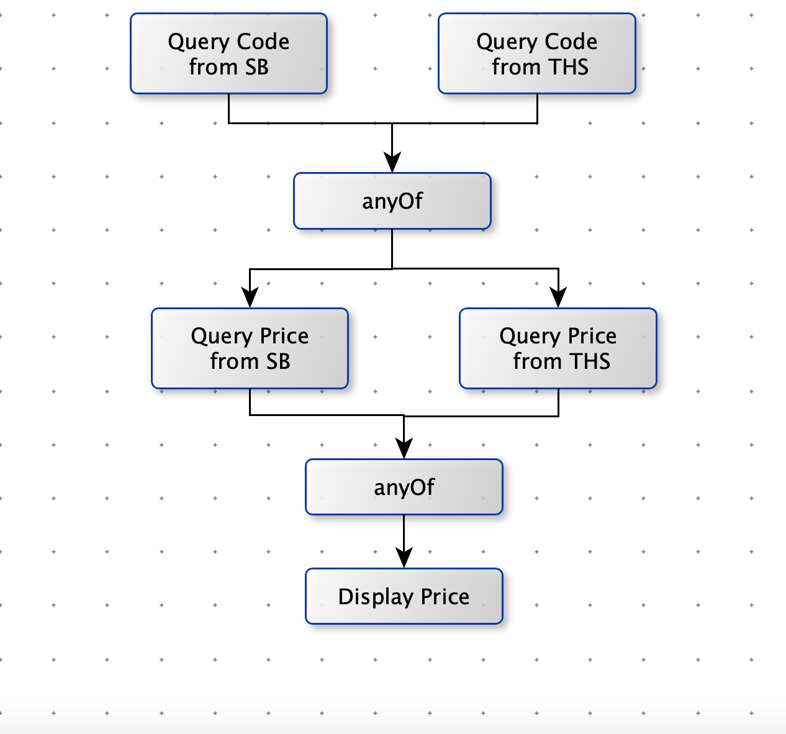

[TOC]

## 神奇的 CompletableFuture

使用 `Future`获得异步执行结果时，要么调用阻塞方法 `get()`。要么轮询看 `isDone()`是否为`true`（耗费CPU），这两种方法都不是很好，因为主线程也会被迫等待。

<font color=red>阻塞方式和异步编程的设计理念相违背，而轮训的方式会耗费无谓的 CPU 资源</font>，因此 Java 8 设计出了 `CompletableFuture`。


从 Java 8 开始引入了 `CompletableFuture`，它是 `Future`的功能的增强版，减少了<font color=green>阻塞和轮训</font>，可以<font color=green>**传入回调对象**</font>，当异步任务完成或者发生异常时，自动调用回调对象的回调方法。


**优点：**

提供了非常强大的 Future 的扩展功能，可以帮助我们简化异步编程的复杂性，提供了函数式编程的能力，可以通过回调的方式处理计算结果，并且提供了转换和组合 CompletableFuture 的方法。


异步编程意味着在主线程之外创建一个独立的线程，与主线程分隔开，并在上面运行一个非阻塞的任务，然后**通知**主线程进展，成功或者失败。

CompletableFuture 继承了 Future 接口和 CompletionStage。CompletionStage 比 Future 复制的多。CompletableFuture 扩展了很多功能。

**CompletionStage**

- 代表异步计算过程中的某一个阶段，一个阶段完成以后可能会触发另一个阶段。
- 一个阶段的计算可以是一个 Function，Consumer 或者 Runntable。比如：stage.thenApply( x -> square( x )).thenAccept( x-> System.out.print(x)  ).thenRun( ()-> System.out.println() )
- 一个阶段的执行可能被单个阶段的完成触发，也可能是由多个阶段一起触发。


```java
public class CompletableFuture<T> implements Future<T>, CompletionStage<T> {}

public interface Future<V> {
    boolean cancel(boolean mayInterruptIfRunning);
    boolean isCancelled();
    boolean isDone();
    V get() throws InterruptedException, ExecutionException;
    V get(long timeout, TimeUnit unit)
        throws InterruptedException, ExecutionException, TimeoutException;
}

public interface CompletionStage<T> {
    public <U> CompletionStage<U> thenApply(Function<? super T,? extends U> fn);
    public <U> CompletionStage<U> thenApplyAsync
        (Function<? super T,? extends U> fn);
    public <U> CompletionStage<U> thenApplyAsync
        (Function<? super T,? extends U> fn,
         Executor executor);
    public CompletionStage<Void> thenAccept(Consumer<? super T> action);
    public CompletionStage<Void> thenAcceptAsync(Consumer<? super T> action);
    public CompletionStage<Void> thenAcceptAsync(Consumer<? super T> action,
                                                 Executor executor);
    public CompletionStage<Void> thenRun(Runnable action);
    public CompletionStage<Void> thenRunAsync(Runnable action);
    public CompletionStage<Void> thenRunAsync(Runnable action,
                                              Executor executor);
    public <U,V> CompletionStage<V> thenCombine
        (CompletionStage<? extends U> other,
         BiFunction<? super T,? super U,? extends V> fn);
    public <U,V> CompletionStage<V> thenCombineAsync
        (CompletionStage<? extends U> other,
         BiFunction<? super T,? super U,? extends V> fn);
    public <U,V> CompletionStage<V> thenCombineAsync
        (CompletionStage<? extends U> other,
         BiFunction<? super T,? super U,? extends V> fn,
         Executor executor);
    public <U> CompletionStage<Void> thenAcceptBoth
        (CompletionStage<? extends U> other,
         BiConsumer<? super T, ? super U> action);
    public <U> CompletionStage<Void> thenAcceptBothAsync
        (CompletionStage<? extends U> other,
         BiConsumer<? super T, ? super U> action);
    public <U> CompletionStage<Void> thenAcceptBothAsync
        (CompletionStage<? extends U> other,
         BiConsumer<? super T, ? super U> action,
         Executor executor);
    public CompletionStage<Void> runAfterBoth(CompletionStage<?> other,
                                              Runnable action);
    public CompletionStage<Void> runAfterBothAsync(CompletionStage<?> other,
                                                   Runnable action);
    public CompletionStage<Void> runAfterBothAsync(CompletionStage<?> other,
                                                   Runnable action,
                                                   Executor executor);
    public <U> CompletionStage<U> applyToEither
        (CompletionStage<? extends T> other,
         Function<? super T, U> fn);
    public <U> CompletionStage<U> applyToEitherAsync
        (CompletionStage<? extends T> other,
         Function<? super T, U> fn);
    public <U> CompletionStage<U> applyToEitherAsync
        (CompletionStage<? extends T> other,
         Function<? super T, U> fn,
         Executor executor);
    public CompletionStage<Void> acceptEither
        (CompletionStage<? extends T> other,
         Consumer<? super T> action);
    public CompletionStage<Void> acceptEitherAsync
        (CompletionStage<? extends T> other,
         Consumer<? super T> action);
    public CompletionStage<Void> acceptEitherAsync
        (CompletionStage<? extends T> other,
         Consumer<? super T> action,
         Executor executor);
    public CompletionStage<Void> runAfterEither(CompletionStage<?> other,
                                                Runnable action);
    public CompletionStage<Void> runAfterEitherAsync
        (CompletionStage<?> other,
         Runnable action);
    public CompletionStage<Void> runAfterEitherAsync
        (CompletionStage<?> other,
         Runnable action,
         Executor executor);
    public <U> CompletionStage<U> thenCompose
        (Function<? super T, ? extends CompletionStage<U>> fn);
    public <U> CompletionStage<U> thenComposeAsync
        (Function<? super T, ? extends CompletionStage<U>> fn);
    public <U> CompletionStage<U> thenComposeAsync
        (Function<? super T, ? extends CompletionStage<U>> fn,
         Executor executor);
    public CompletionStage<T> exceptionally
        (Function<Throwable, ? extends T> fn);
    public CompletionStage<T> whenComplete
        (BiConsumer<? super T, ? super Throwable> action);
    public CompletionStage<T> whenCompleteAsync
        (BiConsumer<? super T, ? super Throwable> action);
    public CompletionStage<T> whenCompleteAsync
        (BiConsumer<? super T, ? super Throwable> action,
         Executor executor);
    public <U> CompletionStage<U> handle
        (BiFunction<? super T, Throwable, ? extends U> fn);
    public <U> CompletionStage<U> handleAsync
        (BiFunction<? super T, Throwable, ? extends U> fn);
    public <U> CompletionStage<U> handleAsync
        (BiFunction<? super T, Throwable, ? extends U> fn,
         Executor executor);
    public CompletableFuture<T> toCompletableFuture();
}
```


## API

#### 实例化：CompletableFuture

```java
public static <U> CompletableFuture<U> supplyAsync(Supplier<U> supplier);
public static <U> CompletableFuture<U> supplyAsync(Supplier<U> supplier, Executor executor);

public static CompletableFuture<Void> runAsync(Runnable runnable);
public static CompletableFuture<Void> runAsync(Runnable runnable, Executor executor);
```

- supply 开头：这种方法，可以返回异步线程执行之后的结果
- run 开头：这种不会返回结果，就只是执行线程任务


<font color=red>注意：我们是可以指定 Executor 参数的，当我们不指定的试话，我们所开的并行线程使用的是默认系统及公共线程池ForkJoinPool，而且这些线程都是守护线程。我们在编程的时候需要谨慎使用守护线程，如果将我们普通的用户线程设置成守护线程，当我们的程序主线程结束，JVM中不存在其余用户线程，那么 CompletableFuture 的守护线程会直接退出，造成任务无法完成的问题，其余的包括守护线程阻塞问题我就不在本篇赘述。</font>


#### 获取结果

```java
public T    get()
public T    get(long timeout, TimeUnit unit)
public T    getNow(T valueIfAbsent)
public T    join()
```

- **get()** 方法同样会阻塞直到任务完成，上面的代码，主线程会一直阻塞
- **getNow()** ：参数 valueIfAbsent 的意思是当计算结果不存在或者 Now 时刻没有完成任务，给定一个确定的值（默认值）。
- **join()** 与 **get()** 区别：
  -  **join()** 不强制异常处理
  -  **get()** 强制异常处理


#### 计算完成后续操作 1——complete

```java
public CompletableFuture<T>     whenComplete(BiConsumer<? super T,? super Throwable> action)
public CompletableFuture<T>     whenCompleteAsync(BiConsumer<? super T,? super Throwable> action)
public CompletableFuture<T>     whenCompleteAsync(BiConsumer<? super T,? super Throwable> action, Executor executor)
public CompletableFuture<T>     exceptionally(Function<Throwable,? extends T> fn)
```

- 方法 1 和 2的区别在于是否使用异步处理
- 方法 2 和 3 的区别在于是否使用自定义的线程池

Demo

```java
CompletableFuture<Integer> future = CompletableFuture.supplyAsync(() -> {
            return 10086;
        });
future.whenComplete((result, error) -> {
            System.out.println("拨打"+result);
            error.printStackTrace();
        });
```


#### 计算完成后续操作 2——handle

```java
public <U> CompletableFuture<U>     handle(BiFunction<? super T,Throwable,? extends U> fn)
public <U> CompletableFuture<U>     handleAsync(BiFunction<? super T,Throwable,? extends U> fn)
public <U> CompletableFuture<U>     handleAsync(BiFunction<? super T,Throwable,? extends U> fn, Executor executor)
```

- handle 与 complete 的区别：handle 执行完毕后返回值类型可以自己定义。

Demo

```java
// 开启一个异步方法
	CompletableFuture<List> future = CompletableFuture.supplyAsync(() -> {
            List<String> list = new ArrayList<>();
            list.add("语文");
            list.add("数学");
            // 获取得到今天的所有课程
            return list;
		});
// 使用handle()方法接收 list 数据和 error 异常
	CompletableFuture<Integer> future2 = future.handle((list,error)-> {
            // 如果报错，就打印出异常
            error.printStackTrace();
            // 如果不报错，返回一个包含 Integer 的全新的 CompletableFuture
            return list.size();
             // 注意这里的两个 CompletableFuture 包含的返回类型不同
    });
```


#### 计算完成的后续操作3——apply

```java
public <U> CompletableFuture<U>     thenApply(Function<? super T,? extends U> fn)
public <U> CompletableFuture<U>     thenApplyAsync(Function<? super T,? extends U> fn)
public <U> CompletableFuture<U>     thenApplyAsync(Function<? super T,? extends U> fn, Executor executor)
```

- handle 与 apply的区别：handle方法会给出异常，可以让用户自己在内部处理，而 apply 方法**只有一个返回结果**，如果异常了，会被直接抛出，交给上一层处理。 如果不想每个链式调用都处理异常，那么就使用 apply 吧。


#### 计算完成的后续操作4——accept

```java
public CompletableFuture<Void>  thenAccept(Consumer<? super T> action)
public CompletableFuture<Void>  thenAcceptAsync(Consumer<? super T> action)
public CompletableFuture<Void>  thenAcceptAsync(Consumer<? super T> action, Executor executor)
```

- accept（）三个方法只做最终结果的消费，注意此时返回的CompletableFuture是空返回。只消费，无返回，有点像流式编程的**终端操作**。


#### 捕获中间产生的异常——exceptionally

```java
public CompletableFuture<T> exceptionally(Function<Throwable, ? extends T> fn)
```

- **exceptionally()** 可以帮我们捕捉到所有中间过程的异常，方法会给我们一个异常作为参数，我们可以处理这个异常，同时返回一个默认值，跟**服务降级** 有点像，默认值的类型和上一个操作的返回值相同。

```java
// 实例化一个 CompletableFuture,返回值是Integer
        CompletableFuture<Integer> future = CompletableFuture.supplyAsync(() -> {
            // 返回 null
            return null;
        });

        CompletableFuture<String> exceptionally = future.thenApply(result -> {
            // 制造一个空指针异常 NPE
            int i = result;
            return i;
        }).thenApply(result -> {
            // 这里不会执行，因为上面出现了异常
            String words = "现在是" + result + "点钟";
            return words;
        }).exceptionally(error -> {
            // 我们选择在这里打印出异常
            error.printStackTrace();
            // 并且当异常发生的时候，我们返回一个默认的文字
            return "出错啊~";
        });

        exceptionally.thenAccept(System.out::println);
    }
```

最后输出结果


## 组合式异步编程

#### 场景1：多个 CompletableFuture 可以串行。

> 1. 根据股票名称查询股票代码。
> 2. 根据股票代码查询股价

```java
public class Main {
    public static void main(String[] args) throws Exception {
        // 第一个任务:
        CompletableFuture<String> stockQuery = CompletableFuture.supplyAsync(() -> {
            return queryCode("中国石油");
        });
        // cfQuery成功后继续执行下一个任务:
        CompletableFuture<Double> pirceFetch = stockQuery.thenApplyAsync((code) -> {
            return fetchPrice(code);
        });
        // cfFetch成功后打印结果:
        pirceFetch.thenAccept((result) -> {
            System.out.println("price: " + result);
        });
        // 主线程不要立刻结束，否则CompletableFuture默认使用的线程池会立刻关闭:
        Thread.sleep(2000);
    }

    static String queryCode(String name) {
        try {
            Thread.sleep(100);
        } catch (InterruptedException e) {
        }
        return "601857";
    }

    static Double fetchPrice(String code) {
        try {
            Thread.sleep(100);
        } catch (InterruptedException e) {
        }
        return 5 + Math.random() * 20;
    }
}
```


#### 场景2：多个 CompletableFuture 可以并行。

> 1. 同时从雪球和同花顺查询股票代码，只要任意一个返回结果，就可以查询股价。
> 2. 同时从雪球和同花顺查询股价，只要任意一个返回结果，就完成操作。

```java
public class Main {
    public static void main(String[] args) throws Exception {
        // 两个CompletableFuture执行异步查询:
        CompletableFuture<String> stockQueryFromSB = CompletableFuture.supplyAsync(() -> {
            return queryCode("中国平安", "https://com/code/");
        });
        CompletableFuture<String> stockQueryFrom163 = CompletableFuture.supplyAsync(() -> {
            return queryCode("中国平安", "https://tonghuashun/code/");
        });

        // 用anyOf合并为一个新的CompletableFuture:
        CompletableFuture<Object> priceQuery = CompletableFuture.anyOf(stockQueryFromSB, stockQueryFrom163);

        // 两个CompletableFuture执行异步查询:
        CompletableFuture<Double> cfFetchFromSina = priceQuery.thenApplyAsync((code) -> {
            return fetchPrice((String) code, "https://finance.sina.com.cn/price/");
        });
        CompletableFuture<Double> cfFetchFrom163 = priceQuery.thenApplyAsync((code) -> {
            return fetchPrice((String) code, "https://money.163.com/price/");
        });

        // 用anyOf合并为一个新的CompletableFuture:
        CompletableFuture<Object> cfFetch = CompletableFuture.anyOf(cfFetchFromSina, cfFetchFrom163);

        // 最终结果:
        cfFetch.thenAccept((result) -> {
            System.out.println("price: " + result);
        });
        // 主线程不要立刻结束，否则CompletableFuture默认使用的线程池会立刻关闭:
        Thread.sleep(200);
    }

    static String queryCode(String name, String url) {
        System.out.println("query code from " + url + "...");
        try {
            Thread.sleep((long) (Math.random() * 100));
        } catch (InterruptedException e) {
        }
        return "601857";
    }

    static Double fetchPrice(String code, String url) {
        System.out.println("query price from " + url + "...");
        try {
            Thread.sleep((long) (Math.random() * 100));
        } catch (InterruptedException e) {
        }
        return 5 + Math.random() * 20;
    }
}
```

异步查询的规则



- anyOf ：任意个 `CompletableFuture` 只要一个成功。
- allOf：所有 `CompletableFuture` 都必须成功。


