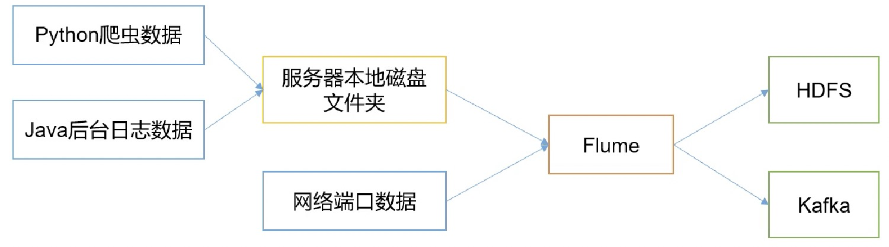
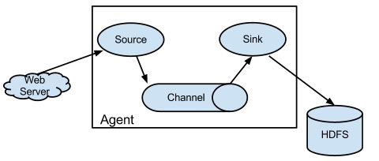

Flume：是 Cloudera 提供的高可用的，高可靠，分布式的==海量日志采集，聚合和传输的系统==。

Flume 基于流式框架，简单灵活。

Flume 最主要的作用：实时读取服务器本地磁盘的数据，将数据写入到 HDFS。

## Flume 基础架构

Agent 是 JVM 进程，它以==**事件**==形式将数据从源头传送至目的地。由一下三部分组成：

- Source：负责接收数据到 Flume Agent ：本地文件，网络端口。

- Channel：Source 和 Sink 之间的缓冲。

- Sink：不断轮询 Channel的事件并且批量删除它们，并将这些事件写入到存储系统。 比如：HDFS，Kafka。

### Source 处理各种日志：

- avro
- thrift
- exec
- spooling directory
- netcat
- jms
- sequence
- generator
- syslog
- http
- lagacy

### Sink 组件包括

- hdfs
- logger
- avro
- thrift
- ipc
- file
- Hbase
- solr
- 自定义

### Channel

Flume 自带两种 Channel：

- Memory Channel：内存队列，速度快，已丢失。
- File Channel：将所有所有事件写到磁盘，宕机数据不会丢失。

Event：Flume 数据传输的基本单元。

- Header
- Body

