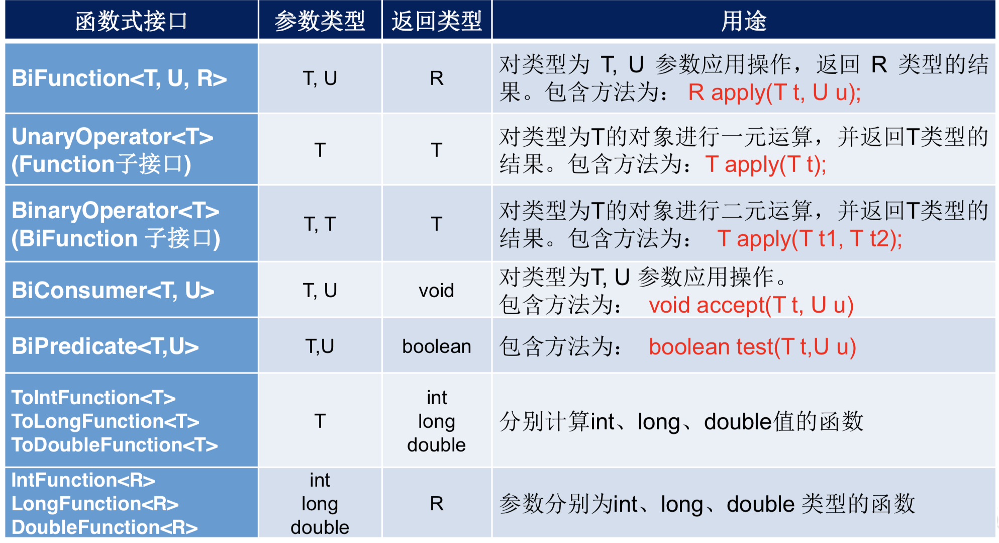

[TOC]

# 为什么要用Lambda 表达式

Lambda 是一个**匿名函数**，是一个函数式接口的实例。

优点：代码更加简洁，更加灵活。、

## Lambda VS 匿名内部类

```java
        List<Integer> list = Arrays.asList(1, 5, 2, 4, 6, 7);
        // 匿名内部类
        list.sort(new Comparator<Integer>() {
            @Override
            public int compare(Integer o1, Integer o2) {
                return o1.compareTo(o2);
            }
        });

        // Lambda
        list.sort((o1, o2) -> o1.compareTo(o2));
```

# 基础语法

1. 无参，无返回值。

() -> {  }

参数列表  -> 代码体

```java
Runnable r = () -> System.out.println("Hello word");
```

2. 一个参数，无返回值：小括号可省略

   ```java
   Consumer<String> consumer = x -> System.out.println(x);
   ```

3. 两个参数，Lambda体中多条语句

   ```java
   Comparator<Integer> com=(x,y)->{
               System.out.println("Hello comparator");
               return x.compareTo(y);
           };
   ```

4. 若Lambda体中只有一条语句，{  } 和 return 都可省略

5. 参数列表的数据类型可以省略，JVM 可以**推断出数据类型**。

Lambda 表达式需要“函数式接口”的支持。

函数式接口：接口中只有一个方法。使用 @FunctionalInterface 修饰：检查是否函数式接口。


# Java 8 四大内置核心函数式接口

```java
// 消费型接口：一个参数，无返回值
@FunctionalInterface
public interface Consumer<T> {

    /**
     * Performs this operation on the given argument.
     *
     * @param t the input argument
     */
    void accept(T t);
}

// 供给型接口：无参数，有返回值
@FunctionalInterface
public interface Supplier<T> {

    /**
     * Gets a result.
     *
     * @return a result
     */
    T get();
}

// 函数式接口：一个参数，有返回值
@FunctionalInterface
public interface Function<T, R> {

    /**
     * Applies this function to the given argument.
     *
     * @param t the function argument
     * @return the function result
     */
    R apply(T t);
}

// 断言式接口：一个参数，返回 boolean 值
@FunctionalInterface
public interface Predicate<T> {

    /**
     * Evaluates this predicate on the given argument.
     *
     * @param t the input argument
     * @return {@code true} if the input argument matches the predicate,
     * otherwise {@code false}
     */
    boolean test(T t);
}
```

```java
    @Test
    public void testConsumer() {
        happy(10000, m -> System.out.println("消费" + m));
    }

    public void happy(double money, Consumer<Double> consumer) {
        consumer.accept(money);
    }

    @Test
    public void testSupplier() {
        List<Integer> list = getNumList(10, () -> (int) (Math.random() * 100));
        System.out.println(list);
    }

    public List<Integer> getNumList(int num, Supplier<Integer> supplier) {
        List<Integer> list = new ArrayList<>();
        for (int i = 0; i < num; i++) {
            list.add(supplier.get());
        }
        return list;
    }

    @Test
    public void testFunction(){
        String newStr = strHandler("\t\t\t Hello world   ", str -> str.trim());
        System.out.println(newStr);
    }

    public String strHandler(String str, Function<String,String> fun){
        return fun.apply(str);
    }

    @Test
    public void testPredicate() {
        List<String> list = Arrays.asList("Hello", "World", "Hi");
        List<String> stringList = filterStr(list, str -> str.length() > 3);
        System.out.println(stringList);

    }

    public List<String> filterStr(List<String> list, Predicate<String> predicate) {
        List<String> strList = new ArrayList<>();
        for (String str : list) {
            if (predicate.test(str)) {
                strList.add(str);
            }
        }
        return strList;
    }
```

其他函数式接口



# 方法引用与构造器引用

## 方法引用

方法引用就是 Lambda 表达式，也是一个函数式接口的一个实例。是Lambda 表达式的一个语法糖。

要求：实现接口的方法**参数列表和返回值类型**必须抽象方法的方法一致。

方法引用形式：

- 对象 **::** 实例方法名
- 类 **::** 静态方法名
- 类 **::** 实例方法名

```java
        Consumer<String> consumer = x -> System.out.println(x);
        // 等价于
        Consumer<String> consumer2 = System.out::println;

        // 静态方法
        Comparator<Integer> com = Integer::compare;

```


```java
			 // 类 **::** 实例方法名
			// 使用场景：当函数式接口方法的第一个参数是需要引用方法的调用者，并且第二个参数是需要引用方法的参数(或无参数)时。
        BiPredicate<String, String> biPredicate = (x, y) -> x.equals(y);
        // 等价于
        BiPredicate<String, String> biPredicate2 = String::equals;
```

## 构造器引用形式

className**::**new

```java
        Person person = new Person("dyf", 1);
        Supplier<Integer> sup2 = person::getAge;
				// 无参构造器
        Supplier<Person> sup23 = Person::new;

        // 调用有参构造器
        BiFunction<String,Integer,Person> biFunction = Person::new;
```

## 数组引用

```java
Function<Integer,Integer[]> fun = (n) -> new Integer[n];
// 等价于
Function<Integer,Integer[]> fun2 = Integer[]::new;
```


使用场景：

Lambda 表达式用于：现场实现功能。

方法引用：已经有实现方法时使用。


