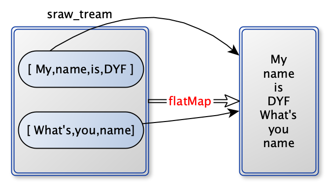
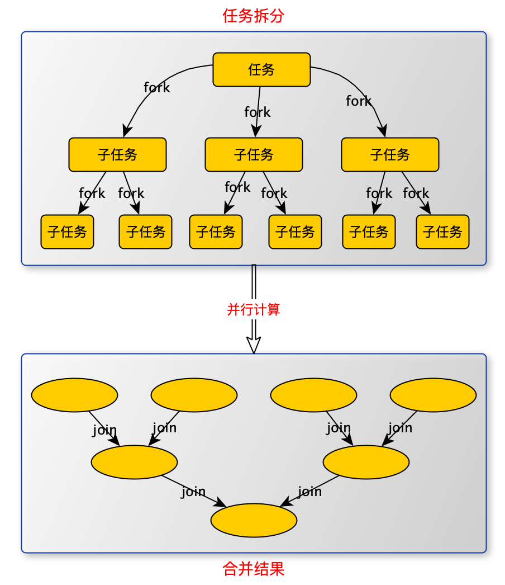
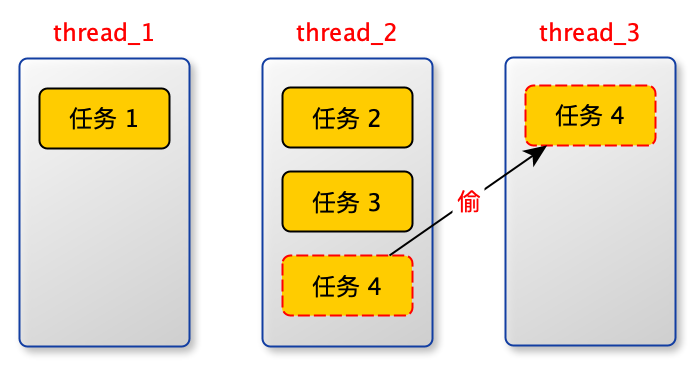

[TOC]

# 简介

stream：对数据的操作。

raw_data —stream 一系列中间操作—> new_data

1. raw_data 不变。
2. 惰性求值：只有在终止操作时，才真正运行。


# 创建 stream


## 1. 通过 Collection 系列集合提供 stream() 或者 parallelStream()

```java
List<Integer> list = Arrays.asList(1, 2, 3, 4);
list.stream();
list.parallelStream();
```

## 2. 通过 Arrays.stream() 获取数组流

```java
String[] strArray = new String[]{"a", "b", "c"};
stream = Arrays.stream(strArray);
```

## 3. 通过 Stream.of() 

```java
Stream<String> stream = Stream.of("a", "b", "c");

String[] strArray = new String[]{"a", "b", "c"};
stream = Stream.of(strArray);  

// 数值流
IntStream.of(new int[]{1, 2, 3});
IntStream.range(1, 3);
IntStream.rangeClosed(1, 3);
```

## 4. 创建无限流

### 迭代

```java
// 迭代：第一次参数初始值
Stream<Integer> stream = Stream.iterate(0, (x) -> x + 2).forEach(System.out::println);
```

### 生成

```java
// 生成
Stream.generate(() -> Math.random()).forEach(System.out::println);
```


# 中间操作

测试数据

```java
List<Person> persons = new ArrayList<>();
persons.add(new Person("name1", 10));
persons.add(new Person("name2", 21));
persons.add(new Person("name3", 34));
persons.add(new Person("name4", 6));
persons.add(new Person("name5", 55));
```

## 筛选与切片

### filter

过滤某些元素

```java
persons.stream().filter((p) -> p.getAge() > 30).forEach(System.out::println);
```

### limit

截断流

```java
 persons.stream().limit(3).forEach(System.out::println);
```

### skip(n)

跳过元素与 limit 互补

```java
persons.stream().skip(3).forEach(System.out::println);
```

### distinct

去重：通过hashCode 和 equals

```java
persons.stream().distinct().forEach(System.out::println);
```

## 映射

### map

将 lambda 表达式作用在每一个元素上，映射为一个新元素。

```java
persons.stream().map(Person::getName).forEach(System.out::println);
```

### flatMap

stream = { stream_1 = {a,a,a}, stream_2 = {b,b,b} }

flatMap 后 stream = {a,a,a,b,b,b}

类似：list.add(元素) 与 list.addAll(list)。将list 中的元素分别加入list 中。

```java
List<String> core = Arrays.asList("My name is DYF", "What's you name");
        Set<String> word = core.stream().flatMap(doc -> Stream.of(doc.trim().split(" "))).collect(Collectors.toSet());
        System.out.println(word);
```



将嵌套流拍平了。

###排序

自然排序

```java
List<Integer> list = Arrays.asList(1, 3, 5, 6, 2);
list.stream().sorted().forEach(System.out::println);
```

定制排序

```java
persons.stream().sorted((p1, p2) ->
                p1.getAge() == p2.getAge() ? p1.getName().compareTo(p2.getName()) : p1.getAge().compareTo(p2.getAge())
        ).forEach(System.out::println);
```

Map 排序

```java
map.entrySet().stream().sorted((o1, o2) -> (int) (o2.getValue() - o1.getValue()))
                .collect(Collectors.toList())
```


# 终止操作

### 查找与匹配

#### allMatch

```java
// 只要有一个不匹配，就放返回：false
boolean r = persons.stream().allMatch(p -> p.getAge() > 18);
```

#### anyMatch

```java
// 只要有一个匹配，就放返回：true
boolean r = persons.stream().allMatch(p -> p.getAge() > 18);
```

#### noneMatch

```java
// 所有都不匹配，就放返回：true
boolean r = persons.stream().allMatch(p -> p.getAge() > 18);
```

#### findFirst

```java
// 查找年龄最小的那个人。有可能找不到，所以返回 Optional
Optional<Person> first = persons.stream().sorted(Comparator.comparing(Person::getAge)).findFirst();
```

#### findAny

```java
// 返回成年中（年龄大于18）任意一个人
Optional<Person> any = persons.stream().filter(x -> x.getAge() > 18).findAny();
```

#### count

```java
long count = persons.stream().count();
```

#### max or min

```java
Optional<Person> max = persons.stream().max(Comparator.comparing(Person::getAge));
Optional<Person> min = persons.stream().min(Comparator.comparing(Person::getAge));
```

### 规约 reduce

将流中元素反复结合，得到一个值。

identity 是初始值。

accumulator：二元运算。。

```java
T reduce(T identity, BinaryOperator<T> accumulator);

// 传T 和 T 返回 T
@FunctionalInterface
public interface BinaryOperator<T> extends BiFunction<T,T,T> {

@FunctionalInterface
public interface BiFunction<T, U, R> {

    /**
     * Applies this function to the given arguments.
     *
     * @param t the first function argument
     * @param u the second function argument
     * @return the function result
     */
    R apply(T t, U u);
```

demo

运算步骤：

起始值：start = 0 作为 x，从流中取出一个值作为y，传进二元函数。

x = x + y

x 再传进二元函数。

```java
 List<Integer> list = Arrays.asList(1, 3, 5, 6, 2);
Integer sum = list.stream().reduce(0, (x, y) -> x + y);

// 这个没有起始值，有可能为空，返回 optional
Optional<Integer> reduce = list.stream().reduce(Integer::sum);
```

### 收集

```java
<R, A> R collect(Collector<? super T, A, R> collector);

// 接口
public interface Collector<T, A, R> {
  
// Collectors.toSet()
// Collectors 提供一些 Collector 接口的静态实现。
  public static <T>
    Collector<T, ?, Set<T>> toSet() {
        return new CollectorImpl<>((Supplier<Set<T>>) HashSet::new, Set::add,
                                   (left, right) -> { left.addAll(right); return left; },
                                   CH_UNORDERED_ID);
    }
```

```java
        Set<String> set = persons.stream().map(Person::getName).collect(Collectors.toSet());
        List<String> list = persons.stream().map(Person::getName).collect(Collectors.toList());
        HashSet<String> hashSet = persons.stream().map(Person::getName).collect(Collectors.toCollection(HashSet::new));
        LinkedHashSet<String> linkedHashSet = persons.stream().map(Person::getName).collect(Collectors.toCollection(LinkedHashSet::new));

        // 分组
        Map<Integer, List<Person>> group = persons.stream().collect(Collectors.groupingBy(Person::getAge));

        // 多级分组
        Map<String, Map<String, List<Person>>> collect = persons.stream().collect(Collectors.groupingBy((p) -> {
            if (p.getAge() <= 35) {
                return "青年";
            } else if (p.getAge() <= 50) {
                return "中年";
            } else {
                return "老年";
            }
        }, Collectors.groupingBy(Person::getName)));

        // 分区
        Map<Boolean, List<Person>> partition = persons.stream().collect(Collectors.partitioningBy(p -> p.getAge() > 60));

        // 总数
        Long count = persons.stream().collect(Collectors.counting());

        // 平均值
        Double mean = persons.stream().collect(Collectors.averagingDouble(Person::getAge));

        // 求和
        Integer sum = persons.stream().collect(Collectors.summingInt(Person::getAge));

        // 最大值
        Optional<Person> maxAgePerson = persons.stream().collect(Collectors.maxBy((p1, p2) -> Integer.compare(p1.getAge(), p2.getAge())));

        // 最小值
        Optional<Person> minAgePerson = persons.stream().collect(Collectors.minBy((p1, p2) -> Integer.compare(p1.getAge(), p2.getAge())));

        // 数据概要
        DoubleSummaryStatistics collect1 = persons.stream().collect(Collectors.summarizingDouble(Person::getAge));


        // 连接字符串
        String str = persons.stream().map(Person::getName).collect(Collectors.joining(",", "===", "----"));
```


```java
public class DoubleSummaryStatistics implements DoubleConsumer {
    private long count;
    private double sum;
    private double sumCompensation; // Low order bits of sum
    private double simpleSum; // Used to compute right sum for non-finite inputs
    private double min = Double.POSITIVE_INFINITY;
    private double max = Double.NEGATIVE_INFINITY;
```

# 并行流

Java 8 之前，使用 Fork / Join 框架 进行并行处理（java 7 提供）。

Fork/Join 框架：将一个大任务，拆分(Fork) 成若干个小任务，在将这些小任务运算的运算结果进行join 汇总。



Fork / Join 框架与传统线程池的区别

Fork / Join 采取“工作窃取”模式（word-stealing）：某个线程从其他队列里窃取任务来执行。



为什么要工作窃取呢？

​       假如我们需要做一个比较大的任务，我们可以把这个任务分割为若干互不依赖的子任务，为了减少线程间的竞争，于是把这些子任务分别放到不同的队列里，并为每个队列创建一个单独的线程来执行队列里的任务，线程和队列一一对应，比如A线程负责处理A队列里的任务。

​		但是有的线程会先把自己队列里的任务干完，而其他线程对应的队列里还有任务等待处理。干完活的线程与其等着，不如去帮其他线程干活，于是它就去其他线程的队列里窃取一个任务来执行。而在这时它们会访问同一个队列，所以为了减少窃取任务线程和被窃取任务线程之间的竞争，通常会使用双端队列，被窃取任务线程永远从双端队列的头部拿任务执行，而窃取任务的线程永远从双端队列的尾部拿任务执行。

优缺点：

优点：是充分利用线程进行并行计算，并减少了线程间的竞争，

缺点：在某些情况下还是存在竞争，比如双端队列里只有一个任务时，消耗了更多的系统资源，比如创建多个线程和多个双端队列。


Fork/Join 求和

```java
import java.util.concurrent.RecursiveTask;

public class ForkJoinCalculate extends RecursiveTask<Long> {

    /*
    自己写 fork 逻辑
     */
    private long start;
    private long end;

    private static final long THRESHOLD = 10000;

    public ForkJoinCalculate(long start, long end) {
        this.start = start;
        this.end = end;
    }

    @Override
    protected Long compute() {
        long length = end - start;
        // 达到临界值，开始计算任务，不在拆分子任务
        if (length <= THRESHOLD) {
            long sum = 0;
            for (long i = start; i <= end; i++) {
                sum += i;
            }
            return sum;
        } else {
            // 拆分子任务
            long middle = (start + end) / 2;
            ForkJoinCalculate left = new ForkJoinCalculate(start, middle);
            // 拆分子任务，并压入线程队列
            left.fork();

            ForkJoinCalculate right = new ForkJoinCalculate(middle + 1, end);
            right.fork();

            // 合并
            return left.join() + right.join();
        }
    }
}
```

执行

```java
    public static void main(String[] args) {
        Instant start = Instant.now();

        ForkJoinPool pool = new ForkJoinPool();
        ForkJoinTask<Long> task = new ForkJoinCalculate(0, 1000000000L);
        Long sum = pool.invoke(task);
      
        System.out.println(sum);
        System.out.println(Duration.between(start, Instant.now()).toMillis());
    }
```


java 8 并行流

```java
long sum = LongStream.rangeClosed(0, 1000000000L).parallel().reduce(0, Long::sum);
```

