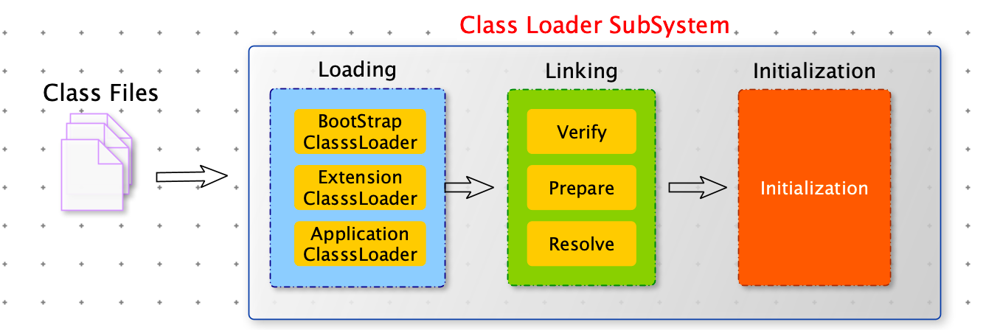
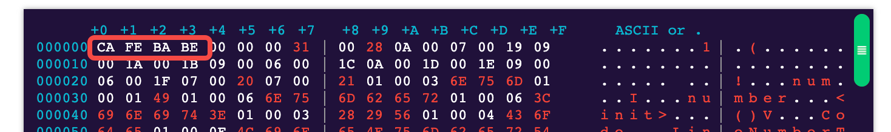

[TOC]

# 加载

1. 通过一个类的全限定名获取定义此类的二进制字节流。
2. 将这个字节流所代表的静态存储结构转化为方法区的运行时数据结构。
3. 在内存中生产一个代表这个类 java.lang.Class 对象，作为方法区这个类的各种数据的访问入口。

加在 .class 文件的方式

- 从本地系统中直接加载
- 通过网络获取，典型场景：web Applet
- 从 zip 压缩包中读取，成为日后 jar，war 格式的基础。
- 运行时计算生产，使用最多的是：动态代理技术
- 由其他文件生成，典型场景：JSP 应用
- 从专有数据库中提取 .class 文件，比较少见
- 从加密文件中获取，典型的防 Class 文件被反编译的保护措施。

# 链接

## 验证（Verify）

目的在于确保 class 文件的字节流中包含信息符合当前虚拟机要求，**保证被加载类的正确性。**

四种验证

- 文件格式验证
- 元数据验证
- 字节码验证
- 符号引用验证

cafe babe 就是字节码文件的魔术码。

## 准备（Prepare）

为类变量（静态变量）分配内存并且设置该类变量的默认初始值，即零值。

这里不包含用 final 修饰的 static 字段，因为 final 在**编译**的时候就会分配了，准备阶段会显示初始化。

这里不会为实例变量分配初始化，类变量（静态变量）会分配在方法区中，而实例变量是会随着对象一起分配到 Java 堆中。

## 解析（Resolve）

将常量池内的符号引用转换为直接引用的过程。

事实上，解析操作往往会伴随着 JVM 在执行完初始化之后再执行。

# 初始化

