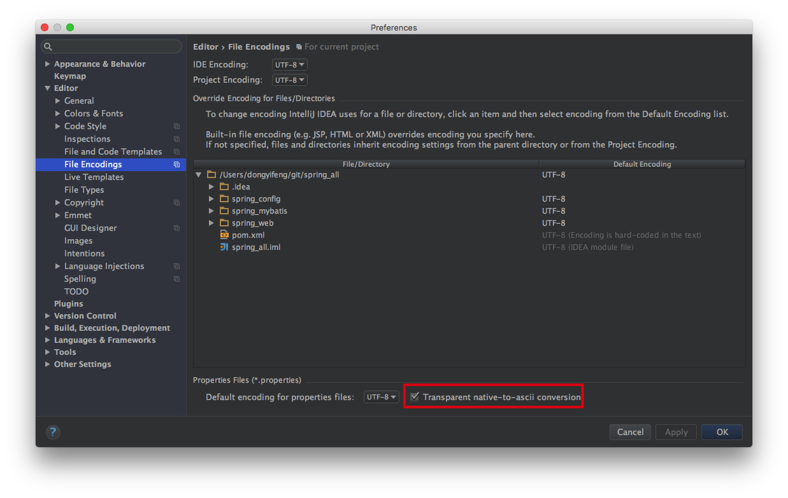

[TOC]

# 配置文件

SpringBoot 使用一个全局的配置文件，文件名固定。
- application.properties
- application.yml

配置文件作用：

修改 SpringBoot 自动配置的默认值。

# YAML 语法

YAML：以数据为中心

YAML：配置例子
```yaml
server:
    port: 8081
```

XML:

```xml
<server>
    <port>8081</port>
</server>
```

## 基本语法
k:(空格)v

表示一对键值对（空格必须有）

以**空格**的缩进来控制层级关系。

只要左对齐的一列数据，都是通一层级。

```yaml
server:
    port: 8081
    path: /hello
```

## 值的写法

### 字面量：普通的值（数字，字符串，布尔值）
k: v：字面值直接写；

字符串默认不用加上单引号或者双引号。
""：双引号；不会转义字符串里面的特殊字符；

例如：name:"zhangsan \n lisi" ；输出：zhangsan 换行 lisi

''：单引号；会转义特殊字符。
name:'zhangsan \n lisi' ；输出：zhangsan \n lisi


### 对象、Map(属性和值)（键值对）
k: v ：在下一行写对象的属性和值；注意缩进。

```yml
friends:
    lastName: zhangsan
    age: 20
```
行内写法：
```yml
friends:{ lastName: zhangsan,age: 18 }
```

### 数组（List、Set）
用 - 值：表示数组的中元素
```yaml
pets:
    - cat
    - dog
    - pig
```

行内写法
```yaml
pets:[cat,dog,pig]
```

# yaml 文件值注入

## Bean

```java
/**
 * 将配置文件中配置的每一个属性的值,映射到这个组件中
 * @ConfigurationProperties: 告诉SpringBoot将本类中的所有属性和配置文件中相关的配置进行绑定;
 * prefix = "person":配置文件中哪个下面的所有属性进行一一映射
 *
 * 只有这个组件是容器中的组件,才能容器提供的@ConfigurationProperties功能
 * @ConfigurationProperties:默认从全局文件中获取数据。
 */
@Component
@ConfigurationProperties(prefix = "person")
public class Person1 {
    private String lastName;

    private Integer age;
    private Boolean boss;
    private Date birth;

    private Map<String, Object> maps;
    private List<Object> lists;
    private Dog dog;

    public String getLastName() {
        return lastName;
    }

    public void setLastName(String lastName) {
        this.lastName = lastName;
    }

    public Integer getAge() {
        return age;
    }

    public void setAge(Integer age) {
        this.age = age;
    }

    public Boolean getBoss() {
        return boss;
    }

    public void setBoss(Boolean boss) {
        this.boss = boss;
    }

    public Date getBirth() {
        return birth;
    }

    public void setBirth(Date birth) {
        this.birth = birth;
    }

    public Map<String, Object> getMaps() {
        return maps;
    }

    public void setMaps(Map<String, Object> maps) {
        this.maps = maps;
    }

    public List<Object> getLists() {
        return lists;
    }

    public void setLists(List<Object> lists) {
        this.lists = lists;
    }

    public Dog getDog() {
        return dog;
    }

    public void setDog(Dog dog) {
        this.dog = dog;
    }

    @Override
    public String toString() {
        return "Person1{" +
                "lastName='" + lastName + '\'' +
                ", age=" + age +
                ", boss=" + boss +
                ", birth=" + birth +
                ", maps=" + maps +
                ", lists=" + lists +
                ", dog=" + dog +
                '}';
    }
}
```

## application.yml

```yml
person:
  lastName: zhangsan
  age: 18
  boss: false
  birth: 2017/12/12
  maps: {k1: 12,K2: 12}
  lists:
    - lisi
    - zhaoliu
  dog:
    name: 小狗
    age: 20
```

## properties 文件值注入

## bean

与 yaml 一样

## application.properties

```properties
# idea 中默认properties 是utf-8 编码

person.last-name=张三
person.age=18
person.boss=false
person.birth=2017/12/11
person.maps.k1=v1
person.maps.k2=14
person.lists=a,b,c
person.dog.name=dog
person.dog.age=10
```

注意：修改 File Encoding ：IDEA —> prefrences —> 搜索File Encoding



# @Value 值注入

## Bean

```java
@Component
//@ConfigurationProperties(prefix = "person")
public class Person {

    /**
     * 类似:
     * <bean class="Person">
     * <property name="lastName" value="字面值/${key}从环境变量,配置文件中获取值/#{SpEL}"></property>
     * </bean>
     */
    @Value("${person.last-name}")
    private String lastName;

    // Spring 表达式
    @Value("#{11*2}")
    private Integer age;
    // 字面值
    @Value("true")
    private Boolean boss;
```

|                 | @ConfigurationProperties | @Value     |
| --------------- | ------------------------ | ---------- |
| 功能            | 批量注入配置文件中的属性 | 一个个指定 |
| 松散绑定        | 支持                     | 不支持     |
| SpEL            | 不支持                   | 支持       |
| JSR303 数据校验 | 支持                     | 不支持     |
| 复杂类型封装    | 支持                     | 不支持     |

yml，properties，@value 可以同时使用。

==某个业务逻辑中需要配置文件中某一项值，使用 @Value==

==编写一个JavaBean 来和配置文件进行映射，使用@ConfigurationProperties==

**松散绑定**：private String lastName;  可以绑定上 person.last_name=张三

**数据校验**:

```java
@Component
@ConfigurationProperties(prefix = "person")
@Validated
public class Person1 {

    @Email
    private String lastName;
```

## 常用注解

### @ConfigurationProperties

默认从全局文件中获取数据。

### @PropertySource

执行配置文件

```java
@PropertySource(value = {"classpath:person.properties"})
@Component
@ConfigurationProperties(prefix = "person")
//@Validated
public class Person1 {

    private String lastName;
```

### @ImportResource：

导入 Spring 的配置文件，让配置文件里的内容生效。

```java
@ImportResource(locations = {"classpath:beans.xml"})
@SpringBootApplication
public class SpringConfigApplication {

    public static void main(String[] args) {
        ConfigurableApplicationContext context = SpringApplication.run(SpringConfigApplication.class, args);
```

beans.xml ( 这种方式不推荐使用 )

```xml
<?xml version="1.0" encoding="UTF-8"?>
<beans xmlns="http://www.springframework.org/schema/beans"
       xmlns:xsi="http://www.w3.org/2001/XMLSchema-instance"
       xsi:schemaLocation="http://www.springframework.org/schema/beans
                        http://www.springframework.org/schema/beans/spring-beans.xsd">

    <bean id="helloService" class="com.example.demo.service.HelloService"></bean>

</beans>
```

### @Bean

使用全注解的方式：

```java
@Configurable
public class MyAppConfig {

    // 将方法返回值,添加到容器中.
    // 实例id,就是方法名.
    @Bean
    public HelloService helloService() {
        return new HelloService();
    }
}
```

# 配置文件占位符

## 配置文件中使用随机数

- ${random.value}

- ${random.int}
- ${ random.long }
- ${ random.int(10) }
- ${ ranom.uuid }
- ${ random.int[1024,65536] }

```properties
person.last-name=张三_${random.uuid}
person.age=${random.int}
person.boss=false
person.birth=2017/12/11
person.maps.k1=v1
person.maps.k2=${person.hello:hello}_14
person.lists=a,b,c
person.dog.name=${person.last-name}_dog
person.dog.age=10
```


## 属性配置占位符

${person.hello:hello}  如果没有person.hello 字段使用默认值"hello"

${person.last-name}

# Profile

==Profile 是 Spring 支持多环境配置==。

## 多 Profile 文件

文件命名：application-{profile}.properties/yml

默认使用：application.properties/yml

在 yml 或者 properties 激活

## yml 支持多文档块

```yml
server:
  port: 8081

#激活环境
spring:
  profiles:
    active: prod
---
server:
  port: 8081
spring:
  profiles: dev
---
server:
  port: 8084
spring:
  profiles: prod
```

## 激活指定 Profile

1. 配置文件中指定。

```properties
spring.profiles.active=dev
```

2. 命令行指定环境变量。

   java -jar spring-boot-02-config-0.0.1-SNAPSHOT.jar --spring.profiles.active=dev;

   3.虚拟机参数；

   -Dspring.profiles.active=dev

#  配置文件的加载位置

Spring Boot 会扫描一下路径：

1. file:/config/

2. file:./             (当前项目根目录下 )

3. classpath:/config/

4. classpath:

**==优先级从高到低==**。

优先级高的配置会覆盖低优先级的配置。所有配置文件都会加载。**==互补配置==**。

通过 spring.config.location 改变默认配置：项目打包好后，用命令行启动时，用参数指定文件位置。指定配置文件优先级最高，和项目中其他配置文件形成互补配置。

java -jar spring-boot-02-config-0.0.1-SNAPSHOT.jar —spring.config.location=path;


# 外部配置载顺序

Spring Boot 也可以从以下位置加载配置。优先级从高到低；高优先级覆盖低优先级，形成互补配置。

1. 命令行参数：多个配置用空格分割。

   java -jar spring-boot-02-config-02-0.0.1-SNAPSHOT.jar --server.port=8087 --server.context-path=/abc

2. 来自 java:comp/env 的JNDI属性

3. Java系统属性(System.getProperties())

4. 操作系统环境变量

5. RandomValuePropertySource配置的 random.* 属性值

   有 jar 包外向 jar 包内进行寻找。 优先加载 profile

6. jar 包外部：application-{profile}.properties 或 application-{profile}.yml

7. jar 包内部：application-{profile}.properties 或 application-{profile}.yml

8. jar 包外部：application.properties 或 application.yml  (不带spring.profile)

9. jar 包内部：application.properties 或 application.yml  (不带spring.profile)

10. @Configuration 注解类上的 @PropertySource

11. 通过 SpringApplication.setDefaultProperties 指定的默认属性

[官方文档](https://docs.spring.io/spring-boot/docs/1.5.9.RELEASE/reference/htmlsingle/#boot-features-external-config)

server.context-path：配置访问路径。

**优先加载带 profile 配置文件。**

**由 jar 包外向 jar 包内。** 

# 自动配置原理

[配置文件能配置的属性](https://docs.spring.io/spring-boot/docs/1.5.9.RELEASE/reference/htmlsingle/#common-application-properties)

原理：

1. SpringBoot 启动时加载主配置类，开启自动配置配置功能：@EnableAutoConfiguration

2. @EnableAutoConfiguration 作用：利用 AutoConfigurationImportSelector.class 给容器导入一部分组件。详细查看：selectImports 内容。

   ```java
   // 获取候选的配置
   List<String> configurations = getCandidateConfigurations(annotationMetadata, attributes);
   
   
   // 扫描所有jar 包类路径下：META-INF/spring.factories
   // 将扫描到文件的内容，包装成Properties 对象
   // 从 properties 文件中获取到：EnableAutoConfiguration.class（类名）对应的值，添加在容器中。
   List<String> configurations = SpringFactoriesLoader.loadFactoryNames(getSpringFactoriesLoaderFactoryClass(),
   				getBeanClassLoader());
   
   Enumeration ex = classLoader != null?classLoader.getResources("META-INF/spring.factories"):ClassLoader.getSystemResources("META-INF/spring.factories");
   
   
   Properties properties = PropertiesLoaderUtils.loadProperties(resource);
   ```

   <!--将类路径下：META-INF/spring.factories 配置的所有：EnableAutoConfiguration 的值加入到容器中-->。

   ```properties
   # Auto Configure
   org.springframework.boot.autoconfigure.EnableAutoConfiguration=\
   org.springframework.boot.autoconfigure.admin.SpringApplicationAdminJmxAutoConfiguration,\
   org.springframework.boot.autoconfigure.aop.AopAutoConfiguration,\
   org.springframework.boot.autoconfigure.amqp.RabbitAutoConfiguration,\
   org.springframework.boot.autoconfigure.batch.BatchAutoConfiguration,\
   org.springframework.boot.autoconfigure.cache.CacheAutoConfiguration,\
   org.springframework.boot.autoconfigure.cassandra.CassandraAutoConfiguration,\
   org.springframework.boot.autoconfigure.cloud.CloudServiceConnectorsAutoConfiguration,\
   org.springframework.boot.autoconfigure.context.ConfigurationPropertiesAutoConfiguration,\
   org.springframework.boot.autoconfigure.context.MessageSourceAutoConfiguration,\
   org.springframework.boot.autoconfigure.context.PropertyPlaceholderAutoConfiguration,\
   org.springframework.boot.autoconfigure.couchbase.CouchbaseAutoConfiguration,\
   org.springframework.boot.autoconfigure.dao.PersistenceExceptionTranslationAutoConfiguration,\
   org.springframework.boot.autoconfigure.data.cassandra.CassandraDataAutoConfiguration,\
   org.springframework.boot.autoconfigure.data.cassandra.CassandraReactiveDataAutoConfiguration,\
   org.springframework.boot.autoconfigure.data.cassandra.CassandraReactiveRepositoriesAutoConfiguration,\
   org.springframework.boot.autoconfigure.data.cassandra.CassandraRepositoriesAutoConfiguration,\
   org.springframework.boot.autoconfigure.data.couchbase.CouchbaseDataAutoConfiguration,\
   org.springframework.boot.autoconfigure.data.couchbase.CouchbaseReactiveDataAutoConfiguration,\
   org.springframework.boot.autoconfigure.data.couchbase.CouchbaseReactiveRepositoriesAutoConfiguration,\
   org.springframework.boot.autoconfigure.data.couchbase.CouchbaseRepositoriesAutoConfiguration,\
   org.springframework.boot.autoconfigure.data.elasticsearch.ElasticsearchAutoConfiguration,\
   org.springframework.boot.autoconfigure.data.elasticsearch.ElasticsearchDataAutoConfiguration,\
   org.springframework.boot.autoconfigure.data.elasticsearch.ElasticsearchRepositoriesAutoConfiguration,\
   org.springframework.boot.autoconfigure.data.jdbc.JdbcRepositoriesAutoConfiguration,\
   org.springframework.boot.autoconfigure.data.jpa.JpaRepositoriesAutoConfiguration,\
   org.springframework.boot.autoconfigure.data.ldap.LdapRepositoriesAutoConfiguration,\
   org.springframework.boot.autoconfigure.data.mongo.MongoDataAutoConfiguration,\
   org.springframework.boot.autoconfigure.data.mongo.MongoReactiveDataAutoConfiguration,\
   org.springframework.boot.autoconfigure.data.mongo.MongoReactiveRepositoriesAutoConfiguration,\
   org.springframework.boot.autoconfigure.data.mongo.MongoRepositoriesAutoConfiguration,\
   org.springframework.boot.autoconfigure.data.neo4j.Neo4jDataAutoConfiguration,\
   org.springframework.boot.autoconfigure.data.neo4j.Neo4jRepositoriesAutoConfiguration,\
   org.springframework.boot.autoconfigure.data.solr.SolrRepositoriesAutoConfiguration,\
   org.springframework.boot.autoconfigure.data.redis.RedisAutoConfiguration,\
   org.springframework.boot.autoconfigure.data.redis.RedisReactiveAutoConfiguration,\
   org.springframework.boot.autoconfigure.data.redis.RedisRepositoriesAutoConfiguration,\
   org.springframework.boot.autoconfigure.data.rest.RepositoryRestMvcAutoConfiguration,\
   org.springframework.boot.autoconfigure.data.web.SpringDataWebAutoConfiguration,\
   org.springframework.boot.autoconfigure.elasticsearch.jest.JestAutoConfiguration,\
   org.springframework.boot.autoconfigure.elasticsearch.rest.RestClientAutoConfiguration,\
   org.springframework.boot.autoconfigure.flyway.FlywayAutoConfiguration,\
   org.springframework.boot.autoconfigure.freemarker.FreeMarkerAutoConfiguration,\
   org.springframework.boot.autoconfigure.gson.GsonAutoConfiguration,\
   org.springframework.boot.autoconfigure.h2.H2ConsoleAutoConfiguration,\
   org.springframework.boot.autoconfigure.hateoas.HypermediaAutoConfiguration,\
   org.springframework.boot.autoconfigure.hazelcast.HazelcastAutoConfiguration,\
   org.springframework.boot.autoconfigure.hazelcast.HazelcastJpaDependencyAutoConfiguration,\
   org.springframework.boot.autoconfigure.http.HttpMessageConvertersAutoConfiguration,\
   org.springframework.boot.autoconfigure.http.codec.CodecsAutoConfiguration,\
   org.springframework.boot.autoconfigure.influx.InfluxDbAutoConfiguration,\
   org.springframework.boot.autoconfigure.info.ProjectInfoAutoConfiguration,\
   org.springframework.boot.autoconfigure.integration.IntegrationAutoConfiguration,\
   org.springframework.boot.autoconfigure.jackson.JacksonAutoConfiguration,\
   org.springframework.boot.autoconfigure.jdbc.DataSourceAutoConfiguration,\
   org.springframework.boot.autoconfigure.jdbc.JdbcTemplateAutoConfiguration,\
   org.springframework.boot.autoconfigure.jdbc.JndiDataSourceAutoConfiguration,\
   org.springframework.boot.autoconfigure.jdbc.XADataSourceAutoConfiguration,\
   org.springframework.boot.autoconfigure.jdbc.DataSourceTransactionManagerAutoConfiguration,\
   org.springframework.boot.autoconfigure.jms.JmsAutoConfiguration,\
   org.springframework.boot.autoconfigure.jmx.JmxAutoConfiguration,\
   org.springframework.boot.autoconfigure.jms.JndiConnectionFactoryAutoConfiguration,\
   org.springframework.boot.autoconfigure.jms.activemq.ActiveMQAutoConfiguration,\
   org.springframework.boot.autoconfigure.jms.artemis.ArtemisAutoConfiguration,\
   org.springframework.boot.autoconfigure.groovy.template.GroovyTemplateAutoConfiguration,\
   org.springframework.boot.autoconfigure.jersey.JerseyAutoConfiguration,\
   org.springframework.boot.autoconfigure.jooq.JooqAutoConfiguration,\
   org.springframework.boot.autoconfigure.jsonb.JsonbAutoConfiguration,\
   org.springframework.boot.autoconfigure.kafka.KafkaAutoConfiguration,\
   org.springframework.boot.autoconfigure.ldap.embedded.EmbeddedLdapAutoConfiguration,\
   org.springframework.boot.autoconfigure.ldap.LdapAutoConfiguration,\
   org.springframework.boot.autoconfigure.liquibase.LiquibaseAutoConfiguration,\
   org.springframework.boot.autoconfigure.mail.MailSenderAutoConfiguration,\
   org.springframework.boot.autoconfigure.mail.MailSenderValidatorAutoConfiguration,\
   org.springframework.boot.autoconfigure.mongo.embedded.EmbeddedMongoAutoConfiguration,\
   org.springframework.boot.autoconfigure.mongo.MongoAutoConfiguration,\
   org.springframework.boot.autoconfigure.mongo.MongoReactiveAutoConfiguration,\
   org.springframework.boot.autoconfigure.mustache.MustacheAutoConfiguration,\
   org.springframework.boot.autoconfigure.orm.jpa.HibernateJpaAutoConfiguration,\
   org.springframework.boot.autoconfigure.quartz.QuartzAutoConfiguration,\
   org.springframework.boot.autoconfigure.reactor.core.ReactorCoreAutoConfiguration,\
   org.springframework.boot.autoconfigure.security.servlet.SecurityAutoConfiguration,\
   org.springframework.boot.autoconfigure.security.servlet.SecurityRequestMatcherProviderAutoConfiguration,\
   org.springframework.boot.autoconfigure.security.servlet.UserDetailsServiceAutoConfiguration,\
   org.springframework.boot.autoconfigure.security.servlet.SecurityFilterAutoConfiguration,\
   org.springframework.boot.autoconfigure.security.reactive.ReactiveSecurityAutoConfiguration,\
   org.springframework.boot.autoconfigure.security.reactive.ReactiveUserDetailsServiceAutoConfiguration,\
   org.springframework.boot.autoconfigure.sendgrid.SendGridAutoConfiguration,\
   org.springframework.boot.autoconfigure.session.SessionAutoConfiguration,\
   org.springframework.boot.autoconfigure.security.oauth2.client.servlet.OAuth2ClientAutoConfiguration,\
   org.springframework.boot.autoconfigure.security.oauth2.client.reactive.ReactiveOAuth2ClientAutoConfiguration,\
   org.springframework.boot.autoconfigure.security.oauth2.resource.servlet.OAuth2ResourceServerAutoConfiguration,\
   org.springframework.boot.autoconfigure.security.oauth2.resource.reactive.ReactiveOAuth2ResourceServerAutoConfiguration,\
   org.springframework.boot.autoconfigure.solr.SolrAutoConfiguration,\
   org.springframework.boot.autoconfigure.task.TaskExecutionAutoConfiguration,\
   org.springframework.boot.autoconfigure.task.TaskSchedulingAutoConfiguration,\
   org.springframework.boot.autoconfigure.thymeleaf.ThymeleafAutoConfiguration,\
   org.springframework.boot.autoconfigure.transaction.TransactionAutoConfiguration,\
   org.springframework.boot.autoconfigure.transaction.jta.JtaAutoConfiguration,\
   org.springframework.boot.autoconfigure.validation.ValidationAutoConfiguration,\
   org.springframework.boot.autoconfigure.web.client.RestTemplateAutoConfiguration,\
   org.springframework.boot.autoconfigure.web.embedded.EmbeddedWebServerFactoryCustomizerAutoConfiguration,\
   org.springframework.boot.autoconfigure.web.reactive.HttpHandlerAutoConfiguration,\
   org.springframework.boot.autoconfigure.web.reactive.ReactiveWebServerFactoryAutoConfiguration,\
   org.springframework.boot.autoconfigure.web.reactive.WebFluxAutoConfiguration,\
   org.springframework.boot.autoconfigure.web.reactive.error.ErrorWebFluxAutoConfiguration,\
   org.springframework.boot.autoconfigure.web.reactive.function.client.ClientHttpConnectorAutoConfiguration,\
   org.springframework.boot.autoconfigure.web.reactive.function.client.WebClientAutoConfiguration,\
   org.springframework.boot.autoconfigure.web.servlet.DispatcherServletAutoConfiguration,\
   org.springframework.boot.autoconfigure.web.servlet.ServletWebServerFactoryAutoConfiguration,\
   org.springframework.boot.autoconfigure.web.servlet.error.ErrorMvcAutoConfiguration,\
   org.springframework.boot.autoconfigure.web.servlet.HttpEncodingAutoConfiguration,\
   org.springframework.boot.autoconfigure.web.servlet.MultipartAutoConfiguration,\
   org.springframework.boot.autoconfigure.web.servlet.WebMvcAutoConfiguration,\
   org.springframework.boot.autoconfigure.websocket.reactive.WebSocketReactiveAutoConfiguration,\
   org.springframework.boot.autoconfigure.websocket.servlet.WebSocketServletAutoConfiguration,\
   org.springframework.boot.autoconfigure.websocket.servlet.WebSocketMessagingAutoConfiguration,\
   org.springframework.boot.autoconfigure.webservices.WebServicesAutoConfiguration,\
   org.springframework.boot.autoconfigure.webservices.client.WebServiceTemplateAutoConfiguration
   ```

   每一个这样的 xxxAutoConfiguration 类都是容器中一个组件；用他们来做自动配置。

3. 每一个自动配置类进行自动配置功能。

4. 以 HttpEncodingAutoConfiguration ( **Http编码自动配置** ) 为例解释自动配置原理。

   ```java
   @Configuration  // 这是一个配置类，可以给容器中添加组件
   @EnableConfigurationProperties(HttpProperties.class)  // 启动EnableConfigurationProperties 功能。将配置文件中对应的值和 HttpEncodingProperties 绑定起来;并把HttpEncodingProperties加入到ioc容器中
   @ConditionalOnWebApplication(type = ConditionalOnWebApplication.Type.SERVLET) //Spring底层@Conditional注解(Spring注解版),根据不同的条件,如果满足指定的条件,整个配置类里面的配置就会生效; 判断当前应用是否是web应用,如果是,当前配置类生效
   @ConditionalOnClass(CharacterEncodingFilter.class)  // 判断当前项目有没有这个类CharacterEncodingFilter;SpringMVC 中进行乱码解决的过滤器;
   @ConditionalOnProperty(prefix = "spring.http.encoding", value = "enabled",
         matchIfMissing = true)
   // 判断配置文件中是否存在某个配置 spring.http.encoding.enabled;如果不存在,判断也是成立的
   // 即使我们配置文件中不配置 pring.http.encoding.enabled=true,也是默认生效的;
   public class HttpEncodingAutoConfiguration {
     // 他已经和 SpringBoot 的配置文件映射了。
     private final HttpProperties.Encoding properties;
     
     // 只有一个有参构造器的情况下，参数的值就会从容器中拿。
     public HttpEncodingAutoConfiguration(HttpProperties properties) {
   		this.properties = properties.getEncoding();
   	}
   
   	@Bean  // 给容器中添加一个组件，组件的值从 properties 中获取。
   	@ConditionalOnMissingBean   // 判断容器没有这个组件。
   	public CharacterEncodingFilter characterEncodingFilter() {
   		CharacterEncodingFilter filter = new OrderedCharacterEncodingFilter();
   		filter.setEncoding(this.properties.getCharset().name());
   		filter.setForceRequestEncoding(this.properties.shouldForce(Type.REQUEST));
   		filter.setForceResponseEncoding(this.properties.shouldForce(Type.RESPONSE));
   		return filter;
   	}
     
   ```

   

5. 所有在配置文件中能配置的属性都是在xxxxProperties类中封装者‘;配置文件能配置什么就可以参照某个功
   能对应的这个属性类

```java
@ConfigurationProperties(prefix = "spring.http")//从配置文件中获取指定的值和bean的属 性进行绑定
public class HttpProperties {
```

