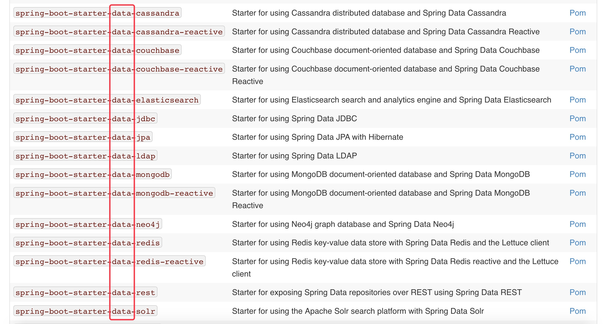
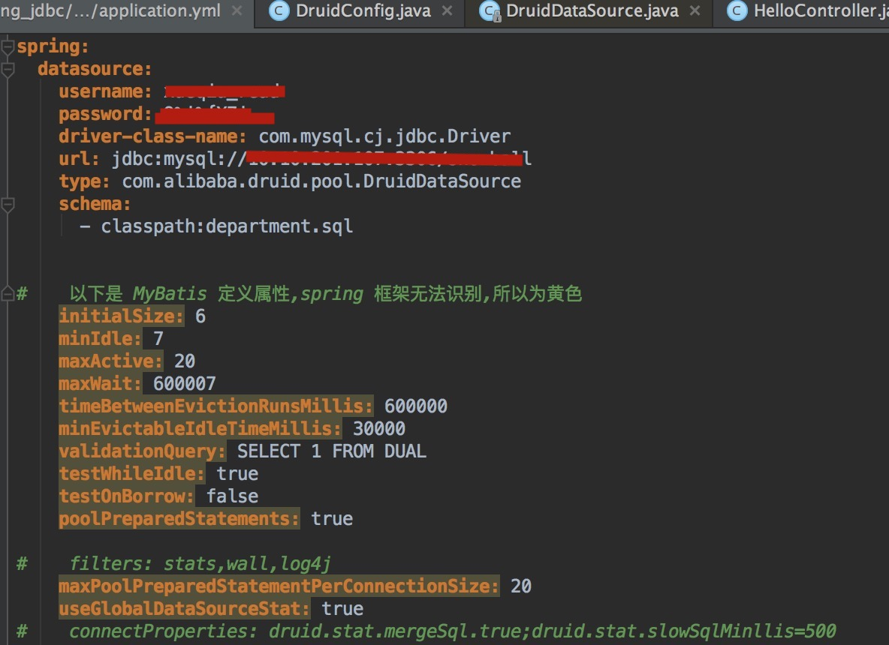

对于数据访问层，无论是SQL还是 NoSQL，Spring Boot 默认采用整合 ==Spring Data== 的方式进行统一处理，添加了大量的自动配置，屏蔽了很多设置。引入各种 xxxTemplate 和 xxxRepository 简化我们对数据访问层的操作。



[spring boot starter](https://docs.spring.io/spring-boot/docs/2.1.6.RELEASE/reference/html/using-boot-build-systems.html#using-boot-starter)


# 整合 JDBC

依赖

```xml
<dependencies>
    <dependency>
        <groupId>mysql</groupId>
        <artifactId>mysql-connector-java</artifactId>
        <scope>runtime</scope>
    </dependency>
</dependencies>
```


```yaml
spring:
  datasource:
    username: admin
<<<<<<< HEAD
    password: admin
    driver-class-name: com.mysql.cj.jdbc.Driver
    url: jdbc:mysql://10.10.201.107:3306/test
=======
    password: 123456
    driver-class-name: com.mysql.cj.jdbc.Driver
    url: jdbc:mysql://127.0.0.1:3306/user_center
>>>>>>> 5b8953e2791b5802020629a326b671272147e79c
```

默认是用 class com.zaxxer.hikari.HikariDataSource 作为数据源;
数据源的相关配置都在 DataSourceProperties 里面;

### 自动配置原理: 

org.springframework.boot.autoconfigure.jdbc: 

1、参考 DataSourceConfiguration ,根据配置创建数据源,默认使用Tomcat连接池;可以使用spring.datasource.type指定自定义的数据源类型; 

2、SpringBoot 默认可以支持;

 	1. org.apache.tomcat.jdbc.pool.DataSource、
 	2. HikariDataSource、
 	3. BasicDataSource、

3、自定义数据源类型( spring 中代码 )：我们在 spring.datasource.type：指定自己数据源：type: com.alibaba.druid.pool.DruidDataSource

```java
  	/**
	 * Generic DataSource configuration.
	 */
	@Configuration
	@ConditionalOnMissingBean(DataSource.class)
	@ConditionalOnProperty(name = "spring.datasource.type")
	static class Generic {

		@Bean
		public DataSource dataSource(DataSourceProperties properties) {
      // 使用 DataSourceBuilder 创建数据源，利用反射创建响应 type 的数据域，并且绑定相关属性。
			return properties.initializeDataSourceBuilder().build();
		}

	}

// build 代码：利用反射构建自定义数据源：BeanUtils.instantiateClass
   public T build() {
        Class type = this.getType();
        DataSource result = (DataSource)BeanUtils.instantiateClass(type);
        this.maybeGetDriverClassName();
        this.bind(result);
        return result;
    }

```

4、**DataSourceInitializer：ApplicationListener**

作用：

1)、runSchemaScripts(); 运行建表语句;
2)、runDataScripts(); 运行插入数据的sql语句;

默认只需要将文件命名为：

```properties
schema-*.sql、data-*.sql
默认规则：schema.sql,schema-all.sql

可以使用(自定义 sql 文件)
spring:
  datasource:
    schema:
      - classpath:department.sql
```

5、操作数据库:自动配置了 JdbcTemplate 操作数据库

```java
@RestController
public class HelloController {
    @Autowired
    JdbcTemplate jdbcTemplate;

    @GetMapping("hello")
    private List<Map<String, Object>> map() {
        return jdbcTemplate.queryForList("select * from t_search_sugg limit 10");
    }
}
```


# 整合 Druid 数据源

依赖：

```xml
<dependency>
   <groupId>com.alibaba</groupId>
   <artifactId>druid</artifactId>
   <version>1.1.17</version>
</dependency>
```




这些 druid 定义的属性，spring 框架无法识别。需要手动配置。

```java
@Configuration
public class DruidConfig {

    @ConfigurationProperties(prefix = "spring.datasource")
    @Bean
    public DataSource druid() {
        return new DruidDataSource();
    }
  
      // 配置 Druid 的监控
    // 1. 配置一个管理后台的 Servlet
    @Bean
    public ServletRegistrationBean statViewServlet() {
        ServletRegistrationBean<StatViewServlet> bean = new ServletRegistrationBean<>(new StatViewServlet(), "/druid/*");
        Map<String, String> initParams = new HashMap<>();

        initParams.put("loginUsername", "admin");
        initParams.put("loginPassword", "admin");
        initParams.put("allow", "");// 默认允许所有访问
        // 拒绝访问
        initParams.put("deny", "192.168.15.21");
        bean.setInitParameters(initParams);
        return bean;
    }


    // 2.配置一个web 监控的 filter
    @Bean
    public FilterRegistrationBean webStatFilter() {
        FilterRegistrationBean bean = new FilterRegistrationBean();
        bean.setFilter(new WebStatFilter());


        Map<String, String> initParams = new HashMap<>();
        initParams.put("exclusions", "*.js,*.css,/druid/*");

        bean.setInitParameters(initParams);
        bean.setUrlPatterns(Arrays.asList("/*"));
        return bean;
    }
}
```

监控后台：http://127.0.0.1:8080/druid/sql.html