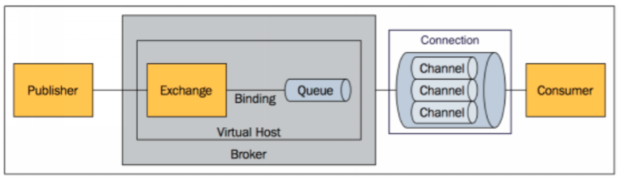
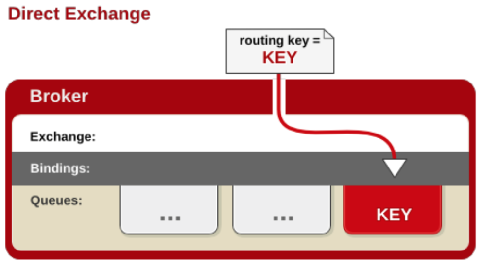
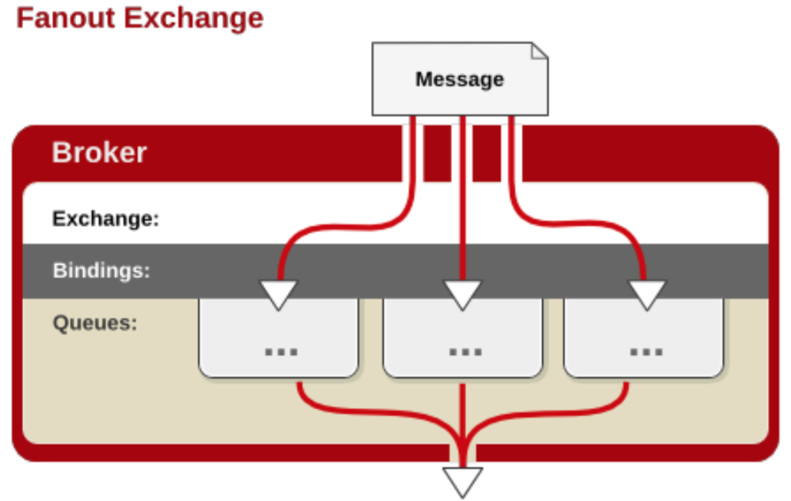
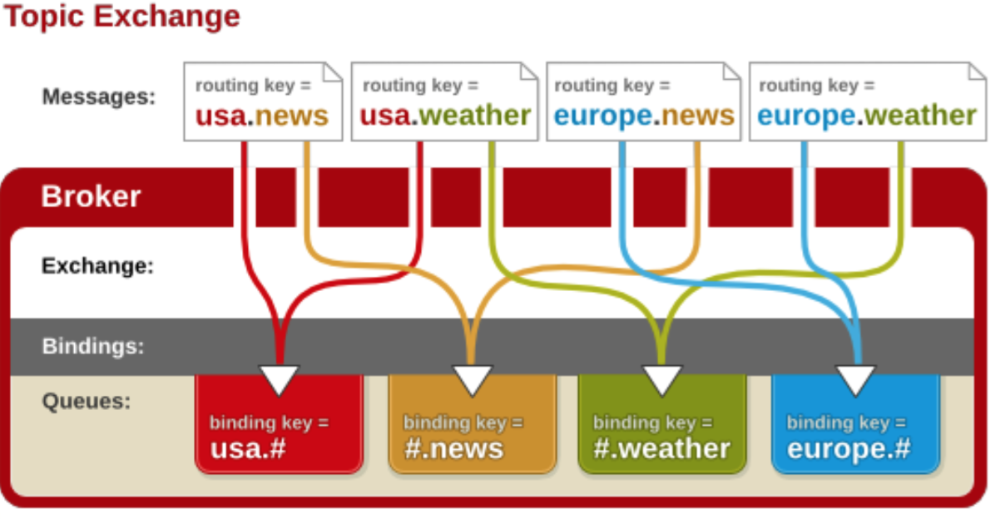

[TOC]

# JMS & AMQP 简介

## 概述

消息中间件作用：

1. 提升系统异步通信。
2. 扩展解耦能力。
3. 流量消峰。


消息队列两种订阅方式：

1. 队列（queue）：点对点消息通信（ point-to-point ）。
2. 主题（topic）：发布（publish）/ 订阅（subscribe）消息通信。


**点对点：消息不能重复消费**。消息只有唯一的发送者和接受者，消费一旦被消费就被删除。

**发布订阅**：多个订阅者同时收到消息。


**JMS（Java Message Service）Java消息服务**

基于 JVM 消息代理的规范。ActiveMQ，HornetMQ 是JMS 实现。

**AMQP（Advanced Message Queuing Protocol）**

高级消息队列协议。兼容JMS。RabbitMQ 是AMQP 的实现。

## JMS VS AMQP

|              | JMS                                                          | AMQP                                                         |
| ------------ | ------------------------------------------------------------ | ------------------------------------------------------------ |
| 定义         | Java api                                                     | 网络线级协议                                                 |
| 跨语言       | 否                                                           | 是                                                           |
| 跨平台       | 否                                                           | 是                                                           |
| Model        | 提供两种消息模型:<br>1. Peer-2-Peer<br> 2. Pub/sub           | 提供五种消息模型:<br>1. direct exchange ：点对点<br>2. fanout exchange <br>3. topic exchange <br>4. header exchange <br>5. system exchange<br>本质上，2，3，4，5与JMS pub/sub 没有太大差别。仅是在路由机制上划分更详细。 |
| 支持消息类型 | 多种消息类型：<br> TextMessage <br>MapMessage<br>BytesMessage<br>StreamMessage<br>ObjectMessage<br>Message(只有消息头和属性) | byte[]<br>将消息序列化后发送。由于跨平台，所以以byte[] 传送。 |
| 综合评价     | JMS 定义了Java API 层面的标准。其跨平台的支持较差            | AMQP 定义了wire-level 层的协议标准。天然具有跨平台，跨语言特性。 |


## Spring 支持

- spring-jms 提供对 JMS 的支持。
- spring-rabbit 提供对AMQP的支持。
- ConnectionFactory 实现连接消息代理。
- 提供 JmsTemplate，RabbitTemplate 来发送消息。
- @JmsListener（JMS），@RabbitListener(AMQP) 注解在方法监听消息代理发布的消息。
- @EnableJms，@EnbaleRabbit 开启支持。

## Spring Boot 自动配置

- JmsAutoConfiguration
- RabbitAutoConfiguration

# RabbitMQ 基本概念简介

RabbitMQ 由 erlang 开发的 AMQP 的开源实现。==稳定性，可靠性比较高==。

## 核心概念

### Message

消息：消息头 + 消息体。

消息头：routing-key（路由键），priority（优先级），delivery-mode（持久性存储）等。

### Publisher

消息生成者

### Exchange

交换器，用来**==接收==**生产者发送的消息并将这些消息**==路由==**给服务器中的队列。

Exchange 类型：

1. direct（默认）：完全匹配，单播模式。

2. fanout：广播模式：每台自网内的主机都获得一份复制消息。

3. topic：交换器通过模式匹配分配消息的路由键属性。

   识别两个通配符：

   - “#”：匹配 0 个或者多个单词。
   - “*”： 匹配一个单词。

4. headers：匹配 AMQP 消息的 header而不是路由键（几乎用不到）。

### Queue

消息队列：消息的容器。保存消息直到被消费。

### Binding

绑定：用于消息队列和交换器之间的关联。

一个绑定就是基于路由键将交换器和消息队列连接起来的路由规则,所以可以将交换器理解成一个由绑定构成的路由表。

Exchange 和 Queue的绑定可以是多对多的关系。 

### Conection

网络连接。

### Channel

信道：**多路复用** 连接中的一条独立的双向数据流通道。

信道是建立在真实的 TCP 连接内的虚拟连接, AMQP 命令都是通过信道发出去的,不管是发布消息、订阅队列还是接收消息,这些动作都是通过信道完成。因为对于操作系统来说建立和销毁 TCP 都是非常昂贵的开销,所以引入了信道的概念,以复用一条 TCP 连接。

### Consumer

消息的消费者。

### Virtual Host

虚拟主机,表示一批交换器、消息队列和相关对象。虚拟主机是共享相同的身份认证和加密环境的独立服务器域。**每个 vhost 本质上就是一个 mini 版的 RabbitMQ** 服务器,拥有自己的队列、交换器、绑定和权限机制。vhost 是 AMQP 概念的基础,必须在连接时指定RabbitMQ 默认的 vhost 是 / 。

### Broker

表示消息队列**服务器**实体


# RabbitMQ 运行机制

AMQP 对比 JMS 多了 ==Exchange 和 Binding== 的角色。



Exchange 很多消息队列绑定。

Exchange 根据消息的路由键（key），决定消息分发给哪个队列。

消费者连接上队列，进行消费了。

==核心就是交换器和绑定规则。交换器不同，绑定规则不同，那么消费分发的规则就不同==。


## Direct Exchange：

消息中的路由键(routing key)如果和 Binding 中的 binding key 一致, 交换器就将消息发到对应的队列中。




## Fanout Exchange

fanout 交换器不处理路由键, 只是简单的将队列绑定到交换器上,每个发送 到交换器的消息都会被转发到与该交换器绑定的所有队列上 。

发送速度最快。



## Topic Exchange

topic 交换器通过==模式匹配分配==消息的路由键属性,将路由键和某个模式进行匹配,此时队列需要绑定到一个模式上。

- “#”：匹配 0 个或者多个单词。
- “*”： 匹配一个单词。




# RabbitMQ 安装测试


# RabbitMQ 整合

步骤：

1. 引入 spring-boot-starter-amqp
2. application.yml 配置
3. 测试 RabbitMQ
   1. AmqpAdmin：管理组件
   2. RabbitTempate：消息发送处理组件


RabbitMQ 的自动配置：

通过 RabbitAutoConfiguration 进行自动配置。

1. rabbitConnectFactory()  加载配置文件：RabbitProperties

   ```java
   @ConfigurationProperties(prefix = "spring.rabbitmq")
   public class RabbitProperties {
   
      /**
       * RabbitMQ host.
       */
      private String host = "localhost";
   
      /**
       * RabbitMQ port.
       */
      private int port = 5672;
   
      /**
       * Login user to authenticate to the broker.
       */
      private String username = "guest";
      
     // 默认值是 "/"
      public void setVirtualHost(String virtualHost) {
   		this.virtualHost = "".equals(virtualHost) ? "/" : virtualHost;
   	}
   
   ```

    

   2. RabbitAutoConfiguration 初始了：RabbitTemplate：发送，接受消息，类似 MySQL 的 JDBCTemplate。
   3. RabbitAutoConfiguration 初始了：AmqpAdmin：RabbitMQ 的系统管理组件：声明一个队列，创建一个交换器等。
   4. 

   2. R

2. c

## AmqpAdmin 管理组件是使用

AmqpAdmin：创建和删除 Queue，Exchange，Binding

```java
@Autowired
AmqpAdmin amqpAdmin;

@Test
public void createExchange() {
    amqpAdmin.declareExchange(new DirectExchange("exchange.direct"));

    // 创建队列
    amqpAdmin.declareQueue(new Queue("amqpAdmin.queue", true));

    // 将队列和exchange 绑定起来
    amqpAdmin.declareBinding(new Binding("amqpAdmin.queue", Binding.DestinationType.QUEUE, "atguigu.news", "atguigu.news", null));

}

@Test
public void deleteExchange() {
    amqpAdmin.deleteExchange("exchange.direct");

    // 创建队列
    amqpAdmin.deleteQueue("amqpAdmin.queue");

    // 将队列和exchange 绑定起来
    amqpAdmin.removeBinding(new Binding("amqpAdmin.queue", Binding.DestinationType.QUEUE, "atguigu.news", "atguigu.news", null));

}
```


## RabbitTemplate 发送接受消息


```java
@RunWith(SpringRunner.class)
@SpringBootTest
public class SpringRabbitMqApplicationTests {

    @Autowired
    RabbitTemplate rabbitTemplate;

    /**
     * 发送消息
     * 单播(点对点)
     */
    @Test
    public void contextLoads() {
//     Message:需要自己构造;可以自定义消息体和消息头
//        rabbitTemplate.send(exchange, routeKey, message);

//        只需要传入消息体内容,自动序列化发送给 rabbitmq
//        rabbitTemplate.convertAndSend(exchange,routeKey,object);


        Map<String, Object> map = new HashMap<>();
        map.put("msg", "Hello world!");
        map.put("data", Arrays.asList("Hello dyf", 123, true));

        // 对象被默认序列化后,发送出去.
        rabbitTemplate.convertAndSend("exchange.direct", "atguigu.news", map);
    }


    /**
     * 接受消息
     * 如何将数据自动序列化为Json 格式.
     */
    @Test
    public void receive() {
        Object object = rabbitTemplate.receiveAndConvert("atguigu.news");
        System.out.println(object.getClass());
        System.out.print(object);
    }

    /**
     * 广播
     * 如何将数据自动序列化为Json 格式.
     */
    @Test
    public void sendMsg() {
        Map<String, Object> map = new HashMap<>();
        map.put("msg", "Hello world!");
        map.put("data", Arrays.asList("Hello dyf", 123, true));
        // 广播不需要指定:routingKey
        rabbitTemplate.convertAndSend("exchange.fanout", "", map);
    }

}
```

topic 的发送只需要指定对应exchange 和 routeKey 就可以了。


RabbitTemplate 默认使用 SimpleMessageConverter() 序列化数据。

```java
private MessageConverter messageConverter = new SimpleMessageConverter();

// SimpleMessageConverter.fromMessage

	@Override
	public Object fromMessage(Message message) throws MessageConversionException {
		Object content = null;
		MessageProperties properties = message.getMessageProperties();
		if (properties != null) {
			String contentType = properties.getContentType();
			if (contentType != null && contentType.startsWith("text")) {
				String encoding = properties.getContentEncoding();
				if (encoding == null) {
					encoding = this.defaultCharset;
				}
				try {
					content = new String(message.getBody(), encoding);
				}
				catch (UnsupportedEncodingException e) {
					throw new MessageConversionException(
							"failed to convert text-based Message content", e);
				}
			}
			else if (contentType != null &&
					contentType.equals(MessageProperties.CONTENT_TYPE_SERIALIZED_OBJECT)) {
				try {
					content = SerializationUtils.deserialize(
							createObjectInputStream(new ByteArrayInputStream(message.getBody()), this.codebaseUrl));
				}
				catch (IOException | IllegalArgumentException | IllegalStateException e) {
					throw new MessageConversionException(
							"failed to convert serialized Message content", e);
				}
			}
		}
		if (content == null) {
			content = message.getBody();
		}
		return content;
	}
```

如果要序列化为Json 格式传输：需要更改 MessageConvert

```java
@Configuration
public class MyQMOPQPConfig {

    @Bean
    public MessageConverter messageConverter() {
        return new Jackson2JsonMessageConverter();
    }

}
```

## @RabbitListener & @EnableRabbit

消费者要实时监听消息队列。

```java
/**
 * 自动配置
 */
@EnableRabbit   // 开启基于注释的 RabbitMQ 模式
@SpringBootApplication
public class SpringRabbitMqApplication {

    public static void main(String[] args) {
        SpringApplication.run(SpringRabbitMqApplication.class, args);
    }
}

@Service
public class BookService {

    @RabbitListener(queues = "atguigu.news")
    public void receive(Book book) {
        System.out.println(book);
    }
  
      // 获取消息头信息
    @RabbitListener(queues = "atguigu.news")
    public void receive02(Message message) {
        System.out.println(message.getBody());
        System.out.println(message.getMessageProperties());
    }
}
```