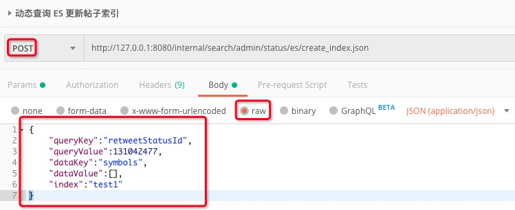

[TOC]

Http 接口提交 Json 数据，比如操作 ES 

接口定义：

```java
@RequestMapping(value = "status/es/create_index.json", method = {RequestMethod.POST}, produces = "application/json;charset=UTF-8")
@ResponseBody
public Object createTask(@RequestBody String request) {
    StatusCreateDto statusCreateDto = JSON.parseObject(request, StatusCreateDto.class);
    if (StringUtils.isBlank(statusCreateDto.getQueryKey())
            || StringUtils.isBlank(statusCreateDto.getQueryValue())
            || StringUtils.isBlank(statusCreateDto.getDataKey())
            || StringUtils.isBlank(statusCreateDto.getDataValue())
            || StringUtils.isBlank(statusCreateDto.getIndex())) {
        return "参数错误";
    }
    statusCreateDto.setIndexCreateEnum(StatusIndexCreateEnum.ES);
    statusIndexService.createIndexToRedis(statusCreateDto);
    return "OK";
}
```

调用：

