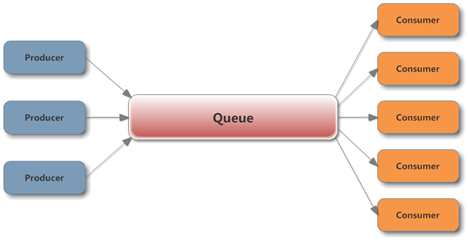
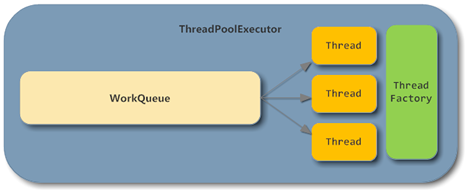

[TOC]

# 场景：支持生产阻塞的线程池

在实际工作中，使用消息队列平衡生产者和消费者速度不平衡的问题。

生产者-消费者模型



<font color=red>注意：如果 Queue 必须设置初始容量，防止生产者过快导致队列长度暴涨，最终触发 OutOfMemory</font>


如果使用有界 Queue ，当队列满时，必须有一个丢弃策略。线程池自带的拒绝策略，这里就不说了。生产中不希望丢弃任何任务。

更好的做法是：把生产者阻塞在提交任务的方法上，待队列未满时再继续提交任务。

阻塞使用：BlockingQueue。ArrayBlockingQueue和 LinkedBlockingQueue在构造时都可以提供容量做限制，其中LinkedBlockingQueue是在实际操作队列时在每次拿到锁以后判断容量。


ThreadPoolExecutor 的基本结构



在ThreadPoolExecutor中，BlockingQueue和Consumer部分已经帮我们实现好了，并且直接采用线程池的实现还有很多优势，例如线程数的动态调整等。

问题：ThreadPoolExecutor时手动指定了一个BlockingQueue作为队列实现，事实上当队列满时，execute方法并不会阻塞，原因在于ThreadPoolExecutor调用的是BlockingQueue非阻塞的offer方法：

 

思路：最简单的做法，我们可以直接定义一个RejectedExecutionHandler，当队列满时改为调用 BlockingQueue.put 来实现生产者的阻塞。队列满时，再 submmit 时就会触发拒绝策略，在拒绝策略中 BlockingQueue.put 会阻塞主线程。

```java
new RejectedExecutionHandler() {
    @Override
    public void rejectedExecution(Runnable r, ThreadPoolExecutor executor) {
        if (!executor.isShutdown()) {
            try {
                executor.getQueue().put(r);
            } catch (InterruptedException e) {
                // should not be interrupted
            }
        }
    }
};

```


这样，我们就无需再关心 Queue 和 Consumer 的逻辑，只要把精力集中在生产者和消费者线程的实现逻辑上，只管往线程池提交任务就行了。


参考：http://ifeve.com/blocking-threadpool-executor/