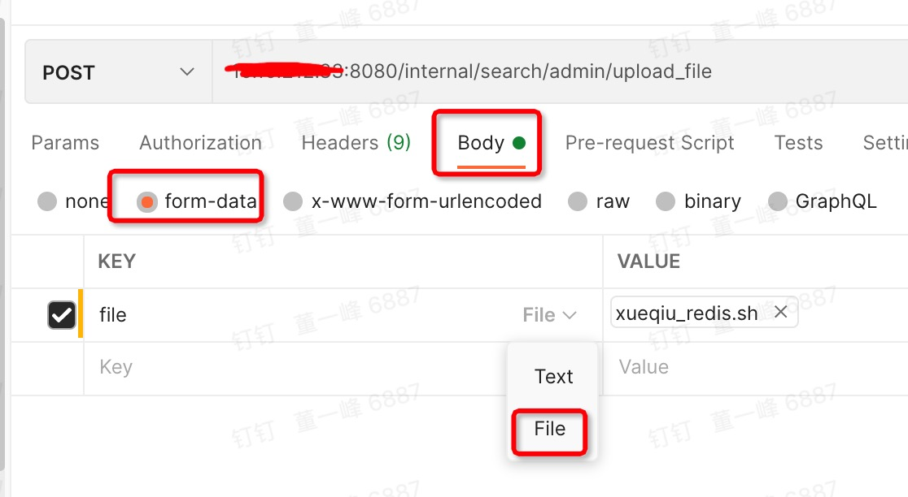

[TOC]

# Http 参数是文件

一些工具服务，需要批量上传很多数据。

Http Get方法提交的数据大小长度并没有限制，HTTP协议规范没有对URL长度进行限制。这个限制是特定的浏览器及服务器对它的限制。

理论上讲，POST是没有大小限制的。HTTP协议规范也没有进行大小限制，起限制作用的是服务器的处理程序的处理能力。

如：在Tomcat下取消POST大小的限制（Tomcat默认2M）

打开tomcat目录下的conf目录，打开server.xml 文件，修改

```xml
debug="0"
acceptCount="100"
connectionTimeout="20000"
disableUploadTimeout="true"
port="8080"
redirectPort="8443"
enableLookups="false"
minSpareThreads="25"
maxSpareThreads="75"
maxThreads="150"
maxPostSize="0"
URIEncoding="GBK"
> 
```

<font color=red>maxPostSize="0" (设为0是取消POST的大小限制)</font>


1. Controller 使用 ：MultipartFile 参数

```java
    @RequestMapping(value = "/internal/search/admin/add/stock/check.json")
    @ResponseBody
    public Object checkAddStockIndex(String indexName, MultipartFile file) {
        try {
            List<String> symbols = FileUtils.getLines(file.getInputStream());
            if (CollectionUtils.isEmpty(symbols)) {
                return "symbols is blank";
            }
            Set<String> symbolSet = new HashSet<>(symbols);
            return stockIndexService.check(indexName, symbolSet, true);
        } catch (IOException e) {
            return e;
        }
    }

public class FileUtils {
    public static List<String> getLines(InputStream inputStream){
        List<String> lines = new ArrayList<>();
        try (BufferedReader br = new BufferedReader(new InputStreamReader(inputStream))) {
            String str = "";
            while ((str = br.readLine()) != null) {
                lines.add(str);
            }
        } catch (IOException e) {
            e.printStackTrace();
        }
        return lines;
    }
}
```

2. postman 请求




# Java Post 请求：加 Cookie

```java
public static String sendPostCookie(String url, Map<String, String> parameterMap, String encoding, String cookies) {
        HttpClient httpClient = new DefaultHttpClient();

        String content = null;
        try {
            if (url.indexOf("https") != -1) {
                httpClient = wrapClient(httpClient);
            }

            HttpPost httpPost = new HttpPost(url);
            TraceUtils.setClientRequestHeaders(httpPost);
            // 请求超时
            httpClient.getParams().setParameter(CoreConnectionPNames.CONNECTION_TIMEOUT, 40000);
            // 读取超时
            httpClient.getParams().setParameter(CoreConnectionPNames.SO_TIMEOUT, 40000);
            httpClient.getParams().setParameter(AllClientPNames.STRICT_TRANSFER_ENCODING, "utf-8");
            if (StringUtils.isNotBlank(cookies)) {
                httpPost.setHeader("Cookie", cookies);
            }

            if (parameterMap != null && !parameterMap.isEmpty()) {
                if (parameterMap.size() == 1 && parameterMap.get("${data}") != null) {
                    try {
                        httpPost.setEntity(new StringEntity(parameterMap.get("${data}")));
                    } catch (UnsupportedEncodingException e) {
                        e.printStackTrace();
                    }
                } else {

                    List<NameValuePair> params = new ArrayList<NameValuePair>();
                    for (Iterator<Entry<String, String>> it = parameterMap.entrySet().iterator(); it.hasNext(); ) {
                        Entry<String, String> entry = it.next();
                        params.add(new BasicNameValuePair(entry.getKey(), entry.getValue()));
                    }
                    try {
                        if (encoding == null) {
                            httpPost.setEntity(new UrlEncodedFormEntity(params));
                        } else {
                            httpPost.setEntity(new UrlEncodedFormEntity(params, encoding));
                        }
                    } catch (UnsupportedEncodingException e) {
                        log.error("Encode the parameter failed!", e);
                    }
                }
            }

            content = httpClient.execute(httpPost, new BasicResponseHandler());
        } catch (Exception e) {
            log.warn(String.format("sendPost exception; url:%s, encoding:%s", url, encoding), e);
            content = null;
        } finally {
            httpClient.getConnectionManager().shutdown();
        }
        return content;
    }
```

