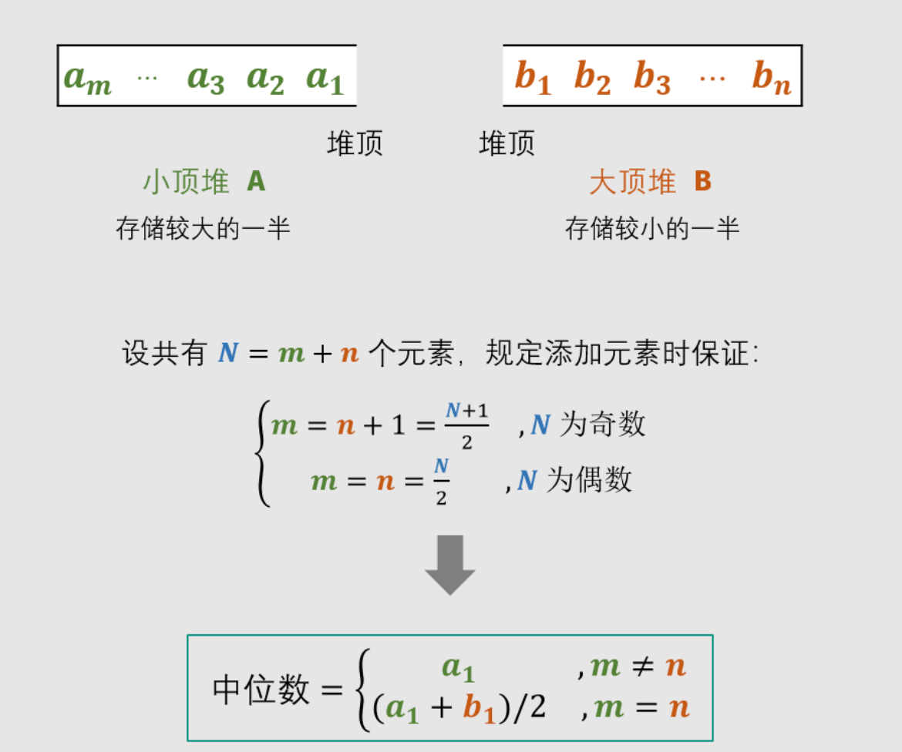

难度：<font color=red>困难</font>

> 如何得到一个数据流中的中位数？如果从数据流中读出奇数个数值，那么中位数就是所有数值排序之后位于中间的数值。如果从数据流中读出偶数个数值，那么中位数就是所有数值排序之后中间两个数的平均值。
>
> 例如，
>
> [2,3,4] 的中位数是 3
>
> [2,3] 的中位数是 (2 + 3) / 2 = 2.5
>
> 设计一个支持以下两种操作的数据结构：
>
> void addNum(int num) - 从数据流中添加一个整数到数据结构中。
> double findMedian() - 返回目前所有元素的中位数。

**示例 1：**

```apl
输入：
["MedianFinder","addNum","addNum","findMedian","addNum","findMedian"]
[[],[1],[2],[],[3],[]]
输出：[null,null,null,1.50000,null,2.00000]
```


**示例 2：**

```apl
输入：
["MedianFinder","addNum","findMedian","addNum","findMedian"]
[[],[2],[],[3],[]]
输出：[null,null,2.00000,null,2.50000]
```


**思路：two heaps**

1. 大顶堆保存较小的一半数据，用 O(1) 的时间复杂度获取这一半数据的最大值。
2. 小顶堆保存较大的一半数据，用 O(1) 的时间复杂度获取这一半数据的最小值。
3. 过程中：保持大顶堆和小顶堆数据相差不能超过 1
4. 过程中：保持小顶堆中的数据 >= 大顶堆中的数据




**代码：**

自己的代码：

```python
import heapq
import sys

class MedianFinder(object):

    def __init__(self):
        """
        initialize your data structure here.
        """
        self.count = 0
        self.max_heap = []
        self.min_heap = []

    def addNum(self, num):
        """
        :type num: int
        :rtype: None
        """
        self.count += 1
        if self.count == 1:
            heapq.heappush(self.max_heap, -num)
            return
        # 向 max_heap 插入
        if self.count % 2 == 1:
            if num > self.min_heap[0]:
                x = heapq.heappop(self.min_heap)
                heapq.heappush(self.min_heap, num)
                heapq.heappush(self.max_heap, -x)
            else:
                heapq.heappush(self.max_heap, -num)
        # 向 min_heap 插入
        else:
            if num < -self.max_heap[0]:
                x = -heapq.heappop(self.max_heap)
                heapq.heappush(self.max_heap, -num)
                heapq.heappush(self.min_heap, x)
            else:
                heapq.heappush(self.min_heap, num)

    def findMedian(self):
        """
        :rtype: float
        """
        if self.count == 0: return 0
        if self.count == 1: return -self.max_heap[0]
        if self.count % 2 == 0:
            return (self.min_heap[0] - self.max_heap[0]) / 2.0
        return -self.max_heap[0]

medianFinder = MedianFinder()
medianFinder.addNum(-1)
medianFinder.addNum(-2)
medianFinder.addNum(-3)
print(medianFinder.findMedian())
print("min_heap", medianFinder.min_heap)
print("max_heap", [-item for item in medianFinder.max_heap])
```


网上的代码：

```python
import heapq
import sys

class MedianFinder(object):

    def __init__(self):
        """
        initialize your data structure here.
        """
        self.max_heap = []
        self.min_heap = []

    def addNum(self, num):
        # 向 max_heap 插入
        if len(self.max_heap) == len(self.min_heap):
            heapq.heappush(self.min_heap, num)
            heapq.heappush(self.max_heap, -heapq.heappop(self.min_heap))
        else:
            heapq.heappush(self.max_heap, -num)
            heapq.heappush(self.min_heap, -heapq.heappop(self.max_heap))

    def findMedian(self):
        """
        :rtype: float
        """
        if len(self.max_heap) == 0 and len(self.min_heap): return 0
        return -self.max_heap[0] if len(self.max_heap) != len(self.min_heap) else (self.min_heap[0] - self.max_heap[
            0]) / 2.0


medianFinder = MedianFinder()
medianFinder.addNum(-1)
medianFinder.addNum(-2)
medianFinder.addNum(-3)
print(medianFinder.findMedian())
print("min_heap", medianFinder.min_heap)
print("max_heap", [-item for item in medianFinder.max_heap])
```


