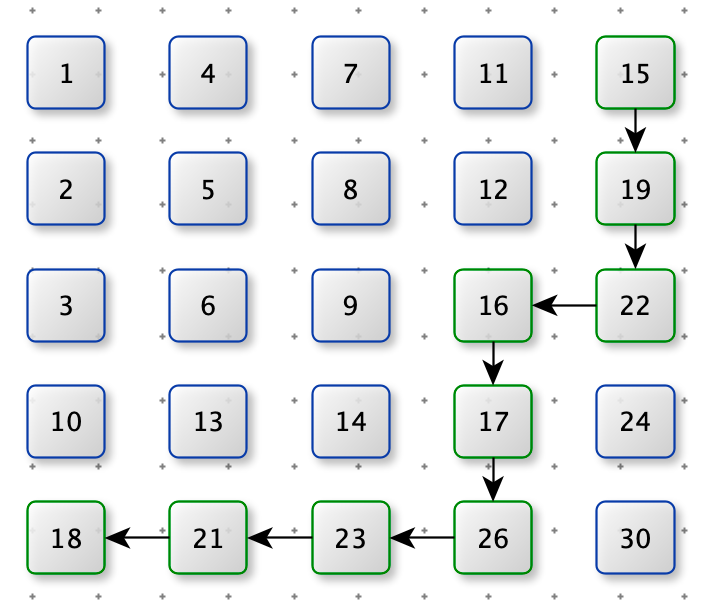

# 240. 搜索二维矩阵 II

难度：<font color=orange>中等</font>

> 编写一个高效的算法来搜索 m x n 矩阵 matrix 中的一个目标值 target 。该矩阵具有以下特性：
>
> 每行的元素从左到右升序排列。
> 每列的元素从上到下升序排列。


**示例 1：**


```python
输入：matrix = [[1,4,7,11,15],[2,5,8,12,19],[3,6,9,16,22],[10,13,14,17,24],[18,21,23,26,30]], target = 5
输出：true
```


**示例 2：**


```python
输入：matrix = [[1,4,7,11,15],[2,5,8,12,19],[3,6,9,16,22],[10,13,14,17,24],[18,21,23,26,30]], target = 20
输出：false
```


**思路：每行二分查找**

只利用了每行的单调递增性

**代码：**

时间复杂度：O(m*log n)

空间复杂度：O(1)

```python
def search_matrix(matrix, target):
    for i in range(len(matrix)):
        left = 0
        right = len(matrix[0]) - 1
        while left <= right:
            mid = left + ((right - left) >> 1)
            if matrix[i][mid] == target:
                return True
            if matrix[i][mid] < target:
                left = mid + 1
            else:
                right = mid - 1
    return False
matrix = [[1,4,7,11,15],[2,5,8,12,19],[3,6,9,16,22],[10,13,14,17,24],[18,21,23,26,30]]
target = 5
print(search_matrix(matrix,target))
```


**思路：Z字型查找**



从 右上角开始，

- 如果 $matrix[x][y] == target$ ，直接返回
- 如果 $matrix[x][y] > target$ ，向左遍历
- 如果 $matrix[x][y] < target$ ，向下遍历

**代码：**

时间复杂度：O(m+n)

空间复杂度：O(1)

```python
def search_matrix2(matrix, target):
    m = len(matrix)
    n = len(matrix[0])
    x = 0
    y = n - 1
    while x < m and y >= 0:
        if matrix[x][y] == target:
            return True
        if matrix[x][y] > target:
            y -= 1
        else:
            x += 1

    return False
```

