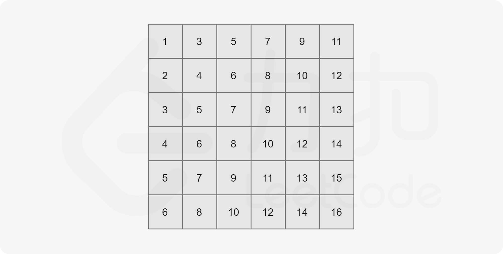
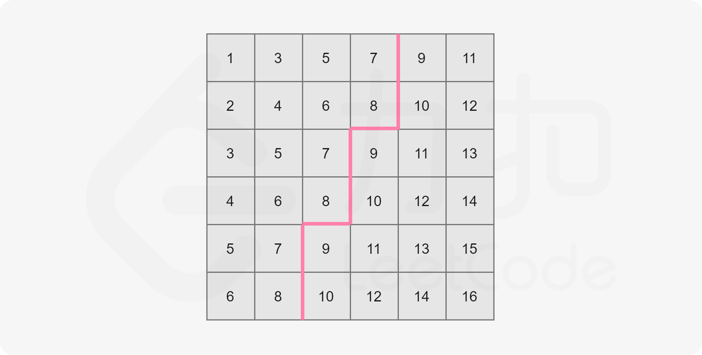

难度：<font color=orange>中等</font>

> 给你一个 n x n 矩阵 matrix ，其中每行和每列元素均按升序排序，找到矩阵中第 k 小的元素。
> 请注意，它是 排序后 的第  k 小元素，而不是第 k 个 不同 的元素。


**示例 1：**

```python
输入：matrix = [[1,5,9],[10,11,13],[12,13,15]], k = 8
输出：13
解释：矩阵中的元素为 [1,5,9,10,11,12,13,13,15]，第 8 小元素是 13
```


**示例 2：**

```py
输入：matrix = [[-5]], k = 1
输出：-5
```


**思想：**



这个矩阵的特点

1. 每行递增
2. 每列递增
3. matrix\[0][0] 最小值
4. matrix\[-1][-1] 最大值
5. 数据越向左上角靠近，数据越小
6. 数据越向右下角靠近，数据越大




存在一个值 mid ， matrix\[0][0] < mid < matrix\[-1][-1] ，将矩阵划分为两块，左上角的板块所有的数据都 <= mid，右下角的板块所有的数据都 > mid。


mid = 8

- 初始位置，左下角：matrix\[-1][0]
- 如果 matrix\[i][j] <= mid，将当前<font color=red>列</font>的数据量累加到结果中，向右移动。
- 如果 matrix\[i][j] > mid，向上移动。

```python
def check(matrix, mid):
    n = len(matrix)
    i = n - 1
    j = 0
    num = 0
    while i >= 0 and j < n:
        if matrix[i][j] <= mid:
            # 累加当前列
            num += i + 1
            j += 1
        else:
            i -= 1

    return num

def check2(matrix, mid):
    n = len(matrix)
    i = n - 1
    j = 0
    num = 0
    while i >= 0 and j < n:
        if matrix[i][j] <= mid:
            j += 1
        else:
            # 累加当前行
            num += j
            i -= 1

    return num
```


要求第 k 小，我们不知道对应 mid ，因此我们可以猜，matrix\[0][0] < mid < matrix\[-1][-1] 。

**代码：**

```python
def kth_smallest(matrix, k):
    left = matrix[0][0]
    right = matrix[-1][-1]

    while left <= right:
        mid = left + ((right - left) >> 1)

        num = check(matrix, mid)
        if num >= k:
            right = mid - 1
        else:
            left = mid + 1
    return left

print(kth_smallest([[1, 5, 9], [10, 11, 13], [12, 13, 15]], 8))
print(kth_smallest([[-5]], 1))
print(kth_smallest([[1, 2], [1, 3]], 3))
```

