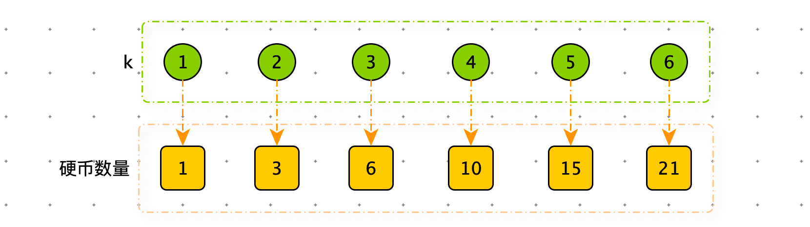

[TOC]

难度：<font color=green>简单</font>

> 你总共有 n 枚硬币，并计划将它们按阶梯状排列。对于一个由 k 行组成的阶梯，其第 i 行必须正好有 i 枚硬币。阶梯的最后一行 可能 是不完整的。
>
> 给你一个数字 n ，计算并返回可形成 完整阶梯行 的总行数。

**示例 1：**

```python
输入：n = 5
输出：2
解释：因为第三行不完整，所以返回 2 。
```


**示例 2：**

```python
输入：n = 8
输出：3
解释：因为第四行不完整，所以返回 3 。
```


## **思路：**

前 k 个完整阶梯行所需的硬币数量：



n 在 (1,3] 需要返回 k = 2

n 在 (3,6] 需要返回 k = 3

n 在 (6,10] 需要返回 k = 4

....

使用程序从 k = 1 时判断，如果硬币数 >= n，返回对应的 k

**代码：**

```python
def arrange_coins(n)
    if n == 1: return n
    tmp = 1
    sub = 2
    while tmp <= n:
        tmp += sub
        sub += 1
    return sub - 2
```


## **思路：二分查找**

前 k 个完整阶梯行是前 k 个等差数列，所需的硬币是等差数列的和：$\frac{k(k+1)}{2}$

在 1 到 n 之间动态寻找 k ，根据 $\frac{k(k+1)}{2}$ 与 n 的大小判断区间的选择

```python
def arrange_coins3(n):
    if n == 1: return n
    right = n
    left = 1

    while left <= right:
        mid = (left + right) >> 1
        tmp = mid * (mid + 1) >> 1
        if tmp == n:
            return mid
        if n > tmp:
            left = mid + 1
        else:
            right = mid - 1
    return right
```


## **思路：数学公式**

前 k 个完整阶梯行是前 k 个等差数列，所需的硬币是等差数列的和：$\frac{k(k+1)}{2}$

那么：$n = \frac{k(k+1)}{2}$

$k^2+k-2n=0$ 

解方程得：$k=\frac{-1\pm\sqrt{1+8n}}{2}$

由于 $k=\frac{-1-\sqrt{1+8n}}{2}$ 这个解为负数，排除。最终的解：$k=\frac{-1+\sqrt{1+8n}}{2}$


备注：一元二次方程的求根公式：

标准形式：$ax^2+bx+c=0$

求根公式：$x=\frac{-b\pm\sqrt{b^2-4ac}}{2a}$


**代码：**

时间复杂度：O(1)

空间复杂度：O(1)

```python
import math

def arrange_coins2(n):
    return int((math.sqrt(1 + 8 * n) - 1) /2)
```

