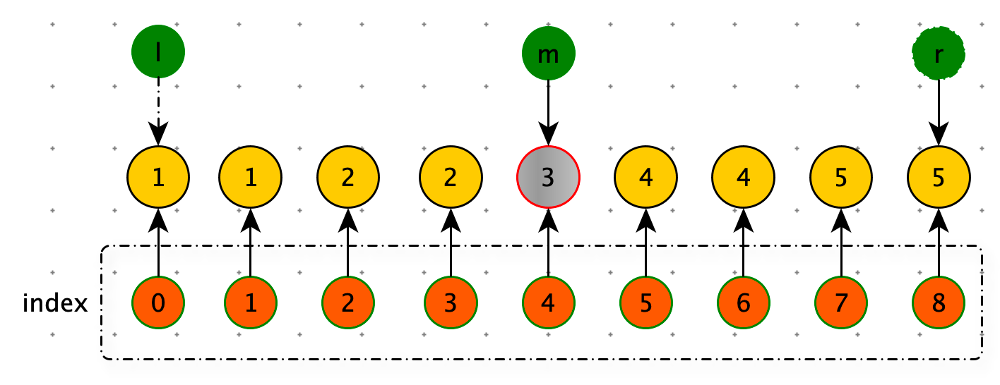
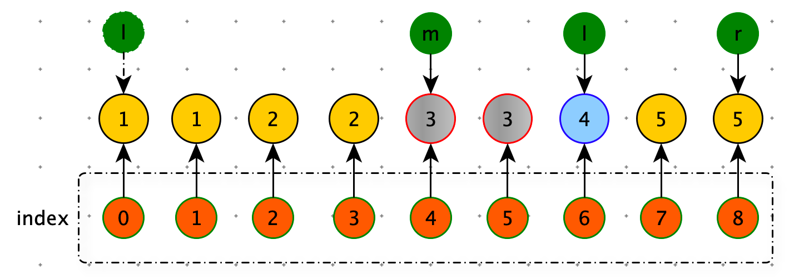
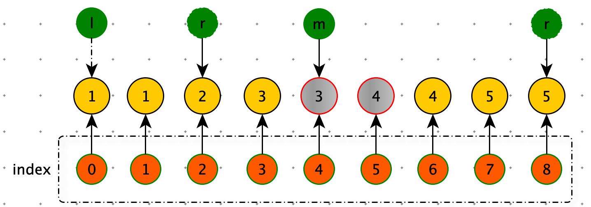
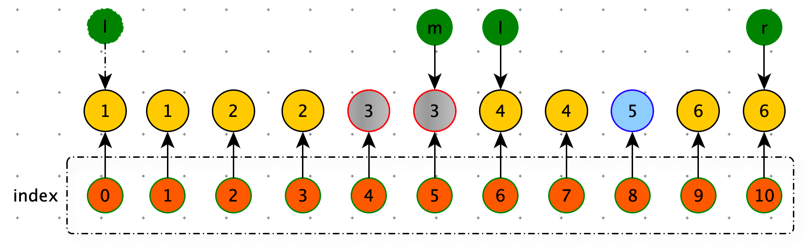
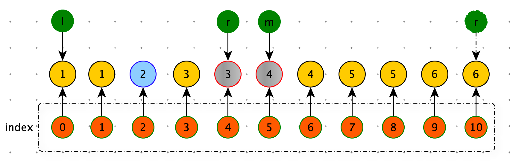

难度：<font color=orange>中等</font>

> 给你一个仅由整数组成的有序数组，其中每个元素都会出现两次，唯有一个数只会出现一次。
>
> 请你找出并返回只出现一次的那个数。
>
> 你设计的解决方案必须满足 O(log n) 时间复杂度和 O(1) 空间复杂度。

**示例 1:**

```python
输入: nums = [1,1,2,3,3,4,4,8,8]
输出: 2
```

**示例 2:**

```python
输入: nums =  [3,3,7,7,10,11,11]
输出: 10
```


**思路：二分查找**

二分查找，每次查找能够舍弃一半的数据。

条件：

1. nums 数组有序。
2. 每个元素都会出现两次，唯有一个数只会出现一次。

nums 数组长度一定为奇数。

每次查找，将数组分为：左右两个数组。要舍弃哪一部分？要舍弃没有单个元素的部分。

mid 几种情况：

第一种情况

当 mid 对应节点，就是只出现一次的数据节点。（num[mid] != num[ mid-1] and  num[mid] != num[ mid+1] ）

直接返回。



第二种情况

当 mid 为偶数，说明mid 前边有偶数个节点，如果目标节点（只出现一次的数据节点）<font color=red>右子数组</font>中，那么 num[mid] == num[mid+1] 

left = mid + 2



第三种情况

当 mid 为偶数，说明mid 前边有偶数个节点，如果目标节点（只出现一次的数据节点）<font color=red>左子数组</font>中，那么 num[mid] != num[mid+1] 

right= mid - 2



第四种情况

当 mid 为奇数，说明 mid 前边有奇数个节点，如果目标节点（只出现一次的数据节点）<font color=red>右子数组</font>中，那么 num[mid] == num[mid-1] 

left = mid + 1



第五种情况

当 mid 为奇数，说明 mid 前边有奇数个节点，如果目标节点（只出现一次的数据节点）<font color=red>左子数组</font>中，那么 num[mid] != num[mid-1] 

right= mid - 1



**代码 :** 

```python
def single_non_duplicate(nums):
    if len(nums) == 1: return nums[0]

    left = 0
    right = len(nums) - 1
    while left < right:
        mid = left + ((right - left) >> 1)
        if nums[mid] != nums[mid + 1] and nums[mid] != nums[mid - 1]: return nums[mid]

        even = mid % 2 == 0
        if even:
            if nums[mid] == nums[mid + 1]:
                left = mid + 2
            else:
                right = mid - 2

        if not even:
            if nums[mid] == nums[mid - 1]:
                left = mid + 1
            else:
                right = mid - 1

    return nums[left]
  
print(single_non_duplicate([1, 1, 2, 3, 3, 4, 4, 8, 8]))
print(single_non_duplicate([1, 1, 3, 3, 4, 4, 8, 9, 9]))
print(single_non_duplicate([3, 3, 7, 7, 10, 11, 11]))
print(single_non_duplicate([10, 11, 11]))
```

