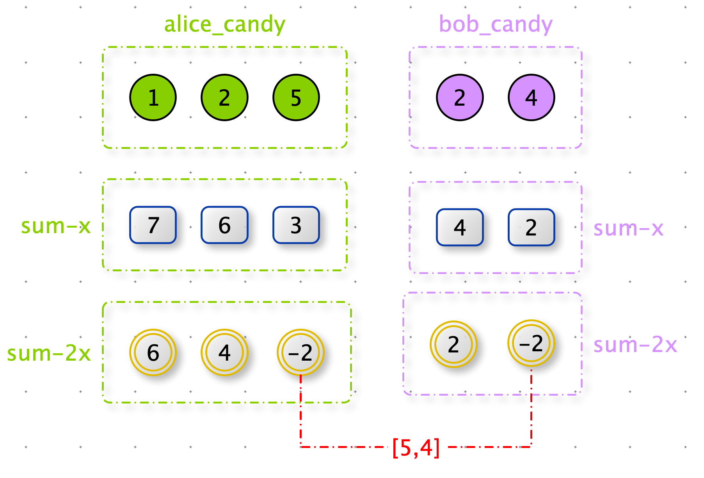

难度：<font color=green>简单</font>

> 爱丽丝和鲍勃有不同大小的糖果棒：A[ i ] 是爱丽丝拥有的第 i 根糖果棒的大小，B[ j ] 是鲍勃拥有的第 j 根糖果棒的大小。
>
> 因为他们是朋友，所以他们想交换一根糖果棒，这样交换后，他们都有相同的糖果总量。（一个人拥有的糖果总量是他们拥有的糖果棒大小的总和。）
>
> 返回一个整数数组 ans，其中 ans[ 0 ] 是爱丽丝必须交换的糖果棒的大小，ans[ 1 ] 是 Bob 必须交换的糖果棒的大小。
>
> 如果有多个答案，你可以返回其中任何一个。保证答案存在。

**示例 1：**

```c#
输入：A = [1,1], B = [2,2]
输出：[1,2]
```


**示例 2：**

```c#
输入：A = [1,2], B = [2,3]
输出：[1,2]
```


**示例 3：**

```python
输入：A = [2], B = [1,3]
输出：[2,3]
```


**示例 4：**

```python
输入：A = [1,2,5], B = [2,4]
输出：[5,4]
```


**思路：**

假设alice 交换 x 与 bob 交换 y 使他们都有相同的糖果总量。

( alice_sum - x ) + y = ( bob_sum - y ) + x

 alice_sum - 2x  =  bob_sum - 2y 

所以我们可以将 alice_candy 和 bob_candy 数组转换成：A = alice_candy  - 2x 和  B = alice_candy  - 2y

这样我们就需要找 A 与 B 交集。




**代码：**

时间复杂度：O(n)

空间复杂度：O(n)

```python
def fair_candy_swap(alice_sizes, bob_sizes):
    alice_sum = sum(alice_sizes)
    bob_sum = sum(bob_sizes)

    alice_sub_map = dict([(alice_sum - 2 * alice_sizes[i], i) for i in range(len(alice_sizes))])
    bob_sub_list = [bob_sum - 2 * item for item in bob_sizes]

    for i in range(len(bob_sub_list)):
        if bob_sub_list[i] in alice_sub_map:
            j = alice_sub_map[bob_sub_list[i]]
            return [alice_sizes[j], bob_sizes[i]]

print(fair_candy_swap([1, 1], [2, 2]))
print(fair_candy_swap([1, 2], [2, 3]))
print(fair_candy_swap([2], [1, 3]))
print(fair_candy_swap([1, 2, 5], [2, 4]))
```

