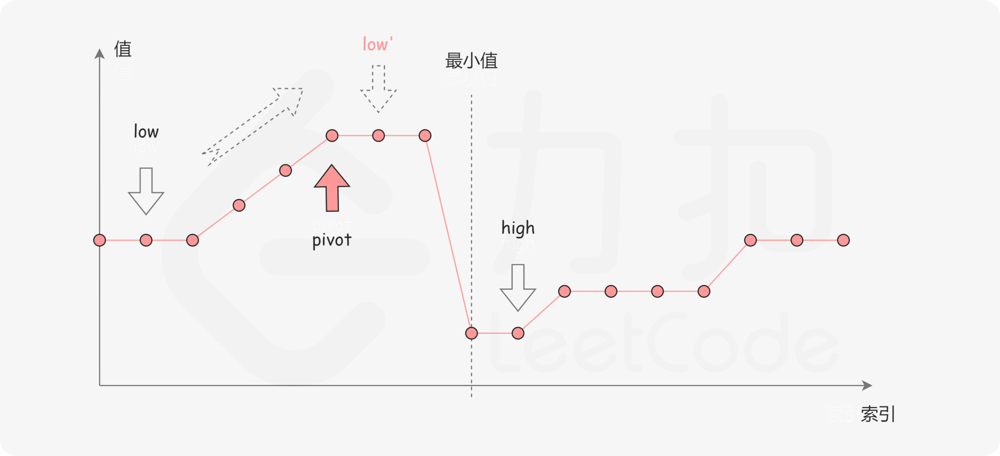

# 剑指 Offer 11. 旋转数组的最小数字

难度：<font color=green>简单</font>

> 把一个数组最开始的若干个元素搬到数组的末尾，我们称之为数组的旋转。
>
> 给你一个可能存在 重复 元素值的数组 numbers ，它原来是一个升序排列的数组，并按上述情形进行了一次旋转。请返回旋转数组的最小元素。例如，数组 [3,4,5,1,2] 为 [1,2,3,4,5] 的一次旋转，该数组的最小值为1。

**示例 1：**

```python
输入：[3,4,5,1,2]
输出：1
```


**示例 2：**

```python
输入：[2,2,2,0,1]
输出：0
```


**思路：**


**代码：**

时间复杂度：O(n)

空间复杂度：O(1)

```python
def min_array(numbers):
    if len(numbers) == 1: return numbers[0]
    # 没有旋转
    if numbers[0] < numbers[-1]:
        return numbers[0]
    
    for i in range(1, len(numbers)):
        if numbers[i] < numbers[i - 1]:
            return numbers[i]
    return numbers[0]
```

**思路二：二分**

与：153 题中寻找数组中的最小值，不同的是，这道题中数组元素是可以重复的。


第一种情况：如果 $numbers[pivot] < numbers[right]$ ，说明最小值在 pivot 左侧，那么丢弃pivot 到 hight 之间的元素。


第二种情况：$numbers[pivot] > numbers[right]$，说明 最小值在 pivot 右侧，那么丢弃 low 到 pivot 之间的元素。



第三种情况：$numbers[pivot] = numbers[right]$，由于重复元素的存在，我们不能确定最小值哪个区间，最小值有可能在 pivot 左边，也有可能在 pivot 右边，那么只需 high 移动一位，然后再判断。


```python
def min_array2(numbers):
    left = 0
    right = len(numbers) - 1
    while left < right:
        mid = left + ((right - left) >> 1)
        if numbers[mid] < numbers[right]:
            right = mid
        elif numbers[mid] > numbers[right]:
            left = mid + 1
        else:
            right -= 1

    return numbers[left]
```

