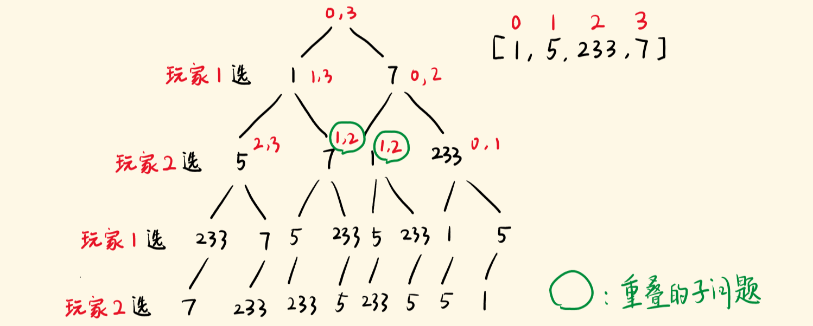
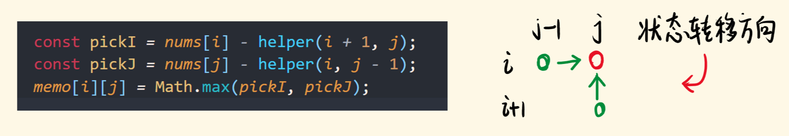

> 给定一个表示分数的非负整数数组。 玩家 1 从数组任意一端拿取一个分数，随后玩家 2 继续从剩余数组任意一端拿取分数，然后玩家 1 拿，…… 。每次一个玩家只能拿取一个分数，分数被拿取之后不再可取。直到没有剩余分数可取时游戏结束。最终获得分数总和最多的玩家获胜。
>
> 给定一个表示分数的数组，预测玩家1是否会成为赢家。你可以假设每个玩家的玩法都会使他的分数最大化。


**示例 1：**

```python
输入：[1, 5, 2]
输出：False
解释：一开始，玩家1可以从1和2中进行选择。
如果他选择 2（或者 1 ），那么玩家 2 可以从 1（或者 2 ）和 5 中进行选择。如果玩家 2 选择了 5 ，那么玩家 1 则只剩下 1（或者 2 ）可选。
所以，玩家 1 的最终分数为 1 + 2 = 3，而玩家 2 为 5 。
因此，玩家 1 永远不会成为赢家，返回 False 。
```


**示例 2：**

```python
输入：[1, 5, 233, 7]
输出：True
解释：玩家 1 一开始选择 1 。然后玩家 2 必须从 5 和 7 中进行选择。无论玩家 2 选择了哪个，玩家 1 都可以选择 233 。
     最终，玩家 1（234 分）比玩家 2（12 分）获得更多的分数，所以返回 True，表示玩家 1 可以成为赢家。
```


**思路一：递归**

​		为了判断哪个玩家可以获胜，需要计算一个总分，即先手得分与后手得分之差。当数组中的所有数字都被拿取时，如果总分大于或等于 00，则先手获胜，反之则后手获胜。


**代码：**

```python
def predict_the_winner(nums):
    return dfs(nums, 0, len(nums) - 1, 1) >= 0

def dfs(nums, start, end, turn):
    if start == end:
        return nums[start] * turn
    score_start = nums[start] * turn + dfs(nums, start + 1, end, -turn)
    score_end = nums[end] * turn + dfs(nums, start, end - 1, -turn)
    return max(score_start * turn, score_end * turn) * turn
```


**思路二：带记忆递归**

有哪些重复计算呢？

答：你选 1，我再选 7 和你先选 7 ，我再选 1，剩下的都是 [ 5 , 233 ]




使用备忘录，将子问题的结果记录下来，下次再遇到一样的子问题，直接返回结果。

```python
def predict_the_winner2(nums):
    n = len(nums)
    dp = [[None for _ in range(n)] for _ in range(n)]
    return dfs2(nums, 0, len(nums) - 1, 1, dp) >= 0

def dfs2(nums, start, end, turn, dp):
    if start == end:
        return nums[start] * turn
    if dp[start][end]:
        return dp[start][end]

    score_start = nums[start] * turn + dfs2(nums, start + 1, end, -turn,dp)
    score_end = nums[end] * turn + dfs2(nums, start, end - 1, -turn,dp)
    res = max(score_start * turn, score_end * turn) * turn
    dp[start][end] = res
    return res

print(predict_the_winner2([1, 5, 233, 7]))
```


**思路三：动态规划**

带记忆递归是从上向下解决问题，将计算结果存入 memo，而动态规划是从下向上解决问题。

动态规划不直接去解决问题，而是根据状态转移方程，从下一个状态推算出上一个状态。


状态转移方程： $dp[i][j] = max(nums[i] - dp[i + 1][j], nums[j] - dp[i][j - 1])$​

dp\[ i ][ j ] 先手在数组 [ i: j ] 中，赢过对方的分数。

终止条件：当 i  == j 时，dp\[ i ][ j ] ==nums [ i ]


```python
def predict_the_winner3(nums):
    n = len(nums)
    dp = [[None for _ in range(n)] for _ in range(n)]

    for i in range(n):
        dp[i][i] = nums[i]

    for i in range(n - 2, -1, -1):
        for j in range(i + 1, n):
            dp[i][j] = max(nums[i] - dp[i + 1][j], nums[j] - dp[i][j - 1])
    return dp[0][n - 1] >= 0
  

```


**思路三：动态规划--滚动数组**



```python
def predict_the_winner4(nums):
    n = len(nums)
    dp = [nums[i] for i in range(n)]
    for i in range(n - 2, -1, -1):
        for j in range(i + 1, n):
            dp[j] = max(nums[i] - dp[j], nums[j] - dp[j-1])
            
    return dp[n - 1] >= 0

print(predict_the_winner4([1, 5, 233, 7]))
print(predict_the_winner4([1, 5, 2]))
```

