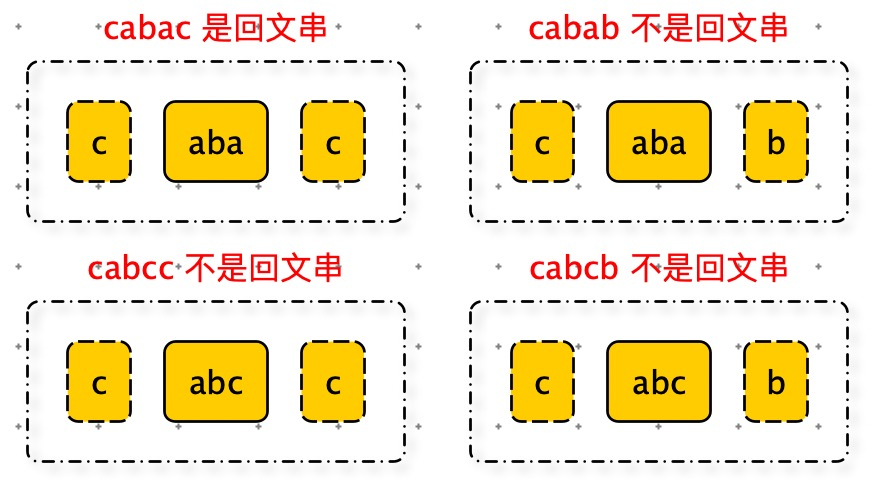

[TOC]

# 题目：

[最长回文子串](https://leetcode-cn.com/problems/longest-palindromic-substring/)

给定一个字符串 s，找到 s 中最长的回文子串。你可以假设 s 的最大长度为 1000。

**示例 1：** buuhy8g7

```python
输入: "babad"
输出: "bab"
注意: "aba" 也是一个有效答案。
```

**示例 2：**

```python
输入: "cbbd"
输出: "bb"
```

# 暴力解法

时间复杂度：$ O ( n^3 )$

空间复杂度：$ O ( 1 )$

```python
def force(s):
    n = len(s)
    result = ''
    # O(n)
    for i in range(n):
       # O(n)
        for j in range(i + 1, n):
            sub_str = s[i:j]
            # O(n)
            if is_palindrome0(sub_str) and len(sub_str) > len(result):
                result = sub_str
    return result

'''
判断字符串是否是回文串
'''
def is_palindrome0(s):
    left = 0
    right = len(s) - 1
    while left < right:
        if s[left] != s[right]:
            return False
        left += 1
        right -= 1
    return True
  
  
print(force("babad"))
print(force("cbbd"))
print(force("abbaabccba"))
print("-" * 100)
```


# 中心扩展算法（回文串对称性）

```python
'''
双指针
时间复杂度：O(n^2)
空间复杂度：O(1)
'''
def longest_palindrome1(s):
    n = len(s)
    start = 0
    max_len = 1
    # O(n)
    for i in range(1, n):
        # O(n)，长度为奇数的回文串
        new_start, new_len = is_palindrome(s, i - 1, i + 1)
        if new_len and new_len > max_len:
            start = new_start
            max_len = new_len
			  # O(n)，长度为偶数的回文串
        new_start, new_len = is_palindrome(s, i - 1, i)
        if new_len and new_len > max_len:
            start = new_start
            max_len = new_len
    return s[start: start + max_len]

def is_palindrome(s, left, right):
    tmp_len = 0
    tmp_start = -1
    while left >= 0 and right < len(s):
        if s[left] != s[right]:
            break
        if (right - left + 1) > tmp_len:
            tmp_len = right - left + 1
            tmp_start = left
        left -= 1
        right += 1
    return (tmp_start, tmp_len)
```


# 动态规划：二维数组



子问题划分：

cabac  的子问题是：aba 如果是回文串，第一个字符 与 末尾字符相等，那么cabac 是回文串。

我们用一个二维数组dp\[ i ][ j ] 表示s 的子串s[i:j] 是否是回味串，如果是dp\[ i ][ j ] = True 否则dp\[ i ][ j ] = False

这样整个二维数组就能记录所有子串是否是回文串。

由于回文串的对称性，我们只需要利用 dp 中一半的空间。


边界条件：

1. 当个字符是回文串。
2. 两个字符，如果相等是回文串。
3. 多个字符，掐头去尾后的子串如果是回文串，并且 头字符== 尾字符，那么也是回文串。

填表规则：从左到右，从上到下，一列一列填表的。

```python
        if i - j < 2:
            dp[i][j] = s[i] == s[j]
        else:
            dp[i][j] = s[i] == s[j] and dp[i + 1][j - 1]
```


```python
'''
动态规划解法
时间复杂度：O(n^2)
空间复杂度：O(n^2)

dp[i][j] = True 表示：s[i:j] 是否是回文串

推导公式：dp[i][j] = (s[i] == s[j]) and ( i-j<2 or dp[i+1][j-1] )

dp[i+1][j-1] 是表示：s[i:j] 掐头去尾的子串是否是回文串。如果是，且 s[i] == s[j] 那么，s[i:j] 也是回文串。
'''
def longest_palindrome(s):
    n = len(s)
    dp = [[None] * n for k in range(n)]
    start = 0
    max_len = 1
    for j in range(n):
        for i in range(j + 1):
            if i - j < 2:
                dp[i][j] = s[i] == s[j]
            else:
                dp[i][j] = s[i] == s[j] and dp[i + 1][j - 1]

            if dp[i][j] and (j - i + 1) > max_len:
                max_len = j - i + 1
                start = i

    return s[start: start + max_len]
```


# 动态规划：一维数组


观察动态规划依赖的二维数组。

填表规则是：从左到右，从上到下，一列一列填表的。

也就是说：在我填写第 j 列时只依赖第 j - 1 列，j - 1 之前的数据已经没有用了。所有我们只需一个一维数组保存最近的一列数据就能满足要求。所以我们有机会将二维数组降维至一维数组。


如果动态规划压缩后一维数组，分为两部分。第一部分是第 j 列数据，也就是要计算的数据的。

下边的部分是是第 j - 1 数据。根据动态规划转移方程：

```python
dp[i][j] = s[i] == s[j] and dp[i + 1][j - 1]
```

dp\[i + 1][j - 1] 就是当前数据的下一个数据，


```python
'''
动态规划解法（将二维数组，压缩成一位数组）
时间复杂度：O(n^2)
空间复杂度：O(n)
'''
def longest_palindrome3(s):
    n = len(s)
    dp = [None for k in range(n)]
    start = 0
    max_len = 1
    for i in range(n):
        for j in range(i + 1):
            if i - j < 2:
                dp[j] = s[i] == s[j]
            else:
                dp[j] = s[i] == s[j] and dp[j + 1]

            if dp[j] and (i - j + 1) > max_len:
                max_len = i - j + 1
                start = j

    return s[start: start + max_len]
```


