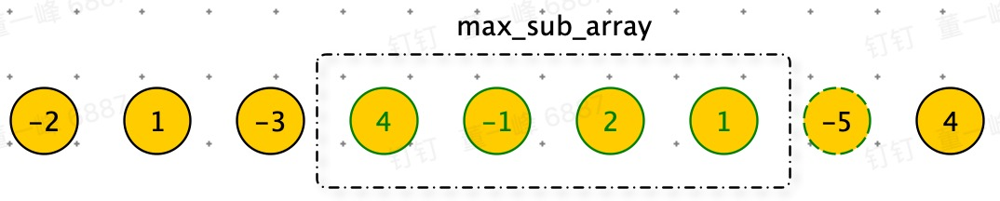

# 最大子序和

> 给定一个整数数组 `nums` ，找到一个具有最大和的连续子数组（子数组最少包含一个元素），返回其最大和。

**示例 1：**

```python
输入：nums = [-2,1,-3,4,-1,2,1,-5,4]
输出：6
解释：连续子数组 [4,-1,2,1] 的和最大，为 6 。
```


**示例 2：**

```python
输入：nums = [1]
输出：1
```


**示例 3：**

```python
输入：nums = [0]
输出：0
```


**示例 4：**

```python
输入：nums = [-1]
输出：-1
```


**示例 5：**

```python
输入：nums = [-100000]
输出：-100000
```


**思路：动态规划**



如图：max_sub_array 一个连续数组和，是否要将下一个数（-5） 纳入其中的条件是：加入下一个数据是否能更大。像贪吃蛇一样。

题目最终寻找：$max(f(x_i))$

- $f(x_i)$ 表示以第 i 个数结尾的：「连续子数组的最大和」。

那么 num[i] 是单独成为一段还是加入 f ( i - 1 ) ，取决于 max( f( i -1 ) + nums[ i ], nums[ i ] ) 

状态转移方程：$f(i)=max( f(i-1) + nums[i], nums[i] )$


**代码：**

```python
def max_sub_array(nums):
    sub_array = [None] * (len(nums) + 1)
    sub_array[0] = 0
    for i in range(len(nums)):
        sub_array[i + 1] = max(sub_array[i] + nums[i], nums[i])
    return max(sub_array[1::])
```

<font color=red>注意：当 i = 0 时，i - 1 为 -1.所以我们加一个哨兵。</font>

