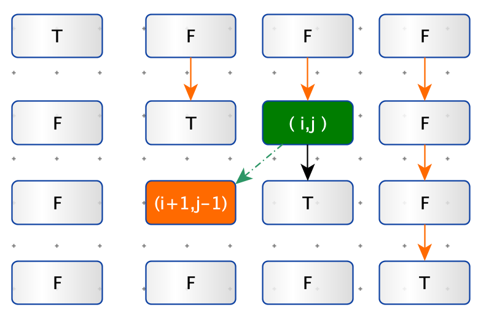

> 给你一个字符串 s ，请你统计并返回这个字符串中 回文子串 的数目。
>
> 回文字符串 是正着读和倒过来读一样的字符串。
>
> 子字符串 是字符串中的由连续字符组成的一个序列。
>
> 具有不同开始位置或结束位置的子串，即使是由相同的字符组成，也会被视作不同的子串。


**示例 1：**

```python
输入：s = "abc"
输出：3
解释：三个回文子串: "a", "b", "c"
```


**示例 2：**

```python
输入：s = "aaa"
输出：6
解释：6个回文子串: "a", "a", "a", "aa", "aa", "aaa"
```


**思路：动态规划**

1. 识别子回文串
2. 统计子回文串的个数

状态转移方程：dp\[i][j] = s[i] == s[j] and dp\[i + 1][j - 1]

ru

如图：$d[i][j] 对 d[i+1][j-1]$ 的依赖关系。

根据依赖关系，决定遍历顺序（橙色箭头）。

**代码：**

```python
def count_substrings(s):
    n = len(s)
    dp = [[False] * n for _ in range(n)]

    res = 0
    for j in range(n):
        for i in range(j + 1):
            if j - i < 2:
                dp[i][j] = s[i] == s[j]
            else:
                dp[i][j] = s[i] == s[j] and dp[i + 1][j - 1]
            if dp[i][j]:
                res += 1

    return res
```


**思路：动态规划：滚动数组**

**代码：**

```python
def count_substrings2(s):
    n = len(s)
    dp = [False] * n

    res = 0
    for j in range(n):
        for i in range(j + 1):
            if j - i < 2:
                dp[i] = s[i] == s[j]
            else:
                dp[i] = s[i] == s[j] and dp[i + 1]
            if dp[i]:
                res += 1

    return res
```