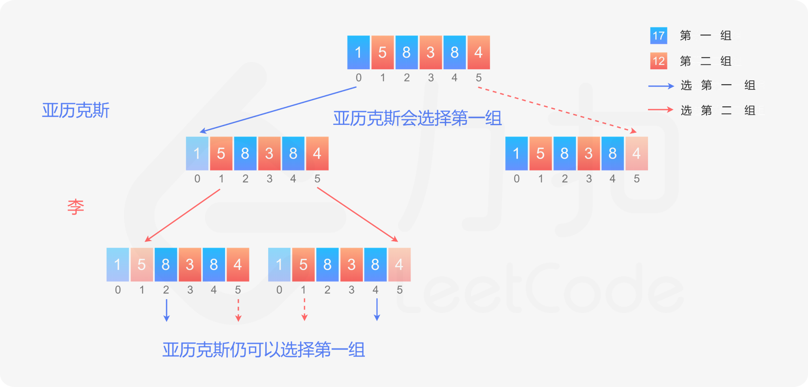

> 亚历克斯和李用几堆石子在做游戏。偶数堆石子排成一行，每堆都有正整数颗石子 piles[i] 。
>
> 游戏以谁手中的石子最多来决出胜负。石子的总数是奇数，所以没有平局。
>
> 亚历克斯和李轮流进行，亚历克斯先开始。 每回合，玩家从行的开始或结束处取走整堆石头。 这种情况一直持续到没有更多的石子堆为止，此时手中石子最多的玩家获胜。
>
> 假设亚历克斯和李都发挥出最佳水平，当亚历克斯赢得比赛时返回 true ，当李赢得比赛时返回 false 。
>

**示例：**

```python
输入：[5,3,4,5]
输出：true
解释：
亚历克斯先开始，只能拿前 5 颗或后 5 颗石子 。
假设他取了前 5 颗，这一行就变成了 [3,4,5] 。
如果李拿走前 3 颗，那么剩下的是 [4,5]，亚历克斯拿走后 5 颗赢得 10 分。
如果李拿走后 5 颗，那么剩下的是 [3,4]，亚历克斯拿走后 4 颗赢得 9 分。
这表明，取前 5 颗石子对亚历克斯来说是一个胜利的举动，所以我们返回 true 。
```

**思路：动态规划**

与 486.预测赢家类似。多了约束条件：

- nums 长度为偶数。
- 数组的元素之和是奇数，所以没有平局

**代码：**

```python
def stone_game(nums):
    n = len(nums)
    dp = [nums[i] for i in range(n)]
    for i in range(n - 2, -1, -1):
        for j in range(i + 1, n):
            dp[j] = max(nums[i] - dp[j], nums[j] - dp[j-1])

    return dp[n - 1] >= 0

print(predict_the_winner4([1, 5, 233, 7]))
print(predict_the_winner4([1, 5, 2]))
```


**思路：数学**

利用两个约束条件

- nums 长度为偶数。
- 数组的元素之和是奇数，所以没有平局

条件一：数组长度为偶数：

​		nums 长度为 n，n 为偶数，可以将数组根据奇数偶数位分成两个子数组（两个子数组长度都为 $\frac{n}{2}$）。

条件二：数组的元素之和是奇数，所以没有平局

​		两个子数组之和，必定不同。先手选择和大的子数组进行选择。

[1,5,8,3,8,4]  分为 sum ([1,8 ,8] )=17 > sum( [ 5, 3, 4 ] )=12

所以：亚历克斯 选择 1（子数组和大的）

[5,8,3,8,4]  李 只能在奇数位数组中选择（[5,3,4]）

如此先去：亚历克斯 总是在偶数位子数组中选择，李只能在奇数位子数组中选择。因此亚历克斯 必胜。


<font color=red>通过数学推导：先手必胜。</font>




**代码：**

```python
def stone_game(nums):
  return True
```

