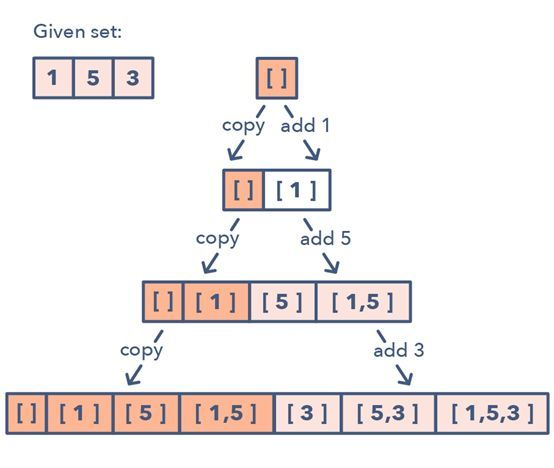

很多面试题都涉及处理给定元素集合的排列和组合问题。

子集（Subsets）模式通过宽度有限搜索（BFS）方法，有效处理这类问题。

给定一个集合 [1, 5, 3]

1． 从一个[空集](https://www.zhihu.com/search?q=空集&search_source=Entity&hybrid_search_source=Entity&hybrid_search_extra={"sourceType"%3A"article"%2C"sourceId"%3A"358653377"})开始：[[]]
2．向所有已有子集添加第一个数 (1)，从而创造新的子集：[[], [1]]
3．向所有已有子集添加第二个数 (5)：[[], [1], [5], [1,5]]
4．向所有已有子集添加第三个数 (3)：[[], [1], [5], [1,5], [3], [1,3], [5,3], [1,5,3]]

LeetCode

参见：other/剑指OfferII079 所有子集

