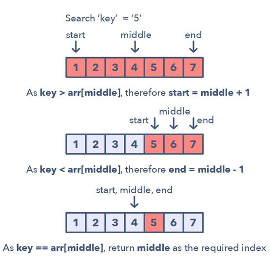

给定一个已排序的数组、链表、矩阵，要求寻找一个特定元素，最佳算法是：二分查找。

对于一个升序集合：nums

1. 寻找中间位置：$middle =\frac{start+end}{2}$
2. 可能造成整数溢出，推荐使用：$minddle =\frac{start+(end-start)}{2}$
3. if nums[middle]==target ：reutrn middle
4. if nums[middle] < target ：left = middle + 1
5. if nums[middle] > target ：right= middle - 1

经过修改的二分查找：

