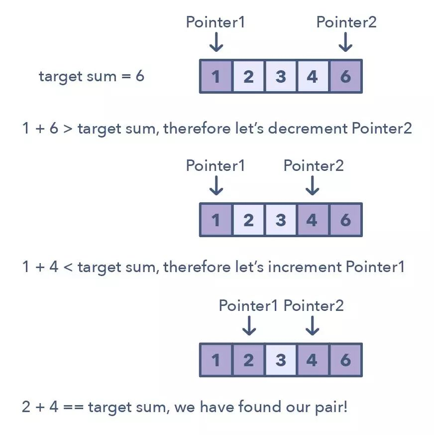

[TOC]

# 定义

（Two Pointers）两个指针以一前一后的模式在数据结构中迭代，直到一个或两个指针达到某种特定条件。二指针通常在排序数组或者链表中搜索配对时很有用；比如需要将一个数组的每个元素与其他元素做比较时。


二指针很有用，因为如果再有一个指针，必须在数组中循环来回才能找到答案。这种使用单个迭代器进行来回搜索时，在时间和空间复杂度上都是很低效（渐近分析 asymptotic analysis）。尽管使用 1 个指针进行暴力搜索的实现方法简单有效，但这会沿 $O(n^2)$ 线搜索到答案。



# Leetcode

## 977. 有序数组的平方

给你一个按 **非递减顺序** 排序的整数数组 `nums`，返回 **每个数字的平方** 组成的新数组，要求也按 **非递减顺序** 排序。

**示例 1：**

```python
输入：nums = [-4,-1,0,3,10]
输出：[0,1,9,16,100]
解释：平方后，数组变为 [16,1,0,9,100]
排序后，数组变为 [0,1,9,16,100]
```


**示例 2：**

```python
输入：nums = [-7,-3,2,3,11]
输出：[4,9,9,49,121]
```


**双指针**

```python
def sorted_squares(nums):
    index = search(nums, 0)
    if index == 0:
        return [item ** 2 for item in nums]
    left = index - 1

    rst = []
    while left >= 0 and index < len(nums):
        if nums[left] ** 2 < nums[index] ** 2:
            rst.append(nums[left] ** 2)
            left -= 1
        else:
            rst.append(nums[index] ** 2)
            index += 1

    # 补充剩余数据
    while index < len(nums):
        rst.append(nums[index] ** 2)
        index += 1

    while left >= 0:
        rst.append(nums[left] ** 2)
        left -= 1

    return rst

# 二分查找
def search(nums, target):
    left = 0
    right = len(nums) - 1
    while left <= right:
        mid = (right + left) >> 1
        if nums[mid] == target:
            return mid
        if nums[mid] < target:
            left = mid + 1
        else:
            right = mid - 1
    return left

print(sorted_squares([-4, -1, 0, 3, 10]))
print(sorted_squares([-7, -3, 2, 4, 11]))
print(sorted_squares([0, 2, 4, 11]))
print(sorted_squares([2, 4, 11, 15, 16]))
```


**双指针**

指针一：0

指针二：n - 1

每次比较两个指针对应的数，选择较大的那个 **逆序** 放入答案并移动指针。

```python
def sorted_squares2(nums):
    left = 0
    right = index = len(nums) - 1
    rst = [0] * len(nums)
    while index >= 0:
        if nums[right] ** 2 > nums[left] ** 2:
            rst[index] = nums[right] ** 2
            right -= 1
        else:
            rst[index] = nums[left] ** 2
            left += 1
        index -= 1
    return rst

print('-' * 100)
print(sorted_squares2([-4, -1, 0, 3, 10]))
print(sorted_squares2([-7, -3, 2, 4, 11]))
print(sorted_squares2([0, 2, 4, 11]))
print(sorted_squares2([2, 4, 11, 15, 16]))
```


## 15. 三数之和

> 给你一个包含 n 个整数的数组 nums，判断 nums 中是否存在三个元素 a，b，c ，使得 a + b + c = 0 ？请你找出所有和为 0 且不重复的三元组。
>
> 注意：答案中不可以包含重复的三元组。


**示例 1：**

```python
输入：nums = [-1,0,1,2,-1,-4]
输出：[[-1,-1,2],[-1,0,1]]
```


**示例 2：**

```python
输入：nums = []
输出：[]
```


**示例 3：**

```python
输入：nums = [0]
输出：[]
```


固定第一位数据，第二位数据从 i + 1 ，第三位数据从 n - 1 ,向中间搜索.

```python
def three_sum(nums):
    if len(nums) < 3:
        return []
    rst = []
    nums.sort()
    n = len(nums)

    i = 0
    while i < n - 2:
        target = -nums[i]
        left = i + 1
        right = len(nums) - 1
        while left < right:
            if nums[left] + nums[right] > target:
                right -= 1
            elif nums[left] + nums[right] < target:
                left += 1
            else:
                a = nums[left]
                b = nums[right]
                rst.append([nums[i], nums[left], nums[right]])
                right -= 1
                left += 1

                # 去重（去掉与 a,b 相同的数据）
                while left < right and nums[left] == a: left += 1
                while left < right and nums[right] == b: right -= 1

        # 去重(去掉num[i] 相同的数据)
        while i + 1 < n and nums[i] == nums[i + 1]:
            i += 1
        i += 1

    return rst


print(three_sum([-1, 0, 1, 2, -1, -4]))
# print(three_sum([0, 0, 0, 0]))