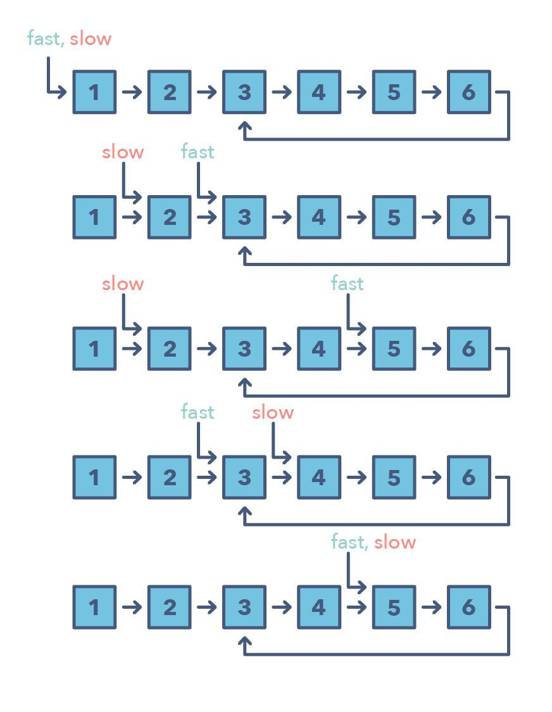

[TOC]

# 定义

快速和慢速指针也被称为：Hare & Tortoise 算法，该算法会使用在数组（序列、链表）中，以不同速度移动的指针。该算法在处理循环链表或者数组时非常有用。

通过以不同的速度进行移动（比如在一个循环链表中），该算法证明这两个指针注定会相遇。只要这两个指针在同一个循环中，快速指针就会追赶上慢速指针。

**该算法的应用场景：**

- 处理链表或数组中的循环的问题
- 找链表中点或需要知道特定元素的位置

**何时应该优先选择这种方法，而不是上面提到的二指针方法？**

- 有些情况不适合使用二指针方法，比如在不能反向移动的单链接链表中。使用快速和慢速模式的一个案例是当你想要确定一个链表是否为回文（palindrome）时。

# Leetcode

## 141.环形链表

参见：leetcode/链表/141 环形链表

## 142. 环形链表 II

参见：leetcode/链表/141 环形链表

## 234.回文链表

参见：leetcode/链表/234 回文链表