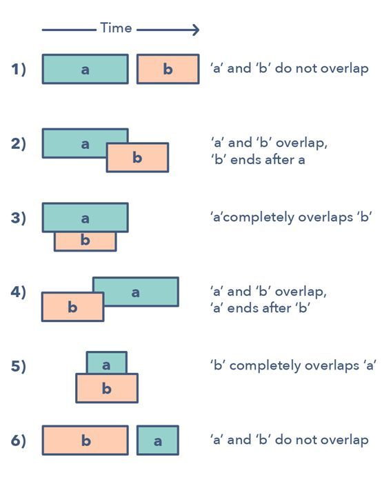

[TOC]

# 定义

合并区间模式是一种处理重叠区间的有效技术。

给定两个区间（a 和 b），这两个区间有 6 钟不同的相互关联的方式：

理解并识别这六种情况有助于你求解范围广泛的问题，从插入区间到优化区间合并等。

那么如何确定何时该使用合并区间模式呢？

- 如果你被要求得到一个仅含互斥区间的列表
- 如果你听到了术语「重叠区间（overlapping intervals）」

合并区间模式的问题：

- 区间交叉（中等）
- 最大 CPU 负载（困难）

# Leetcode

## 56.合并区间

参见：leetcode/数组/56 合并区间

