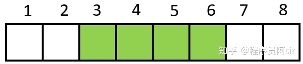
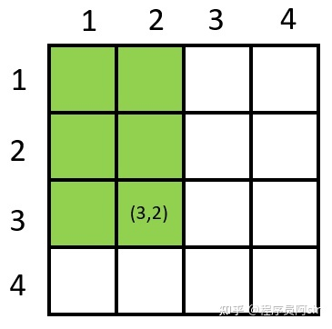
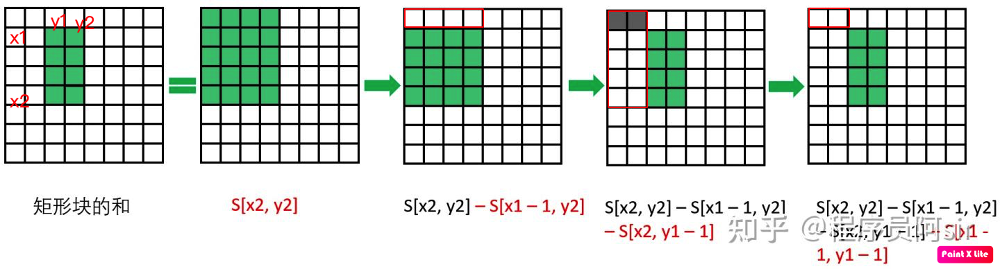

[TOC]

# 一维数组：前缀和

## 定义

前缀和数列 S 的递推公式：$S[i]=S[i-1]+A[i]$

原数列 A

S[i] 表示前 i 个元素的和。

```python
def prefix_sum(nums):
    res = []
    cur = 0
    for val in nums:
        cur += val
        res.append(cur)
    return res

print(prefix_sum([1, 2, 3, 4, 5]))
```


## 使用

快速求出任意区间的区间和

> 需求：计算数组区间 [ k , r ] 的区间和

结论： $res = S[r] - S[ k - 1]$

推导：

$res=A[k]+A[k+1]+...+A[r]=\sum_{i=1}^r{A[i]}-\sum_{i=1}^{k-1}A[i]=S[r]-S[k-1]$


例如：下图表示区间 [ 3 , 6 ] 的区间和：$S[6]-S[2]$




# 二维数组：前缀和

## 定义

二维数组 A 的前缀和 S [ i , j ] 表示以（1，1）为左上角元素，以（i，j)为右下角元素的矩阵块中所有元素的总和。

$S[i,j]=\sum_{x=1}^i\sum_{y=1}^j{A[x,y]}$


例子：绿色的部分表示：前缀和 S [ 3 , 2 ]



递推公式： S[ i , j ] = S [ i - 1, j ] + S [ i, j - 1 ] - S[ i - 1 , j - 1 ] + A[ i , j ]

如图可以理解推导公式


> 【说明】:
> 当把 ![[公式]](https://www.zhihu.com/equation?tex=S%5Bi+-+1%2C+j%5D) 与 ![[公式]](https://www.zhihu.com/equation?tex=S%5Bi%2C+j+-+1%5D) 相加之后，![[公式]](https://www.zhihu.com/equation?tex=S%5Bi+-+1%2C+j+-+1%5D) 被多加了一遍，因此需要减去这一部分。
> 最后剩下了一个元素 ![[公式]](https://www.zhihu.com/equation?tex=A%5Bi%2C+j%5D)，把这个元素再加上即可计算出 ![[公式]](https://www.zhihu.com/equation?tex=S%5Bi%2C+j%5D)。

```python
def prefix_sum2(nums):
    row_total = len(nums)
    column_total = len(nums[0])

    # matrix 添加哨兵行，哨兵列，全是 0 
    matrix = [[0] * (column_total + 1) for i in range(row_total + 1)]
    for i in range(1, row_total + 1):
        for j in range(1, column_total + 1):
            matrix[i][j] = matrix[i - 1][j] + matrix[i][j - 1] - matrix[i - 1][j - 1] + nums[i - 1][j - 1]

    return [[matrix[i][j] for j in range(1, column_total + 1)] for i in range(1, row_total + 1)]

print(prefix_sum2([[1, 2, 3], [4, 5, 6], [7, 8, 9], [10, 11, 12]]))
```


## 使用

快速计算区块和

假设我们要计算的区块左上角下标为![[公式]](https://www.zhihu.com/equation?tex=%28x_1%2C+y_1%29)，右下角下标为 ![[公式]](https://www.zhihu.com/equation?tex=%28x_2%2C+y_2%29) 的区块和 ![[公式]](https://www.zhihu.com/equation?tex=res)，计算公式

$res=S[x_2,y_2]-S[x_1-1,y_2]-S[x_2,y_1-1]+S[x_1-1,y_1-1]$

下图给出了计算 ![[公式]](https://www.zhihu.com/equation?tex=%282%2C+3%29)到![[公式]](https://www.zhihu.com/equation?tex=%285%2C+4%29) 的区块和示意图



# LeetCode 

## 520：和为K的子数组

> 给定一个整数数组和一个整数 k，你需要找到该数组中和为 k 的连续的子数组的个数。

**示例 1 :**

> 输入:nums = [1,1,1], k = 2
> 输出: 2 , [1,1] 与 [1,1] 为两种不同的情况。


```python
def sub_array_sum(nums, k):
    n = len(nums)
    # 前缀和
    pre_sum = [0] * (n + 1)
    for i in range(n):
        pre_sum[i + 1] = pre_sum[i] + nums[i]
    res = 0
    for i in range(n):
        for j in range(i, n):
            if pre_sum[j + 1] - pre_sum[i] == k:
                res += 1
    return res

print(sub_array_sum([1, 1, 1], 2))
```


## 523 连续的子数组和

> 给定一个包含 非负数 的数组和一个目标 整数 k，编写一个函数来判断该数组是否含有连续的子数组，其大小至少为 2，且总和为 k 的倍数，即总和为 n*k，其中 n 也是一个整数。

**示例 1：**

> 输入：[23,2,4,6,7], k = 6
> 输出：True
>
> 解释：[2,4] 是一个大小为 2 的子数组，并且和为 6。

**示例 2：**

> 输入：[23,2,6,4,7], k = 6
> 输出：True
>
> 解释：[23,2,6,4,7]是大小为 5 的子数组，并且和为 42。


```python
def check_sub_array_sum(nums, k):
    n = len(nums)
    # 前缀和
    pre_sum = [0] * (n + 1)
    for i in range(n):
        pre_sum[i + 1] = pre_sum[i] + nums[i]
    print(pre_sum)
    for i in range(n):
        for j in range(i + 2, n):
            if (pre_sum[j] - pre_sum[i]) % k == 0:
                return True
    return False

print(check_sub_array_sum([23, 2, 4, 6, 7], 6))
print(check_sub_array_sum([23, 2, 6, 4, 7], 6))
```


## 974 和可被 K 整除的子数组

> 给定一个整数数组 A，返回其中元素之和可被 K 整除的（连续、非空）子数组的数目。

**示例：**

> 输入：A = [4,5,0,-2,-3,1], K = 5
> 输出：7
>
> 有 7 个子数组满足其元素之和可被 K = 5 整除：
> [4, 5, 0, -2, -3, 1], [5], [5, 0], [5, 0, -2, -3], [0], [0, -2, -3], [-2, -3]


```python
def sub_arrays_div_by_k(nums, k):
    n = len(nums)
    # 前缀和
    pre_sum = [0] * (n + 1)
    for i in range(n):
        pre_sum[i + 1] = pre_sum[i] + nums[i]
    res = 0
    for i in range(n):
        for j in range(i, n):
            if (pre_sum[j + 1] - pre_sum[i]) % k == 0:
                res += 1
    return res

print(sub_arrays_div_by_k([4, 5, 0, -2, -3, 1], 5))
```


