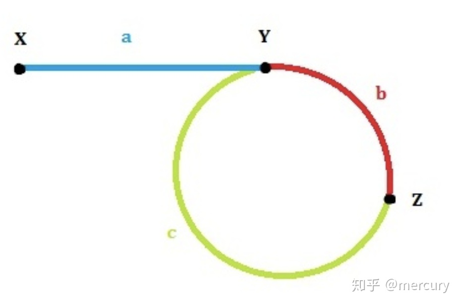

难度：<font color=orange>中等</font>

> 给定一个链表的头节点  head ，返回链表开始入环的第一个节点。 如果链表无环，则返回 null。
>
> 如果链表中有某个节点，可以通过连续跟踪 next 指针再次到达，则链表中存在环。 为了表示给定链表中的环，评测系统内部使用整数 pos 来表示链表尾连接到链表中的位置（索引从 0 开始）。如果 pos 是 -1，则在该链表中没有环。注意：pos 不作为参数进行传递，仅仅是为了标识链表的实际情况。
>
> 不允许修改 链表。


**示例 1：**


```python
输入：head = [3,2,0,-4], pos = 1
输出：返回索引为 1 的链表节点
解释：链表中有一个环，其尾部连接到第二个节点。
```


**示例 2：**


```python
输入：head = [1,2], pos = 0
输出：返回索引为 0 的链表节点
解释：链表中有一个环，其尾部连接到第一个节点。
```


**示例 3：**


```python
输入：head = [1], pos = -1
输出：返回 null
解释：链表中没有环。
```


**思路：**

1. 快慢指针，判断是否有环。
2. 没环：直接放回None
3. 有环：两个指针，同步到相同节点，该节点就是相交节点。




假设在 Z 节点第一次相遇：

slow 指针走过的路程：a + b

fast 指针走过的路程：a + n(b+c) + c

由于 fast 的速度是 slow 的 2倍：2(a+b) = a + n(b+c) + c 

得 ：a = (n - 1) * (b + c) + c

所以：在有两个指针 A 从 X 出发，指针 B 从 Z 出发，当 A 到达节点 Y 时，B 指针走了 n - 1 圈 + c 在Y 节点相遇。


```python
class ListNode(object):
    def __init__(self, x):
        self.val = x
        self.next = None
        
def detect_cycle(head):
    fast = head
    slow = head
    has_cycle = False
    while fast and fast.next:
        fast = fast.next.next
        slow = slow.next
        if fast == slow:
            has_cycle = True
            break
    if not has_cycle: return None

    slow = head
    while slow != fast:
        slow = slow.next
        fast = fast.next

    return slow

head = ListNode(3)
node = ListNode(2)
head.next = node
head.next.next = ListNode(0)
head.next.next.next = ListNode(-4)
head.next.next.next.next = node

print(detect_cycle(head))

head = ListNode(1)
node = ListNode(2)
head.next = node
node.next=head

print(detect_cycle(head))

head = ListNode(1)
print(detect_cycle(head))
```

