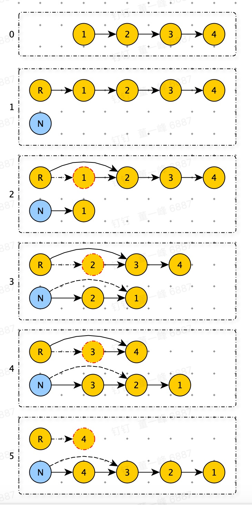

# 206 反转链表

> 给你单链表的头节点 `head` ，请你反转链表，并返回反转后的链表。

**示例 1：**


```python
输入：head = [1,2,3,4,5]
输出：[5,4,3,2,1]
```


**示例 2：**


```python
输入：head = [1,2]
输出：[2,1]
```


**示例 3：**

```python
输入：head = []
输出：[]
```


思路：

参数链表：raw_link_list

新建链表(返回值): new_link_list

将 raw_link_list 删除一个头结点，插入到 new_link_list 的头结点。



```python
class ListNode:
    def __init__(self, val=0, next=None):
        self.val = val
        self.next = next


def reverse_list(head):
    if not head or not head.next: return head
    raw_link_list = ListNode(0)
    raw_link_list.next = head

    new_link_lisk = ListNode(None)
    while raw_link_list and raw_link_list.next:
        node = raw_link_list.next
        # 从旧删除 node 节点
        raw_link_list.next = raw_link_list.next.next

        tmp = new_link_lisk.next
        # 将 node 插入新链表
        new_link_lisk.next = node
        node.next = tmp

    return new_link_lisk.next
  
l2 = ListNode(1)
l2.next = ListNode(2)
l2.next.next = ListNode(3)
l2.next.next.next = ListNode(4)
l2.next.next.next.next = ListNode(5)
foreach_list_node(reverse_list(l2))
```

