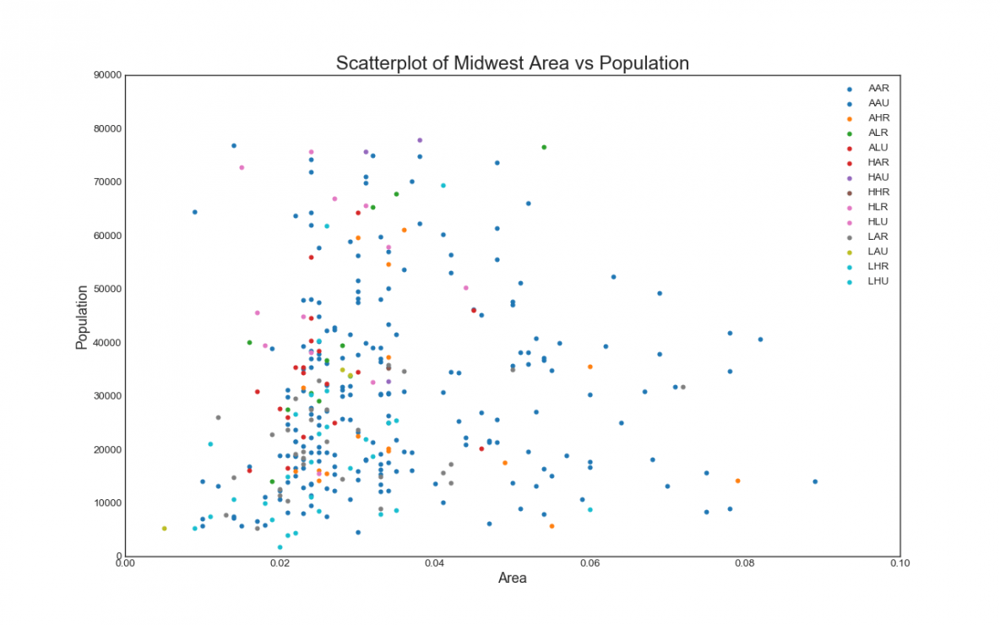
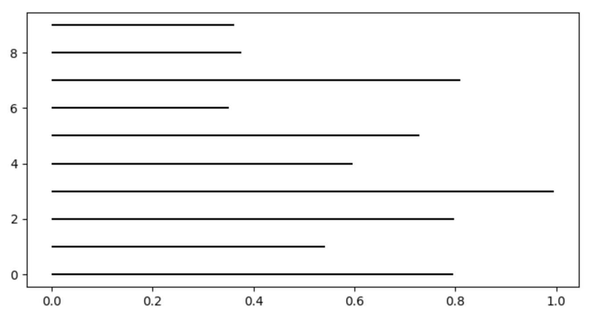

[TOC]

# 安装


- **matplotlib**：python中自带的，也是最常用的可视化工具包
- **seaborn**：python中可视化的新起之秀，致力于统计数据可视化
- **brewer2mpl**：色谱的工具


```shell
pip install seaborn
pip install brewer2mpl
```

# 关联图

- 散点图
- 折线图
- 相关性矩阵（相关系数）

探索两个维度的相关性。

## 散点图



绘制散点图步骤

```python
# 导入绘图库
import numpy as np
import pandas as pd
import matplotlib as mpl
import matplotlib.pyplot as plt
import seaborn as sns

# 定义数据
x1 = np.random.randn(10)
x2 = x1 ** 2 + x1 - 10

# 确定画布：当只有一个图的时候，不是必须存在
plt.figure(figsize=(8, 4))

# 绘图
plt.scatter(x1, x2,
            s=50, # 点的大小
            c="blue", # 点的颜色
            label='Positive' # 图例)

# 装饰图形
plt.legend()  # 显示图例

# 展示图形
plt.show()
```


机器学习中数据都是有类别：不同类别的数据显示不同的颜色。

```python
    X = np.random.randn(10, 2)
    y = np.array([0, 0, 1, 1, 0, 1, 0, 1, 0, 0])

    plt.figure(figsize=(8, 4))

    plt.scatter(X[:, 0], X[:, 1], s=30,
                c=y # 让分类被可视化
                )

    plt.show()
    
    
 # 指定颜色
    colors = ["red", "black"]
    labels = ["Zero", "One"]

    X = np.random.randn(10, 2)
    y = np.array([0, 0, 1, 1, 0, 1, 0, 1, 0, 0])
    # 循环绘制
    for i in range(len(colors)):
        plt.scatter(X[y == i, 0], X[y == i, 1], c=colors[i], label=labels[i])
    plt.legend()
    plt.show()
    
```


```python
   # 指定颜色  
  	colors = ["red", "black"]
    labels = ["Zero", "One"]

    X = np.random.randn(10, 2)
    y = np.array([0, 0, 1, 1, 0, 1, 0, 1, 0, 0])
    # 循环绘制
    for i in range(len(colors)):
        plt.scatter(X[y == i, 0], X[y == i, 1], c=colors[i], label=labels[i])
    plt.legend()
    plt.show()
```


颜色选择

```python
# plt.cm.tab 任意一个随机数，来提取一种颜色
color1 = plt.cm.tab(5.2)
# 前三个 RGB ，最后一个色彩饱和度
# (0.09019607843137255, 0.7450980392156863, 0.8117647058823529, 1.0)

plt.figure(figsize=(16,10))

# i/len(categories) 不同的颜色
for i in range(len(categories)):
    plt.scatter(midwest.loc[midwest["category"]==categories[i],"area"]
                ,midwest.loc[midwest["category"]==categories[i],"poptotal"]
                ,s=20
                ,c=np.array(plt.cm.tab10(i/len(categories))).reshape(1,-1)
                ,label=categories[i]
               )
    
#对图像进行装饰
# 获取当前图像：plt.gca()
plt.gca().set(xlim=(0.0, 0.12), ylim=(0, 80000)) #控制横纵坐标的范围
plt.xticks(fontsize=12) #坐标轴上的标尺的字的大小
plt.yticks(fontsize=12)
plt.ylabel('Population',fontsize=22) #坐标轴上的标题和字体大小
plt.xlabel('Area',fontsize=22)
plt.title("Scatterplot of Midwest Area vs Population", fontsize=22) #整个图像的标题和字体的大小
plt.legend(fontsize=12) #图例的字体大小

plt.show()
```


在特征探索阶段，经常看特征在 label 的分布。

```python
import pandas as pd
import matplotlib.pyplot as plt

data_train = pd.read_csv("/Users/dongyf/dongyf/data/status_rank/train_data_uniq_filter_feature")

plt.scatter(data_train.cubeFeature, data_train.label, c=data_train.label, s=10)

# 装饰
plt.title("staticScore distribution in label")
plt.xlabel("staticScore")
plt.xlabel("label")
plt.legend()

plt.show()
```


# 偏差图

偏差图是当个特征的所有值和特定值（一般是均值）之间的关系图，反映的是所有值偏离特定值的距离。

- 发散型条形图
- 面积图


**参数说明：**

- y: y轴索引
- xmin: 每行的开头
- xmax: 每行的结尾
- colors: 颜色，默认是‘k’(黑色)
- linestyles : 线的类型，可选择{'solid', 'dashed', 'dashdot', 'dotted'}
- label: 标签，默认为空
- linewidth：线的宽度* alpha：色彩饱和度

## 条形图

```python
# 水平条形图
plt.hlines()
# 垂直条形图
plt.vlines()

import numpy as np
import matplotlib.pyplot as plt

x=np.random.rand(10)
plt.figure(figsize=(8,4))
plt.hlines(y=range(10),xmin=0,xmax=x)
plt.show()
```



## 发散型条形图

```python
import numpy as np
import matplotlib.pyplot as plt 

  	x = np.random.rand(10)
  	# 排序
    x.sort()
    # 减去均值（去中心）
    x -= x.mean()
		
    # 颜色
    color = []
    for i in x:
        if i > 0:
            color.append("red")
        else:
            color.append("green")

    plt.figure(figsize=(8, 4))
    plt.hlines(y=range(10), xmin=0, xmax=x, 
               colors=color, 	# 颜色
               linewidth=5,		# 线宽
               alpha=0.6 			# 色彩饱和度
              )

    plt.show()
```

