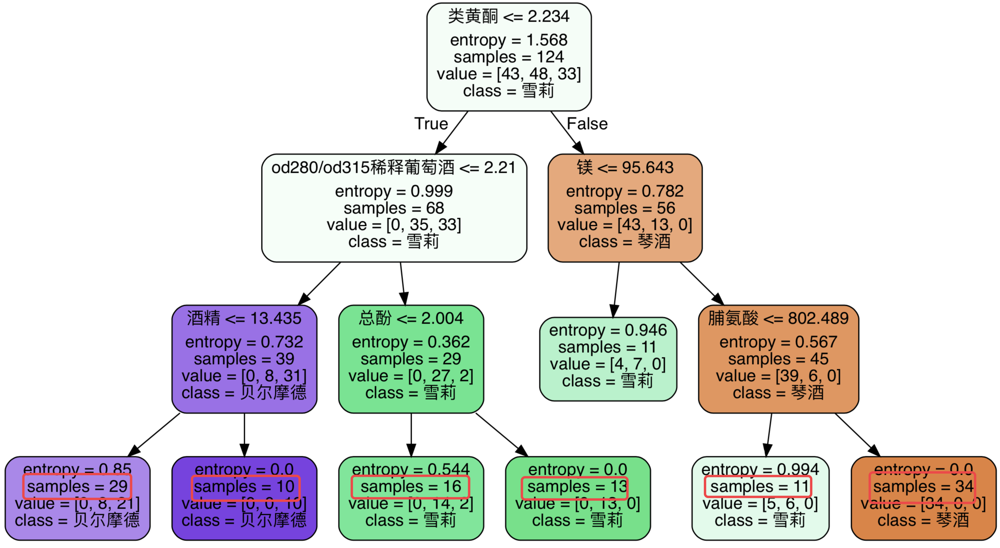
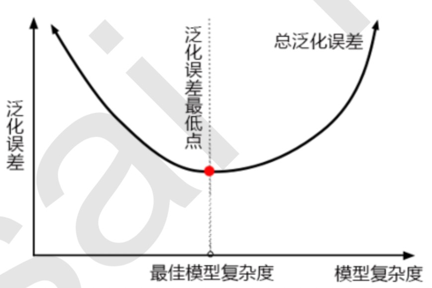

[TOC]

决策树算法的核心是要解决两个问题: 

1. 如何从数据表中找出最佳节点和最佳分枝? 
2. 如何让决策树停止生长，防止过拟合? 

Sklearn 中的决策树

| tree.DecitionTreeClassifier | 分类树                                |
| --------------------------- | ------------------------------------- |
| Tree.DicitionTreeRegressor  | 回归树                                |
| Tree.export_graphviz        | 将生产的决策树导出为DOT格式，画图专用 |
| tree.ExtraTreeClassifier    | 高随机版本的分类树                    |
| tree.ExtraTreeRegressor     | 高随机版本的回归树                    |

# DecitionTreeClassifier

```python
    def __init__(self,
                 criterion="gini",
                 splitter="best",
                 max_depth=None,
                 min_samples_split=2,
                 min_samples_leaf=1,
                 min_weight_fraction_leaf=0.,
                 max_features=None,
                 random_state=None,
                 max_leaf_nodes=None,
                 min_impurity_decrease=0.,
                 min_impurity_split=None,
                 class_weight=None,
                 presort=False):
```

## 重要参数

### criterion

不纯度：衡量最佳的特征，进行决策。

子节点的不纯度 < 父节点

1. entropy ：信息熵
2. gini: 基尼系数

$Entropy(t)=\sum^{c-1}_{i=0}{p(i|t)log_2p(i|t)}$

$Gini(t)=1-\sum^{c-1}_{i=0}{p(i|t)^2}$

默认值：gini

信息熵对不纯度更加敏感，对不纯度的惩罚最强。计算速度较慢。

高维数据或者噪音很多的数据，信息熵很容易过拟合，基尼系数在这种情况下效果往往比较好 。

参数选取：

1. 通常使用gini
2. 高维数据或者噪音很多的数据，使用gini
3. 低位，数据干净，entropy 和 gini 差不多。
4. 决策树拟合程度不好时，使用entropy
5. 两个都试试，选最好的。

demo

**查看数据**

```python
# 导入需要的模块
from sklearn import tree
from sklearn.datasets import load_wine
from sklearn.model_selection import train_test_split

wine = load_wine()
# 查看数据维度
print(wine.data.shape)
print(wine.target[:1])

# 将 data 和 target 拼到一张表里（比较好看一点）
import pandas as pd
pd.concat([pd.DataFrame(wine.data), pd.DataFrame(wine.target)], axis=1)

# 特征名称
print(wine.feature_names)
# 类型名称
print(wine.target_names)
```

**训练**

```python
# 切分为训练集和测试集(30%)
x_train, x_test, y_train, y_test = train_test_split(wine.data, wine.target, test_size=0.3)

# 建模
model = tree.DecisionTreeClassifier(criterion="entropy")
model = model.fit(x_train, y_train)
# 测试集上的准确度
score = model.score(x_test, y_test)
print(score)
```

**绘出决策树**

```python
feature_name = ['酒精', '苹果酸', '灰', '灰的碱性', '镁', '总酚', '类黄酮', '非黄烷类酚类', '花青素', '颜 色强度', '色调', 'od280/od315稀释葡萄酒', '脯氨酸']
import graphviz
# feature_name：节点内切分条件中值
# class_names：节点内 class 的值
# filled：节点是否填充颜色：相同分类相同颜色
# rounded：节点圆角方框
dot_data = tree.export_graphviz(model
                                , feature_names=feature_name, class_names=["琴酒", "雪莉", "贝尔摩德"]
                                , filled=True
                                , rounded=True
                                )
graph = graphviz.Source(dot_data)
graph.view()
```


训练数据不变情况下，每次运行，生成的决策树都不同。

### Random_state & splitter

### 剪枝参数

防止过拟合，提高泛化能力，需要剪枝。

**剪枝策略对决策树的影响巨大，正确的剪枝策略是优化决策树算法的核心 。**

#### max_depth

最大深度，超过最大深度树枝全部剪掉。

在高纬度，低样本时，非常有效。决策树多生长一层，样本量的需求增加一倍。

建议：max_depth = 3 开始尝试。

```python
model = tree.DecisionTreeClassifier(criterion="entropy", random_state=30, max_depth=2)
```


#### min_spamples_leaf & min_samples_split

min_samples_leaf ：一个节点分枝后，每个子节点必须至少包含 min_samples_leaf 个样本数据，否则不进行分枝。

min_samples_leaf 一般搭配 max_depth 使用，可以是模型更加平滑。

min_samples_leaf 过小会引起过拟合，过大引起欠拟合。建议从 5 开始尝试。

min_samples_leaf 保证每个叶子的最小尺寸，回归问题避免了低方差，过拟合的叶子节点出现。

对于类别不多的分类问题，min_samples_leaf = 1 是最佳的选择。


min_spamples_spit：一个节点必须包含 min_spamples_spit 个样本点，这个节点才被允许分枝。

```python
model = tree.DecisionTreeClassifier(criterion="entropy"
                                    , splitter="random"
                                    , random_state=30
                                    , max_depth=3
                                    , min_samples_leaf=10,
                                    min_samples_split=10)
```



#### max_feature & min_impurity_decrease

max_feature：分枝时考虑==特征个数==，超过限制个数的特征会被丢弃。比较暴力，没有考虑特征的重要性的情况下，移除特征，容易引起欠拟合。

建议：使用PCA，ICA 或者特征选择模块中降维算法，提前降维。


min_impurity_decrease：限制==信息增益==大的大小，信息增益小于设定数值的分枝不会发生。

#### 调参

超参数学习曲线：超参数作为横坐标，模型的度量指标作为纵坐标的曲线。可以衡量不同的超参数下的模型表现。

```python
import matplotlib.pyplot as plt

test = []

for i in range(10):
    model = tree.DecisionTreeClassifier(max_depth=i + 1
                                        , criterion="entropy"
                                        , random_state=30
                                        , splitter="random")
    model = model.fit(x_train, y_train)
    score = model.score(x_test, y_test)
    plt.xlabel("max_depth")
    plt.ylabel("accuracy")
    test.append(score)

plt.plot(range(1, 11), test, color='red', label="max_depth")
plt.legend()
plt.show()
```


max_depth：为 3，4，5 都是一个不错的选择。

思考题：

1. 通过剪枝一定能够提升 model 的泛化能力吗？



模型优化目标：泛化误差小，模型复杂度低。

决策树天生模型复杂度高（树不断生长，树层数越深模型越复制），在曲线的右边。所以我们通过 max_depth，min_samples_leaf，min_samples_split 等参数来简化模型，将模型向左推。

如果样本数据不足，可能生成决策树欠拟合，在曲线左边。

调参顺序：根据参数对模型的影响程度，优先影响调程度大的参数：max_depth。

### 目标权重参数

#### class_weight & min_weight_fraction_leaf

class_weight：平衡正负样本数量不平衡的情况，给样本少的标签更多的权重，让模型更偏向少数类。

比如：银行判断”一个要办信用卡的用户是否失信？“，历史数据中失信用户占1%，那么模型什么都不做，直接给不失信，正确率为：99%。

分枝时受 class_weight 权重影响，需要配合 min_weight_fraction_leaf 属性使用。