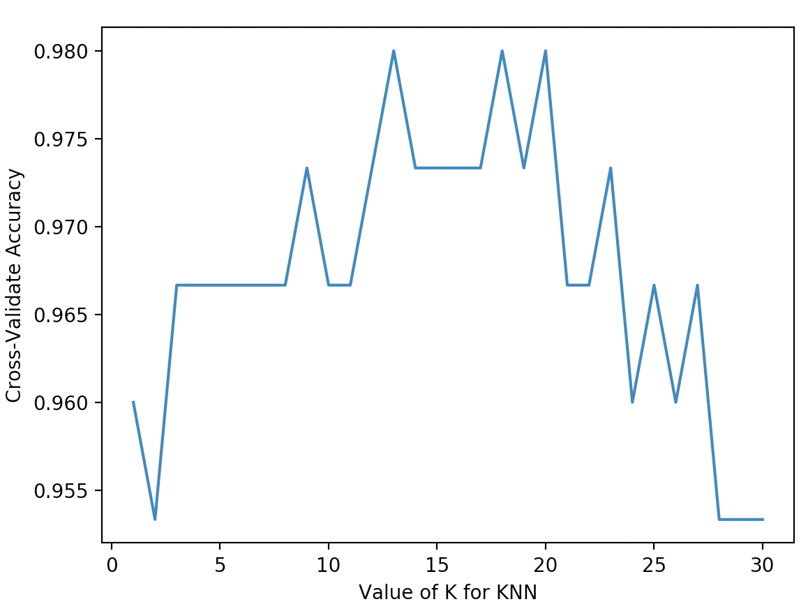
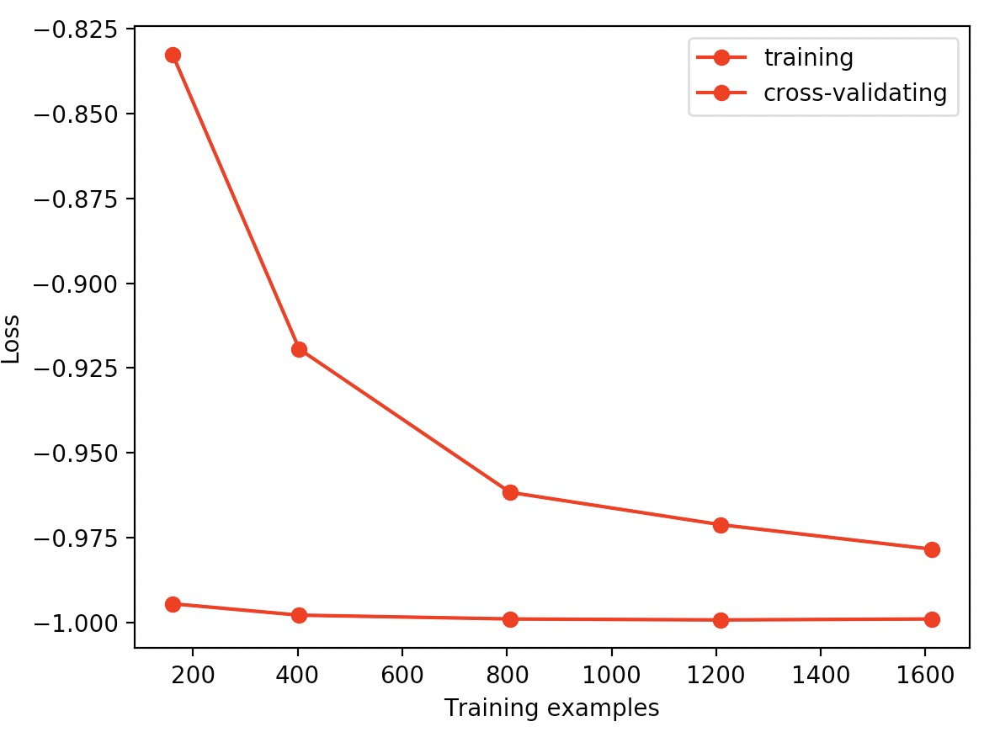

[TOC]

Sklearn train 流程

```python
# 导入需要的模块
from sklearn import tree

# 实例化分类器
clf = tree.DecisionTreeClassifier()
# 训练
clf = clf.fit(x_train,y_train)
# 预测：result(准确率)
result = clf.score(x_test,y_test)
```


# 数据

数据集：https://scikit-learn.org/stable/modules/classes.html#module-sklearn.datasets

1. 使用数据

   ```python
   from sklearn import datasets
   from sklearn.model_selection import train_test_split
   from sklearn.neighbors import KNeighborsClassifier
   
   iris = datasets.load_iris()
   iris_x = iris.data
   iris_y = iris.target
   
   # 切分训练集和测试集（打乱顺序）
   x_train, x_test, y_train, y_test = train_test_split(iris_x, iris_y, test_size=0.3)
   
   # 训练 knn 模型
   knn = KNeighborsClassifier()
   knn.fit(x_train, y_train)
   
   # 预测
   print(knn.predict(x_test))
   print(y_test)
   ```

   

2. 产生数据

```python
from sklearn import datasets
import matplotlib.pyplot as plt

x,y = datasets.make_regression(n_samples=100,n_features=1,n_targets=1,noise=3)
plt.scatter(x,y)
plt.show()
```

# model 属性

```python
from sklearn.linear_model import LinearRegression
import matplotlib.pyplot as plt

boston = datasets.load_boston()
data_x = boston.data
data_y = boston.target

x_train, x_test, y_train, y_test = train_test_split(data_x, data_y, test_size=0.3)
model = LinearRegression()
model.fit(x_train, y_train)

print(model.predict(x_test))
print(y_test)

# y = kx + b
# 输出 k
print(model.coef_)
# 输出 b
print(model.intercept_)
# 分类模型：准确率
# 回归模型：偏差？？？？
print(model.score(x_test, y_test))

# 实际分类中，特征对模型的重要性
print(model.feature_importances_)
# 将特征名称和权重接口
print([*zip(feature_name, model.feature_importances_)])

# apply 返回测试样本所有的叶子节点的索引
model.apply(x_test)
# predict 返回测试样本的分类、回归结果。
model.predict(x_test)
```

# normailzation 标准化

```python
from sklearn import preprocessing
from sklearn.model_selection import train_test_split
from sklearn.datasets.samples_generator import make_classification
from sklearn.svm import SVC

X, y = make_classification(n_samples=300, n_features=2, n_redundant=0, n_informative=2, random_state=22,
                           n_clusters_per_class=1, scale=100)

X = preprocessing.scale(X)
X_train, X_test, y_train, y_test = train_test_split(X, y, test_size=0.3)

clf = SVC()
clf.fit(X_train,y_train)
print(clf.score(X_test,y_test))
# 归一化后：准确率是：88.88%
# 没有归一化：准确率是：53.33%


```


# Cross validation

```python
from sklearn import datasets
from sklearn.neighbors import KNeighborsClassifier
from sklearn.model_selection import cross_val_score

iris = datasets.load_iris()
iris_x = iris.data
iris_y = iris.target

knn = KNeighborsClassifier(n_neighbors=5)
# 交叉验证
scores = cross_val_score(knn, iris_x, iris_y, cv=5, scoring="accuracy")
print(scores)
```

## 参数选择

```python
from sklearn import datasets
from sklearn.model_selection import train_test_split
from sklearn.neighbors import KNeighborsClassifier
from sklearn.model_selection import cross_val_score
import matplotlib.pyplot as plt

iris = datasets.load_iris()
iris_x = iris.data
iris_y = iris.target

k_range = range(1, 31)
k_score = []
for k in k_range:
    knn = KNeighborsClassifier(n_neighbors=k)
    # 交叉验证
    # cv: 5 组
    # scoring=accuracy 准确率 for classification
    # scoring=mean_squared_error for regression
    # loss = -cross_val_score(knn, iris_x, iris_y, cv=10, scoring="mean_squared_error")
    scores = cross_val_score(knn, iris_x, iris_y, cv=10, scoring="accuracy")
    k_score.append(scores.mean())

plt.plot(k_range, k_score)
plt.xlabel("Value of K for KNN")
plt.ylabel("Cross-Validate Accuracy")
plt.show()
```



Over fitting

## 学习过程可视化

```python
from sklearn.model_selection import learning_curve
from sklearn.datasets import load_digits
from sklearn.svm import SVC
import matplotlib.pyplot as plt
import numpy as np

digits = load_digits()
X = digits.data
y = digits.target

# learning_curve 可视化机器学习的整个过程
# cv=10：10 轮交叉验证
# scoring：loss function
# train_sizes:在training 过程中，在10% 时记录一下，25% 时记录一下绘图。

# 返回值：
# train_sizes: 在这 [0.1, 0.25, 0.5, 0.75, 1] 5 个位置时，train_data 的记录数。
# train_loss：train_data 的误差值
# test_loss：test_data 的误差值
#
# train_sizes, train_loss, test_loss = learning_curve(SVC(gamma=0.001), X, y, cv=10, scoring="mean_squared_error",
#                                                     train_sizes=[0.1, 0.25, 0.5, 0.75, 1])

train_sizes, train_loss, test_loss = learning_curve(SVC(gamma=0.001), X, y, cv=10, scoring="accuracy",
                                                    train_sizes=[0.1, 0.25, 0.5, 0.75, 1])

# 交叉验证 10 组，在这 [0.1, 0.25, 0.5, 0.75, 1] 5 个位置，有10 个值
train_loss_mean = -np.mean(train_loss, axis=1)
test_loss_mean = -np.mean(test_loss, axis=1)

plt.plot(train_sizes, train_loss_mean, "o-", color="r", label="training")
plt.plot(train_sizes, test_loss_mean, "o-", color="r", label="cross-validating")

plt.xlabel("Training examples")
plt.ylabel("Loss")
plt.legend(loc="best")
plt.show()
```




通过可视化调参：找到不欠拟合也不过拟合的参数。奥卡姆剃刀。


# 模型保存

```python
from sklearn import svm
from sklearn import datasets

clf = svm.SVC()
iris = datasets.load_iris()

X, y = iris.data, iris.target
clf.fit(X, y)

# method 1: pickle
import pickle

# save
with open("models/clf.pickle", "wb") as f:
    pickle.dump(clf, f)
# restore
with open("models/clf.pickle", "rb")as f:
    clf2 = pickle.load(f)
    print(clf2.predict(X[0:1]))
```


```python
# method 2: joblib
# 比joblib 快，多线程处理
from sklearn.externals import joblib

# save
joblib.dump(clf, "models/clf.joblib")
# restore
clf3 = joblib.load("models/clf.joblib")
print(clf3.predict(X[0:1]))
```


## PMLL model 跨平台

python 安装

```shell
pip3 install sklearn2pmml
```

java 

https://github.com/jpmml/jpmml

```xml
<!-- Class model classes -->
<dependency>
	<groupId>org.jpmml</groupId>
	<artifactId>pmml-model</artifactId>
	<version>${jpmml.version}</version>
</dependency>
<!-- Class model annotations -->
<dependency>
	<groupId>org.jpmml</groupId>
	<artifactId>pmml-schema</artifactId>
	<version>${jpmml.version}</version>
</dependency>

<dependency>
	<groupId>org.jpmml</groupId>
	<artifactId>pmml-evaluator</artifactId>
	<version>${jpmml.version}</version>
</dependency>
```


参考：https://www.cnblogs.com/pinard/p/9220199.html


