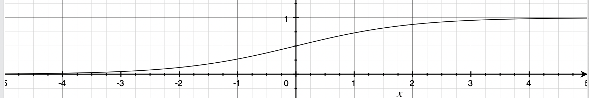
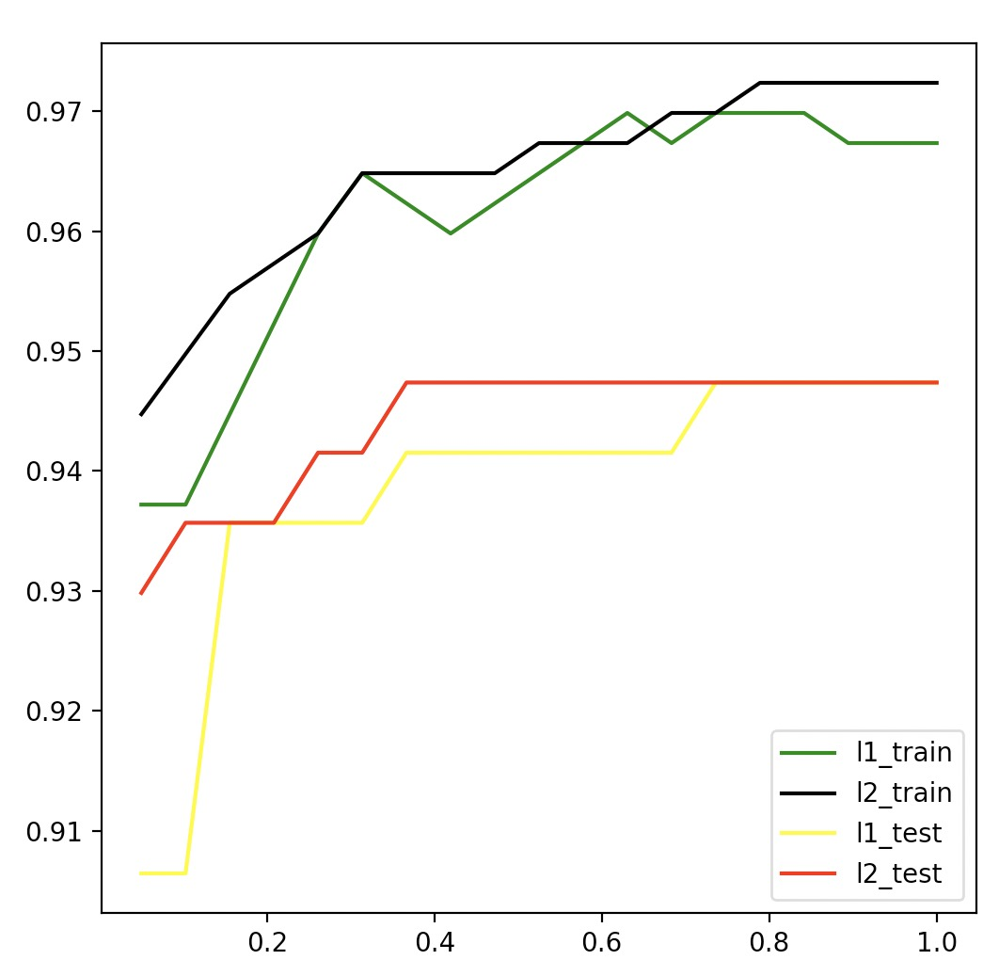

[TOC]

# 概述

sigmoid 函数：$g(z)=\frac{1}{1+e^{-z}}$




线性回归：$z=w^Tx$ 


```python

from sklearn.linear_model import LogisticRegression as LR
# 乳腺癌数据
from sklearn.datasets import load_breast_cancer
from sklearn.model_selection import train_test_split
from sklearn.metrics import accuracy_score

# 绘图
import numbers as np
import matplotlib.pyplot as plt

data = load_breast_cancer()
x = data.data
y = data.target

# penalty 正则化
# liblinear：最优化算法
# C：超参数
# max_iter：最大迭代数
lrl1 = LR(penalty="l1", solver="liblinear", C=0.5, max_iter=1000)
lrl2 = LR(penalty="l2", solver="liblinear", C=0.5, max_iter=1000)

lrl1 = lrl1.fit(x, y)
# 特征对应的参数(l1 正则化具有特征选择的作用)
print(lrl1.coef_)
'''
[[ 4.00474322  0.03199364 -0.13768065 -0.01622774  0.          0.
   0.          0.          0.          0.          0.          0.50401436
   0.         -0.07127066  0.          0.          0.          0.
   0.          0.          0.         -0.24586711 -0.12860585 -0.01440959
   0.          0.         -2.03774736  0.          0.          0.        ]]
'''

# 有效特征数（不为零特征数）
print((lrl1.coef_ != 0).sum(axis=1))
# [10]

lrl2 = lrl2.fit(x, y)
# 特征对应的参数
print(lrl2.coef_)
'''
[[ 1.61331113e+00  1.00124606e-01  4.60084835e-02 -4.19839426e-03
  -9.26228937e-02 -3.00484301e-01 -4.53250190e-01 -2.19778015e-01
  -1.33074668e-01 -1.92576286e-02  1.89635811e-02  8.74998561e-01
   1.32421950e-01 -9.53784315e-02 -9.62972408e-03 -2.53596204e-02
  -5.83890299e-02 -2.67755115e-02 -2.73846616e-02 -8.05302922e-05
   1.28529688e+00 -3.00088054e-01 -1.74310770e-01 -2.23545072e-02
  -1.70267493e-01 -8.77272211e-01 -1.15830085e+00 -4.22526360e-01
  -4.12406225e-01 -8.66393364e-02]]
'''
```


```python
l1_train = []
l2_train = []
l1_test = []
l2_test = []

x_train, x_test, y_train, y_test = train_test_split(x, y, test_size=0.3, random_state=300)

# np.linspace(起始数，终止数，个数)
# np.linspace(0.05,1,19)：[0.05,1] 均匀生成19个数
for i in np.linspace(0.05, 1, 19):
    lrl1 = LR(penalty="l1", solver="liblinear", C=i, max_iter=1000)
    lrl2 = LR(penalty="l2", solver="liblinear", C=i, max_iter=1000)

    lrl1 = lrl1.fit(x_train,y_train)
    l1.append(accuracy_score(lrl1.predict(x_train),y_train))
    l1_test.append(accuracy_score(lrl1.predict(x_test), y_test))


    lrl2 = lrl2.fit(x_train,y_train)
    l2.append(accuracy_score(lrl2.predict(x_train),y_train))
    l2_test.append(accuracy_score(lrl2.predict(x_test), y_test))

graph = [l1,l2,l1_test,l2_test]
color = ["green","black","yellow","gray"]
label =["L1","L2","l1_test","l2_test"]

# 6*6 的画布
plt.figure(figsize=(6,6))
for i in range(len(graph)):
    plt.plot(np.linspace(0.05,1,19),graph[i],color[i],label=label[i])

plt.legend(loc=4)
plt.show()
```




模型在训练集上表现碾压测试测试集上。

用 l2 正则化时，C = 0.3x 模型简单，效果最好。

用 l1 正则化时，C = 0.8 模型简单，效果最好。

