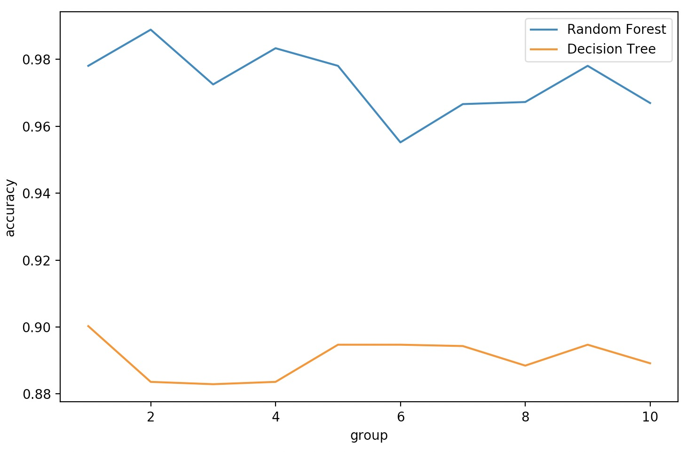
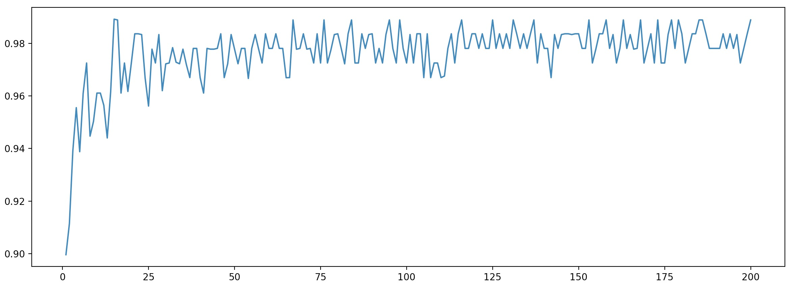

[TOC]

# 概述

## 集成学习

集成学习（ensemble learning ）目标：

> 集成算法会收集多个评估器的得分，得到一个综合结果，以此获取比单个模型更好的效果。

常见集成算法：

1. 随机森林
2. 梯度提升树（GBDT）
3. Xgboost
4. ....


集成评估器(ensmeble estimator)：多个模 型集成后的模型。

基评估器（base estimator）：单个评估器。
集成算法：

1. 装袋法（Bagging）
2. 提升法（Boosting）
3. stacking


Bagging：构建==多个相互独立的评估器==。预测时采用平均或者多数表决的原则进行集成。代表模型：随机森林。

Boosting：==基评估器是相关的==，按顺序构建，将上一次预测失败的样本，加大权重再训练一个基评估器。代表模型：Adaboost 和梯度提升树。

## sklearn 中的集成算法

**模块：ensemble**

| 类                                  | 类的功能                                |
| :---------------------------------- | :-------------------------------------- |
| ensemble.AdaBoostClassifier         | AdaBoost 分类                           |
| ensemble.AdaBoostRegressor          | Adaboost 回归                           |
| ensemble.BaggingClassifier          | 装袋分类器                              |
| ensemble.BaggingRegressor           | 装袋回归器                              |
| ensemble.ExtraTreesClassifier       | Extra-trees 分类(超树，极端随机树)      |
| ensemble.ExtraTreesRegressor        | Extra-trees 回归                        |
| ensemble.GradientBoostingClassifier | 梯度提升分类                            |
| ensemble.GradientBoostingRegressor  | 梯度提升回归                            |
| ensemble.IsolationForest            | 隔离森林                                |
| **ensemble.RandomForestClassifier** | **随机森林分类**                        |
| **ensemble.RandomForestRegressor**  | **随机森林回归**                        |
| ensemble.RandomTreesEmbedding       | 完全随机树的集成                        |
| ensemble.VotingClassifier           | 用于不合适估算器的软投票/多数规则分类器 |

集成算法中，有一半以上都是树的集成模型，可见决策树在集成中必定是有很好的效果。


# RandomForestClassifier

sklearn.ensemble.RandomForestClassifier 

```python
    def __init__(self,
                 n_estimators='warn',
                 criterion="gini",
                 max_depth=None,
                 min_samples_split=2,
                 min_samples_leaf=1,
                 min_weight_fraction_leaf=0.,
                 max_features="auto",
                 max_leaf_nodes=None,
                 min_impurity_decrease=0.,
                 min_impurity_split=None,
                 bootstrap=True,
                 oob_score=False,
                 n_jobs=None,
                 random_state=None,
                 verbose=0,
                 warm_start=False,
                 class_weight=None):
```

随机森林：Bagging 的代表模型。

基评估器：决策树。

## 重要参数

### 控制基评估器

在决策树文档里已说明。

1. criterion
2. max_depth
3. min_sample_leaf
4. max_features
5. min_impurity_decrease

### n_estimators

==基评估器的数量==，即森林中树木的数量。

==n_estimators 越大，模型效果越好。== n_estimators 达到一定程度，随机森林的精确性往往上不去了。

n_estimators 越大，计算量和内存使用也越大。

n_estimators 默认值为10，0.22 版本中 默认值是100.


### 决策树 VS 随机森林

```python
from sklearn.tree import DecisionTreeClassifier
from sklearn.ensemble import RandomForestClassifier
from sklearn.datasets import load_wine
from sklearn.model_selection import train_test_split

wine = load_wine()

x_train, x_test, y_train, y_test = train_test_split(wine.data, wine.target, test_size=0.3)

dtc = DecisionTreeClassifier(random_state=0)
rfc = RandomForestClassifier(random_state=0)

dtc = dtc.fit(x_train, y_train)
rfc = rfc.fit(x_train, y_train)

score_c = dtc.score(x_test, y_test)
score_r = rfc.score(x_test, y_test)

print("Single Tree:{s1},Random Forest:{s2}".format(s1=score_c, s2=score_r))
# Single Tree:0.9444444444444444,Random Forest:1.0
```


随机森林 VS 决策树 交叉验证的效果对比

```python
from sklearn.model_selection import cross_val_score
import matplotlib.pyplot as plt

# 随机森林 VS 决策树 交叉验证的效果对比
rfc_l = []
dtc_l = []

for i in range(10):
    rfc = RandomForestClassifier(n_estimators=25)
    rfc_s = cross_val_score(rfc, wine.data, wine.target, cv=10).mean()
    rfc_l.append(rfc_s)

    dtc = DecisionTreeClassifier()
    dtc_s = cross_val_score(dtc, wine.data, wine.target, cv=10).mean()
    dtc_l.append(dtc_s)

plt.plot(range(1, 11), rfc_l, label="Random Forest")
plt.plot(range(1, 11), dtc_l, label="Decision Tree")
plt.xlabel("group")
plt.ylabel("accuracy")
plt.legend()
plt.show()
```



随机森林 :smile: 碾压决策树 :sob:

#### n_estimators 学习曲线

```python
superpa = []
for i in range(200):
    rfc = RandomForestClassifier(n_estimators=i + 1)
    rfc_s = cross_val_score(rfc, wine.data, wine.target, cv=10).mean()
    superpa.append(rfc_s)
# 输出最好准确率，以及对应的 n_estimators
print(max(superpa), superpa.index(max(superpa)) + 1)
plt.figure(figsize=[20, 5])
plt.plot(range(1, 201), superpa)
plt.show()
# 0.9891812865497076 15
```



## 重要属性和接口

- estimators_：查看随机森林中所有树的列表。
- oob_score_：袋外得分（模型的精确度）。随机森林为保证每个棵树都不尽相同，训练时采取放回抽样的方式产生训练集，那么没有被随机选中的数据，成为袋外数据。用袋外数据测试生成的模型，测试结果就是袋外得分。
- feature_importances_：特征重要性。
- apply
- fit
- predict
- score
- Predict_proba：返回样本被分到每一类的概率，多分类是一个数组。传统的随机森林，基评估器单独决策类别，少数服从多数，而sklearn 中随机森林是，返回所有基评估器预测概率，用平均概率，从而决定样本的分类。