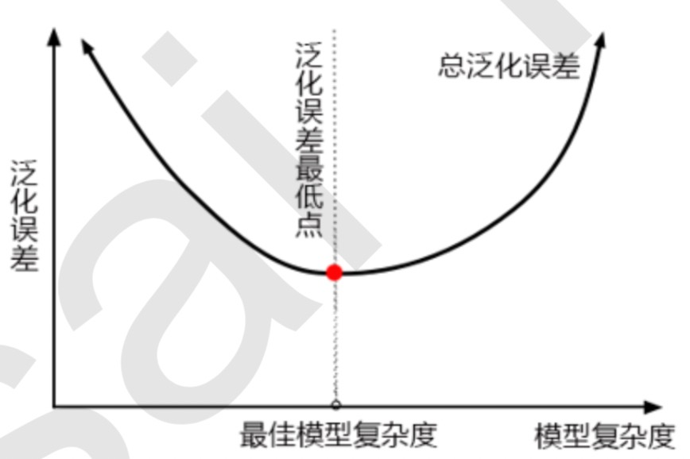
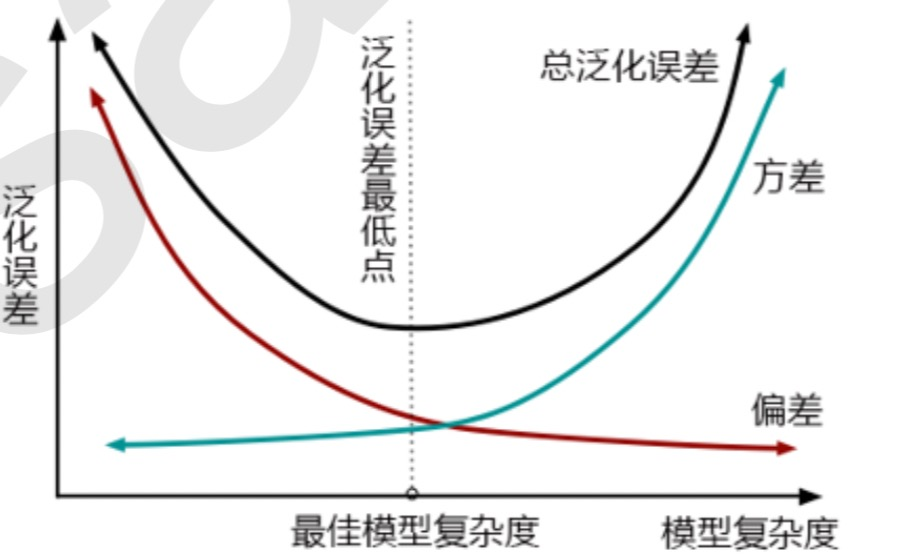
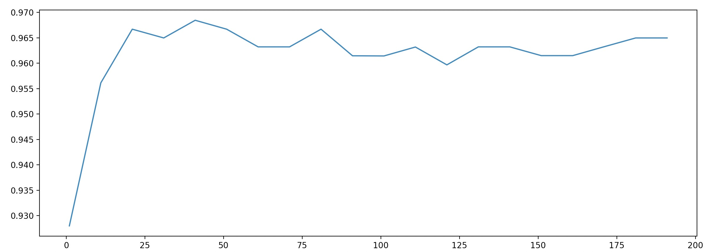
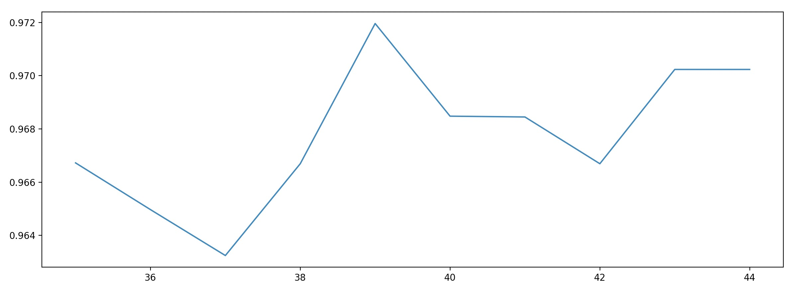

[TOC]

# 调参基本思想

通过学习曲线或者网格搜索，可以探索到调参边缘（代价：一次训练可能要跑三天三夜）。

实际工作中，高手调参多依赖经验。

1. 正确的调参思路和方法
2. 对模型评估指标的理解
3. 对数据的感觉和经验
4. 不断尝试


## 正确的调参思路：

目标：提升某个模型的评估指标（随机森林是准确度，score 或者 oob_score 来衡量）。

衡量模型在未知数据上的准确率的指标：泛化误差（Genelization error）



**==对模型认知==**

调参前，先判断，模型现在究竟在图像哪一边。

树模型，树越茂盛，深度越深，枝叶越多，模型越复杂。

决策树天生在上图右上角。

随机森立是有决策树构成，所以随机森立天生也在图的右上角。

所以优化目标：减少模型复杂度，剪枝，防止过拟合。

1. 模型太简单和太复杂，都会让泛化误差升高，追求的是平衡点。
2. 模型太复杂就过拟合，模型太简单就欠拟合。
3. 对树模型和树的集成模型，树的深度越深，枝叶越多，模型越复杂。
4. 对树模型和树的集成模型的目标，减少模型复杂度，把模型图像向左移动。


研究参数改变，对模型准确率的改变的单调性。优先选影响比较大，进行调节。调参过程中，有些参数既能增加模型复杂度，也能减小模型复杂度。

这些参数对模型的影响，可以通过小量数据验证。等到如下表，然后在大数据上调参。

随机森林参数对模型影响排序。

| 参数              | 对模型测试数据上的性能评估的影响 | 影响程度                 |
| ----------------- | -------------------------------- | ------------------------ |
| n_estimators      |                                  | :star::star::star::star: |
| max_depth         | max_depth ↓，模型更简单          | :star::star::star:       |
| min_samples_leaf  | min_samples_leaf ↑，模型更简单   | :star::star:             |
| min_samples_split | min_samples_split↑，模型更简单   | :star::star:             |
| max_features      | max_features↓，模型更简单        | :star:                   |
| criterion         | 一般使用 gini                    | 看具体情况               |


## 方差 VS 偏差

泛化误差的背后其实是“偏差-方差困境”。

|            | 偏差大                                                       | 偏差小                                                       |
| ---------- | ------------------------------------------------------------ | ------------------------------------------------------------ |
| **方差大** | 模型不适合这个数据，换模型。                                 | 过拟合，模型复杂，对某些数据集预测准确，对某些数据集预测很糟糕 |
| **方差小** | 欠拟合，模型相对简单，预测很稳定，但对所有数据预测都不太准确。 | 泛化误差小，我们的目标                                       |



有图可以，随机森林训练过程旨在降方差（降低模型复杂度）。

# 调参实例

数据：sklearn 中乳腺癌的数据。

模型：随机森林。

## base line

```python
from sklearn.datasets import load_breast_cancer
from sklearn.ensemble import RandomForestClassifier
from sklearn.model_selection import GridSearchCV
from sklearn.model_selection import cross_val_score

import matplotlib.pyplot as plt
import pandas as pd
import numpy as np

data = load_breast_cancer()

# print(data.data)
# print(data.data.shape)
# (569, 30)
# print(data.target)

# base line
rfc = RandomForestClassifier(n_estimators=100, random_state=90)
score_pre = cross_val_score(rfc, data.data, data.target, cv=10).mean()
print(score_pre)
# 0.9666925935528475
```

## 调整 n_estimators

在这里我们选择==学习曲线==，可以使用网格搜索吗?可以，但是只有==学习曲线，才能看见趋势== ，看见n_estimators在什么取值开始变得平稳，是否一直推动模型整体准确率的上升等信息。

第一次的学习曲线，可以先用来帮助我们划定范围，我们取每十个数作为一个阶段，来观察n_estimators的变化如何 引起模型整体准确率的变化。（算法思想：快慢步）

```python
score_list = []
# 步长：10
for i in range(0, 200, 10):
    rfc = RandomForestClassifier(n_estimators=i + 1, n_jobs=1, random_state=90)
    score = cross_val_score(rfc, data.data, data.target, cv=10).mean()
    score_list.append(score)

print(max(score_list), score_list.index(max(score_list)) * 10 + 1)
# 0.9684480598046841 41
plt.figure(figsize=[20, 5])
plt.plot(range(1, 201, 10), score_list)
plt.show()
```



步长为10，最优解在 n_estimators = 41 左右。

于是在 [35,45] 之间，以步长为1，重新搜索。

```python
score_list = []
# 步长：1
for i in range(35, 45):
    rfc = RandomForestClassifier(n_estimators=i, n_jobs=1, random_state=90)
    score = cross_val_score(rfc, data.data, data.target, cv=10).mean()
    score_list.append(score)

print(max(score_list), 35 + score_list.index(max(score_list)))
# 0.9719568317345088 39
plt.figure(figsize=[20, 5])
plt.plot(range(35, 45), score_list)
plt.show()
```



最终选定：n_estimators = 39

结论：由于 n_estimators 的调节，准确率提升：0.005。

## 调整 max_depth

max_depth 的调整，通过简化模型基评估器，来简化整体模型，把模型向左推，整体的准确率下降，泛化错误率提升。

```python
param_grid = {"max_depth": range(1, 20)}
rfc = RandomForestClassifier(n_estimators=39,random_state=90)
GS = GridSearchCV(rfc,param_grid,cv=10)
GS.fit(data.data,data.target)

print(GS.best_params_)
# {'max_depth': 11}
print(GS.best_score_)
# 0.9718804920913884
```

最佳参数： max_depth == 11 ，准确率反而下降。max_depth == 11 反而欠拟合了。n_estimators=39,random_state=90 已经达到最完美的附近了，不需要再调参了。


实际项目调参过程，到此结束。

min_samples_leaf 和 min_samples_split 这两参数也能简化随机森林，尝试调一下。

## 调整 min_samples_leaf

1. 对于min_samples_split和min_samples_leaf,一般是从他们的最小值开始向上增加10或20

2. 面对高维度高样本量数据，如果不放心，也可以直接+50，对于大型数据，可能需要200~300的范围 
3. 如果调整的时候发现准确率无论如何都上不来，那可以放心大胆调一个很大的数据，大力限制模型的复杂度 

```python
param_grid = {"min_samples_leaf": range(1, 11)}
rfc = RandomForestClassifier(n_estimators=39, random_state=90)
GS = GridSearchCV(rfc, param_grid, cv=10)
GS.fit(data.data, data.target)

print(GS.best_params_)
# {'min_samples_leaf': 1}
print(GS.best_score_)
# 0.9718804920913884
```

最优的 min_samples_leaf 为 默认值 1。不需要调整。

## 调整 min_samples_split

```python
param_grid = {"min_samples_split": range(2, 2+20)}
rfc = RandomForestClassifier(n_estimators=39, random_state=90)
GS = GridSearchCV(rfc, param_grid, cv=10)
GS.fit(data.data, data.target)

print(GS.best_params_)
# {'min_samples_split': 2}
print(GS.best_score_)
# 0.9718804920913884
```

最优的 min_samples_split 为 默认值 2。不需要调整。

## 调整 max_features

==max_features==是唯一一个即能够将**模型往左(低方差高偏差)推，也能够将模型往右(高方差低偏差)推的参数**。

如果需要的是更高的复杂度，应该把 max_features往更大的方向调整，可用的特征 越多，模型才会越复杂。

max_features的默认最小值是sqrt(n_features)，因此我们使用这个值作为调参范围的最小值。 

```python
# 由于我们的特征是30,sqrt(30) = 5,所以在 [5,30] 区间尝试
param_grid = {"max_features": range(5, 30)}
rfc = RandomForestClassifier(n_estimators=39, random_state=90)
GS = GridSearchCV(rfc, param_grid, cv=10)
GS.fit(data.data, data.target)

print(GS.best_params_)
# {'max_features': 5}
print(GS.best_score_)
# 0.9718804920913884
```

最优 max_features 是默认值 sqrt(30)=5 。不需要调整。

## 调整 criterion

```python
param_grid = {"criterion": ["gini","entropy"]}
rfc = RandomForestClassifier(n_estimators=39, random_state=90)
GS = GridSearchCV(rfc, param_grid, cv=10)
GS.fit(data.data, data.target)

print(GS.best_params_)
# {'criterion': 'gini'}
print(GS.best_score_)
# 0.9718804920913884
```

