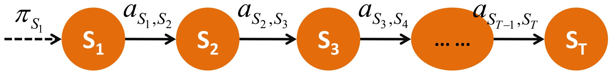
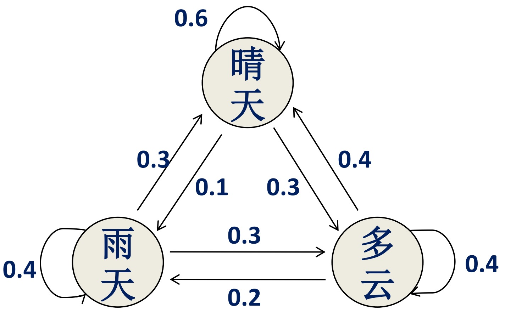

[TOC]

# 马尔科夫链

## 模型

$p(s_1,s_2,...,s_t) = p(s_1)*p(s_2|s_1)*p(s_3|s_2)*...*p(s_t|s_{t-1})$ 

- 状态：假设有 M 个。
- 初始概率：$\pi_k=P(S_1=k)$ 数组。长度 = M。
- 状态转移概率：$a_{k,l}=P(S_{t+1}=l|S_t=k)$ 矩阵：M x M

例如：

- 状态：{ 晴天，雨天，多云  }
- 初始概率 $\pi_k$ ：P( 晴天 )，P( 雨天 )，P( 多云 )
- 状态转移概率 $a_{k,l}$：P( 晴天|雨天 )，P( 雨天|多云 )，......

## 策略+算法

最大似然法

- 初始概率 $\pi_k$ ：$P(S_l=k)=\frac{k\;作为序列开始的次数}{观测序列总数}$
- 状态转移概率 $a_{k,l}$：$P(S_{t+1}=l|S_t=k)=\frac{l\;紧跟 k\;出现的次数}{k\;出现的总次数}$

