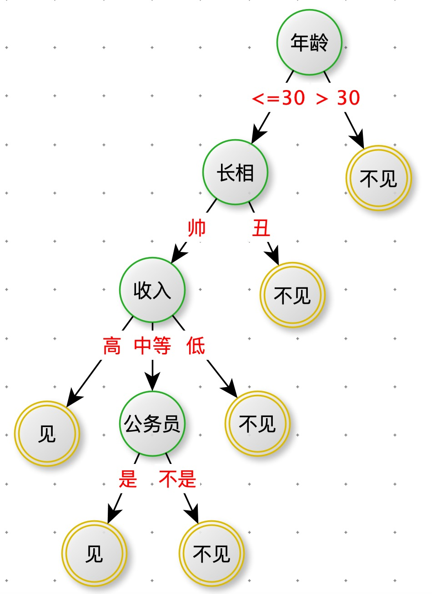
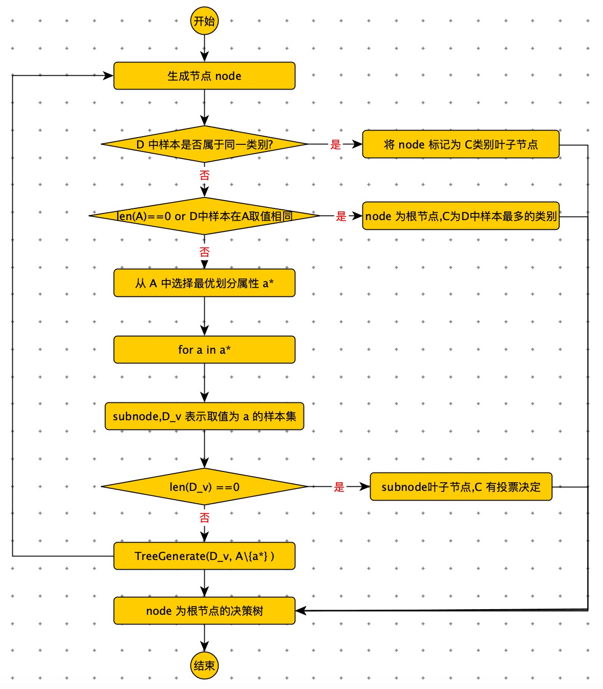

[TOC]


# 相亲

示例：

**现想象一个女孩的母亲要给这个女孩介绍男朋友**，于是有了下面的对话：

> **女儿：多大年纪了？**
>
> **母亲：26。**
>
> **女儿：长的帅不帅？**
>
> **母亲：挺帅的。**
>
> **女儿：收入高不？**
>
> **母亲：不算很高，中等情况。**
>
> **女儿：是公务员不？**
>
> **母亲：是，在税务局上班呢。**
>
> **女儿：那好，我去见见。**

这个女孩的决策过程就是典型的分类树决策。相当于通过年龄、长相、收入和是否公务员对将男人分为两个类别：见和不见（二分类）。




# 决策树

决策树（decision tree）


决策树特点

- 决策树是一个 if - else 规则集合，从根节点到叶子节点的一条路径，构成一条规则。
- 所有规则具备一个重要性质：<font color=red>互斥并且完备</font>。

- 节点：内部节点和叶子节点。内部节点表示一个特征。叶子节点对应一个决策结果。


解决的问题

- 分类

- 回归

  

**优点**

- 易于理解，模型可读性强
- 分类速度快
- 相比其他算法需要更少的特征工程（比如：不需要特征标准化，可以很好处理字段缺失值，不用关心特征间是否相互依赖，自动组合多个特征）

**缺点：**

- 容易过拟合


比较幸运的是，防止过拟合的方法很多：

- 限制树的最大深度
- 限制叶子节点的最少样本数量。
- 限制节点分裂时的最小样本数量。
- 吸收 bagging 的思想对训练样本采样（subsample），使用部分训练样本进行训练单棵树。
- 借鉴随机森林的思想在学习单棵树时，只采用一部分特征。
- 在目标函数中添加正则项，惩罚复杂的树结构。


决策树学习步骤

1. 特征选择
2. 决策树的生成
3. 决策树的修剪


常见的决策树算法

- ID3 算法：使用信息增益，寻找最优特征
- C4.5 算法：使用信息增益比，寻找最优特征
- CART（classification and regression tree） 算法：使用基尼系数，寻找最优特征。


## 生成决策树

决策树的生成是一个递归过程，递归选择最优特征，并根据该特征对训练数据进行划分，使每个子数集有一个最好的分类。

递归过程中，有三种情况会导致递归结束。

1. 当前节点包含的样本全属于一个类别，无需再划分。
2. 当前属性集为空，或者所有样本在所有属性上取值相同，无法划分。
3. 当前节点包含的样本集合为空，不能划分。


输入：训练集 $D = [\,(x_1,y_1),(x_2,y_2),...,(x_m,y_m)\,]$

​			 属性集 $ = [\, a_1,a_2,...,a_d \,] $


> TreeGenerate( D  , A )
>
> 生成节点 node
>
> if D 中样本全属于同一类别 C:
>
> ​		将 node 标记为 C 类的叶子节点
>
> ​		return
>
> if len(A) == 0 or D 中样本在 A  上取中相同：
>
> ​		将 node 标记为叶子节点，其类别标记为 D 中样本最多的类。
>
> ​		return
>
> 从 A 中选择出最优划分属性：$a_*$
>
> for $a_*$ in $a_*^v$：
>
> ​		为 node 生成一个分支，令 $D_v = $ D 中在 $a_*$ 上取中为$a_*^v$ 的样本子集。
>
> ​		if len($D_v$) == 0:
>
> ​				将分支节点标记为叶子节点，其类别标记为 D 中样本最多的类。
>
> ​				return
>
> ​		else:
>
> ​				TreeGenerate( $D_v, A / {a_*}$)
>
> return node



决策树代码

```python
# 决策树
import math

class DecisionTree():
    def create_tree(self, data_set, labels):
        class_list = [example[0] for example in data_set]
        # data_set 中的样本，类别完全相同，停止划分
        if class_list.count(class_list[0]) == len(class_list):
            return class_list[0]
        # 只有一个特征
        if len(labels) == 0 or len(data_set[0]) == 1:
            return self.majority_count(class_list)

        # 选择最优特征划分
        best_feat = self.choose_best_feature(data_set)
        best_feat_label = labels[best_feat]
        my_tree = {best_feat_label: {}}
        del (labels[best_feat])

        feat_value_set = set([example[best_feat] for example in data_set])
        for value in feat_value_set:
            sub_labels = labels[:]
            sub_list = self.split_data_set(data_set, best_feat, value)
            if len(sub_list) == 0:
                my_tree[best_feat_label][value] = self.majority_count(class_list)
            else:
                my_tree[best_feat_label][value] = self.create_tree(sub_list, sub_labels)

        return my_tree

    # 样本中类别最多
    @staticmethod
    def majority_count(class_list):
        class_count = {}
        for vote in class_list:
            class_count[vote] += class_count.get(vote, 0) + 1
        return sorted(class_count.items(), key=lambda x: x[1], reverse=True)[0][0]

    # 使用增益率进行特征选择
    def choose_best_feature(self, data_set):
        num_features = len(data_set[0]) - 1
        base_ent = self.calc_shannon_ent(data_set)
        best_info_gain_ratio = 0.0
        best_feature = -1

        for i in range(num_features):
            feat_set = set(example[i] for example in data_set)
            new_ent = 0.0
            split_info = 0.0
            for value in feat_set:
                sub_data_set = self.split_data_set(data_set, i, value)
                prod = len(sub_data_set) / float(len(data_set))
                new_ent += prod * self.calc_shannon_ent(sub_data_set)
                split_info += -prod * math.log2(prod)
            info_gain = base_ent - new_ent
            if info_gain == 0: continue

            info_gain_ratio = info_gain / split_info
            if info_gain_ratio > best_info_gain_ratio:
                best_info_gain_ratio = info_gain_ratio
                best_feature = i

        return best_feature

    # 计算熵：
    @staticmethod
    def calc_shannon_ent(data_set):

        label_count = {}
        for feat_vec in data_set:
            label = feat_vec[0]
            label_count[label] = label_count.get(label, 0) + 1

        shannon_ent = 0.0
        n = len(data_set)
        for label, count in label_count.items():
            prob = float(count) / n
            shannon_ent -= prob * math.log(prob, 2)
        return shannon_ent

    # 离散型特征，分隔数据集
    @staticmethod
    def split_data_set(data_set, axis, value):
        result = []
        for feat_vec in data_set:
            if feat_vec[axis] != value: continue
            result.append(feat_vec[:axis] + feat_vec[axis + 1:])
        return result
```


## 特征选择

决策树生成过程，一个关键步骤，选择最优特征进行划分。

我们希望决策树的分支节点包含的样本属于同一类别，即节点的“纯度”（purity）越来越高。

 

### 信息增益

**信息熵（information enthropy）**

$Ent(D) = -\sum_{k=1}^{|y|}{p_k log_2 p_k}$

- $p_k$：集合 D 中第 k 类样本的占比

    

$Ent(D) $ 的值越小，D 的纯度越高。

**熵只与 X 的分布有关，与 X 取值无关**

```python
    def calc_shannon_ent(data_set):
        label_count = {}
        for feat_vec in data_set:
            label = feat_vec[0]
            label_count[label] = label_count.get(label, 0) + 1

        shannon_ent = 0.0
        n = len(data_set)
        for label, count in label_count.items():
            prob = float(count) / n
            shannon_ent -= prob * math.log(prob, 2)
        return shannon_ent
```


**信息增益**

$Gain(D,a) = Ent(D) - \sum_{v=1}^V \frac{|D^v|}{|D|}Ent(D)$

$\frac{|D^v|}{|D|}$ 加权：每个分支数量不一样。

<font color=red>**信息增益特点：对可取值数目较多的属性有偏好。**</font>

决策树中信息增益等价于训练数据集中类与特征的互信息。

### 增益率

为了克服信息增益：对可取值数目较多的属性有偏好。使用增益率。

Gain_ratio(D,a) = $\frac{Gain(D,a)}{IV(a)}$

$IV(a) = -\sum_{i=1}^{n}{\frac{|D_i|}{|D|}log{\frac{|D_i|}{|D|}}}$  模仿信息熵。

- n 是特征 A 取值的个数。

<font color=red>**增益率特点：对可取值数目较少的属性有偏好。**</font>

```python
    def choose_best_feature(self, data_set):
        num_features = len(data_set[0]) - 1
        base_ent = self.calc_shannon_ent(data_set)
        best_info_gain_ratio = 0.0
        best_feature = -1

        for i in range(num_features):
            feat_set = set(example[i] for example in data_set)
            new_ent = 0.0
            split_info = 0.0
            for value in feat_set:
                sub_data_set = self.split_data_set(data_set, i, value)
                prod = len(sub_data_set) / float(len(data_set))
                new_ent += prod * self.calc_shannon_ent(sub_data_set)
                split_info += -prod * math.log2(prod)
            info_gain = base_ent - new_ent
            if info_gain == 0: continue

            info_gain_ratio = info_gain / split_info
            if info_gain_ratio > best_info_gain_ratio:
                best_info_gain_ratio = info_gain_ratio
                best_feature = i

        return best_feature
```


### 基尼指数

基尼值

$Gini(D) =\sum_{k=1}^{|y|}{\sum_{k!=k'}{p_k*p_k'}}$

$= 1 - \sum_{k=1}^{|y|}{p_k^2}$

 <font color=red>Gini(D) 越小，则数据集 D 的纯度越高。</font>

基尼指数：

$Gini\_index(D,a) = \sum_{i=1}^n{\frac{|D_i|}{|D|}Gini(D_i)}$

<font color=red>在属性集合 A 中，选择那个使得划分后基尼指数最小的特征，作为最优化划分特征。</font>

## 预测

```python
    def classify(self, input_tree, feat_lables, text_vec):
        first_str = list(input_tree.keys())[0]
        second_dict = input_tree[first_str]
        feat_index = feat_lables.index(first_str)
        for key in second_dict.keys():
            if text_vec[feat_index] == key:
                if type(second_dict[key]).__name__ == "dict":
                    class_label = self.classify(second_dict[key], feat_lables, text_vec)
                else:
                    class_label = second_dict[key]
        return class_label
```


## 剪枝

### 预剪枝


### 后剪枝


## 缺失值处理


# 多变量决策树


# 梯度提升树


