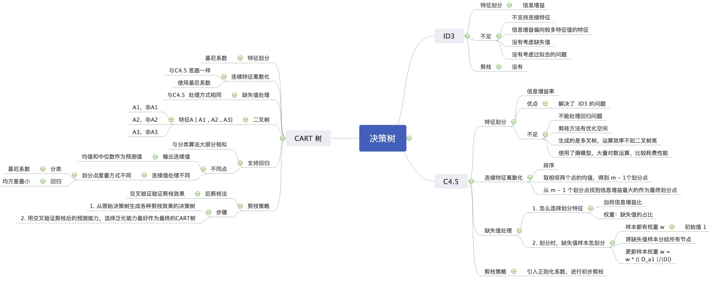
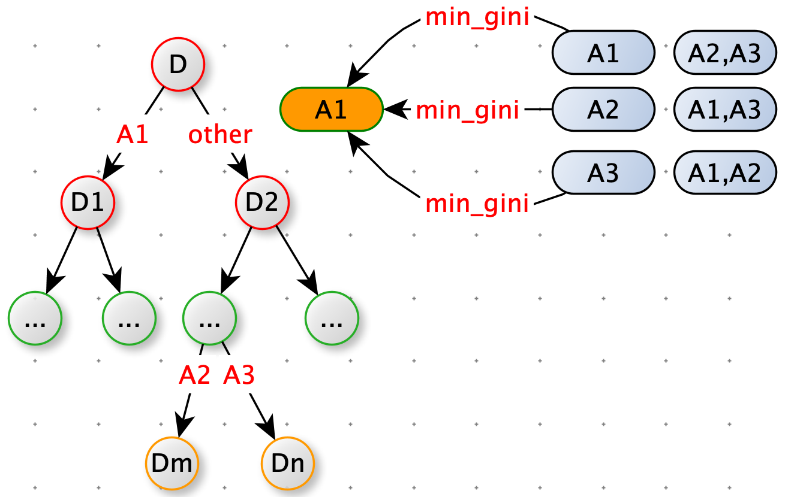

[TOC]



# 相亲

示例：

**现想象一个女孩的母亲要给这个女孩介绍男朋友**，于是有了下面的对话：

> **女儿：多大年纪了？**
>
> **母亲：26。**
>
> **女儿：长的帅不帅？**
>
> **母亲：挺帅的。**
>
> **女儿：收入高不？**
>
> **母亲：不算很高，中等情况。**
>
> **女儿：是公务员不？**
>
> **母亲：是，在税务局上班呢。**
>
> **女儿：那好，我去见见。**

这个女孩的决策过程就是典型的分类树决策。相当于通过年龄、长相、收入和是否公务员对将男人分为两个类别：见和不见（二分类）。


# 决策树

决策树（decision tree）


决策树特点

- 决策树是一个 if - else 规则集合，从根节点到叶子节点的一条路径，构成一条规则。
- 所有规则具备一个重要性质：<font color=red>互斥并且完备</font>。

- 节点：内部节点和叶子节点。内部节点表示一个特征。叶子节点对应一个决策结果。


解决的问题

- 分类

- 回归

  

**优点**

- 易于理解，模型可读性强
- 分类速度快，决策待见：$O(log_2m)$,m 为样本特征数。
- 既可以处理离散值也可以处理连续值。很多算法只是专注离散值或者连续值。
- 相比其他算法需要更少的特征工程（比如：不需要特征标准化，可以很好处理字段缺失值，不用关心特征间是否相互依赖，自动组合多个特征）
- 可以处理多维度输出的分类问题。
-  对于异常点的容错能力好，健壮性高。
- 可以交叉验证的剪枝来选择模型，从而提高泛化能力。

**缺点：**

- 非常容易过拟合，导致泛化能力不强。
- 决策树会因为样本发生一点点的改动，就会导致树结构的剧烈改变。这个可以通过集成学习之类的方法解决。
- 寻找最优的决策树是一个NP难的问题，我们一般是通过启发式方法，容易陷入局部最优。可以通过集成学习之类的方法来改善。
- 有些比较复杂的关系，决策树很难学习，比如异或。这个就没有办法了，一般这种关系可以换神经网络分类方法来解决。
- 如果某些特征的样本比例过大，生成决策树容易偏向于这些特征。这个可以通过调节样本权重来改善。


比较幸运的是，防止过拟合的方法很多：

- 限制树的最大深度
- 限制叶子节点的最少样本数量。
- 限制节点分裂时的最小样本数量。
- 吸收 bagging 的思想对训练样本采样（subsample），使用部分训练样本进行训练单棵树。
- 借鉴随机森林的思想在学习单棵树时，只采用一部分特征。
- 在目标函数中添加正则项，惩罚复杂的树结构。


决策树学习步骤

1. 特征选择
2. 决策树的生成
3. 决策树的修剪


常见的决策树算法

- ID3 算法：使用信息增益，寻找最优特征
- C4.5 算法：使用信息增益比，寻找最优特征
- CART（classification and regression tree） 算法：使用基尼系数，寻找最优特征。


## 生成决策树

决策树的生成是一个递归过程，递归选择最优特征，并根据该特征对训练数据进行划分，使每个子数集有一个最好的分类。

递归过程中，有三种情况会导致递归结束。

1. 当前节点包含的样本全属于一个类别，无需再划分。
2. 当前属性集为空，或者所有样本在所有属性上取值相同，无法划分。
3. 当前节点包含的样本集合为空，不能划分。


输入：训练集 $D = [\,(x_1,y_1),(x_2,y_2),...,(x_m,y_m)\,]$

​			 属性集 $ = [\, a_1,a_2,...,a_d \,] $


> TreeGenerate( D  , A )
>
> 生成节点 node
>
> if D 中样本全属于同一类别 C:
>
> ​		将 node 标记为 C 类的叶子节点
>
> ​		return
>
> if len(A) == 0 or D 中样本在 A  上取中相同：
>
> ​		将 node 标记为叶子节点，其类别标记为 D 中样本最多的类。
>
> ​		return
>
> 从 A 中选择出最优划分属性：$a_*$
>
> for $a_*$ in $a_*^v$：
>
> ​		为 node 生成一个分支，令 $D_v = $ D 中在 $a_*$ 上取中为$a_*^v$ 的样本子集。
>
> ​		if len($D_v$) == 0:
>
> ​				将分支节点标记为叶子节点，其类别标记为 D 中样本最多的类。
>
> ​				return
>
> ​		else:
>
> ​				TreeGenerate( $D_v, A / {a_*}$)
>
> return node


决策树代码

```python
# 决策树
import math

class DecisionTree():
    def create_tree(self, data_set, labels):
        class_list = [example[0] for example in data_set]
        # data_set 中的样本，类别完全相同，停止划分
        if class_list.count(class_list[0]) == len(class_list):
            return class_list[0]
        # 只有一个特征
        if len(labels) == 0 or len(data_set[0]) == 1:
            return self.majority_count(class_list)

        # 选择最优特征划分
        best_feat = self.choose_best_feature(data_set)
        best_feat_label = labels[best_feat]
        my_tree = {best_feat_label: {}}
        del (labels[best_feat])

        feat_value_set = set([example[best_feat] for example in data_set])
        for value in feat_value_set:
            sub_labels = labels[:]
            sub_list = self.split_data_set(data_set, best_feat, value)
            if len(sub_list) == 0:
                my_tree[best_feat_label][value] = self.majority_count(class_list)
            else:
                my_tree[best_feat_label][value] = self.create_tree(sub_list, sub_labels)

        return my_tree

    # 样本中类别最多
    @staticmethod
    def majority_count(class_list):
        class_count = {}
        for vote in class_list:
            class_count[vote] += class_count.get(vote, 0) + 1
        return sorted(class_count.items(), key=lambda x: x[1], reverse=True)[0][0]

    # 使用增益率进行特征选择
    def choose_best_feature(self, data_set):
        num_features = len(data_set[0]) - 1
        base_ent = self.calc_shannon_ent(data_set)
        best_info_gain_ratio = 0.0
        best_feature = -1

        for i in range(num_features):
            feat_set = set(example[i] for example in data_set)
            new_ent = 0.0
            split_info = 0.0
            for value in feat_set:
                sub_data_set = self.split_data_set(data_set, i, value)
                prod = len(sub_data_set) / float(len(data_set))
                new_ent += prod * self.calc_shannon_ent(sub_data_set)
                split_info += -prod * math.log2(prod)
            info_gain = base_ent - new_ent
            if info_gain == 0: continue

            info_gain_ratio = info_gain / split_info
            if info_gain_ratio > best_info_gain_ratio:
                best_info_gain_ratio = info_gain_ratio
                best_feature = i

        return best_feature

    # 计算熵：
    @staticmethod
    def calc_shannon_ent(data_set):

        label_count = {}
        for feat_vec in data_set:
            label = feat_vec[0]
            label_count[label] = label_count.get(label, 0) + 1

        shannon_ent = 0.0
        n = len(data_set)
        for label, count in label_count.items():
            prob = float(count) / n
            shannon_ent -= prob * math.log(prob, 2)
        return shannon_ent

    # 离散型特征，分隔数据集
    @staticmethod
    def split_data_set(data_set, axis, value):
        result = []
        for feat_vec in data_set:
            if feat_vec[axis] != value: continue
            result.append(feat_vec[:axis] + feat_vec[axis + 1:])
        return result
```


## 特征选择

决策树生成过程，一个关键步骤，选择最优特征进行划分。

我们希望决策树的分支节点包含的样本属于同一类别，即节点的“纯度”（purity）越来越高。

 

### 信息增益

**信息熵（information enthropy）**

熵度量事物的不确定性，越不确定的事物，它的熵越大。

$Ent(X) = -\sum_{i=1}^{n}{p_i log_2 p_i}$

- n：X 的 n 种不同的离散值

- $p_i$：X 取值为 i 的概率

$Ent(D) $ 的值越小，D 的纯度越高。


例子：假设 X 有两个取值A，B。P(A) =0.5，P(B) =0.5。

​			那么 X 具有的不确定性：$Ent(X)=-(0.5*log_2{0.5}+0.5*log_2{0.5})=log_2{2}=1$

​	

​			假设 X 有两个取值A，B。P(A) =1/3，P(B) =2/3。

​			那么 X 具有的不确定性：$Ent(X)=-(\frac{1}{3}*log_2{\frac{1}{3}}+\frac{2}{3}*log_2{\frac{2}{3}})$

$=\frac{1}{3}log_23-\frac{2}{3}log_2\frac{2}{3}$

$=log_23-\frac{2}{3}log_23-\frac{2}{3}log_2{\frac{2}{3}}$

$=log_23-\frac{2}{3}(log_23+log_2{\frac{2}{3}})$

$=log_23-\frac{2}{3}log_22$

$=log_23-\frac{2}{3}<log_22=1$						


P(A) =1/3，P(B) =2/3  比 P(A) =1/2，P(B) =1/2 确定性大。


**熵只与 X 的分布有关，与 X 取值无关**

```python
    def calc_shannon_ent(data_set):
        label_count = {}
        for feat_vec in data_set:
            label = feat_vec[0]
            label_count[label] = label_count.get(label, 0) + 1

        shannon_ent = 0.0
        n = len(data_set)
        for label, count in label_count.items():
            prob = float(count) / n
            shannon_ent -= prob * math.log(prob, 2)
        return shannon_ent
```


**联合熵**

多个变量的联合熵

$H(X,Y) = -\sum_{x_i \in X}\sum_{y_i \in Y}{p(x_i,y_i)log_2{p(x_i,y_i)}}$


**条件熵**

条件熵类似条件概率，它度量了已知 X 后，剩下 Y 的不确定性。

$H(X|Y) = -\sum_{x_i \in X}\sum_{y_i \in Y}{p(x_i,y_i)log_2{p(x_i|y_i)}}=\sum_{j=1}^np(y_i)H(X|y_i)$


**信息增益**

H(X) 度量了 X 的不确定性。

H(X|Y) 度量了，已知 Y 后 X 剩下的不确定性

H(X) - H(X|Y) 什么能度量什么？

韦恩图


- H(X)：左边的椭圆

- H(Y)：左边的椭圆

- I (X ,Y)互信息或者信息增益：两个椭圆交集

- H( X , Y)：两个椭圆并集

- H(X|Y)

- H(Y|X)

  

$Gain(X,Y) = H(X) - H(X|Y)$

$\frac{|D^v|}{|D|}$ 加权：每个分支数量不一样。

<font color=red>**信息增益特点：对可取值数目较多的属性有偏好。**</font>

决策树中信息增益等价于训练数据集中类与特征的互信息。

### 增益率

为了克服信息增益：对可取值数目较多的属性有偏好。使用增益率。

Gain_ratio(D,a) = $\frac{Gain(D,a)}{IV(a)}$

$IV(a) = -\sum_{i=1}^{n}{\frac{|D_i|}{|D|}log{\frac{|D_i|}{|D|}}}$  模仿信息熵。

- n 是特征 A 取值的个数。

<font color=red>**增益率特点：对可取值数目较少的属性有偏好。**</font>

```python
    def choose_best_feature(self, data_set):
        num_features = len(data_set[0]) - 1
        base_ent = self.calc_shannon_ent(data_set)
        best_info_gain_ratio = 0.0
        best_feature = -1

        for i in range(num_features):
            feat_set = set(example[i] for example in data_set)
            new_ent = 0.0
            split_info = 0.0
            for value in feat_set:
                sub_data_set = self.split_data_set(data_set, i, value)
                prod = len(sub_data_set) / float(len(data_set))
                new_ent += prod * self.calc_shannon_ent(sub_data_set)
                split_info += -prod * math.log2(prod)
            info_gain = base_ent - new_ent
            if info_gain == 0: continue

            info_gain_ratio = info_gain / split_info
            if info_gain_ratio > best_info_gain_ratio:
                best_info_gain_ratio = info_gain_ratio
                best_feature = i

        return best_feature
```


### 基尼指数

基尼值


$Gini(D) =\sum_{k=1}^K{p_k*（1-p_k)}=1-\sum_{k=1}^Kp_k^2$


 <font color=red>Gini(D) 越小，则数据集 D 的纯度越高。</font>

基尼指数：

$Gini\_index(D,a) = \sum_{i=1}^n{\frac{|D_i|}{|D|}Gini(D_i)}$

<font color=red>在属性集合 A 中，选择那个使得划分后基尼指数最小的特征，作为最优化划分特征。</font>

## 预测

```python
    def classify(self, input_tree, feat_lables, text_vec):
        first_str = list(input_tree.keys())[0]
        second_dict = input_tree[first_str]
        feat_index = feat_lables.index(first_str)
        for key in second_dict.keys():
            if text_vec[feat_index] == key:
                if type(second_dict[key]).__name__ == "dict":
                    class_label = self.classify(second_dict[key], feat_lables, text_vec)
                else:
                    class_label = second_dict[key]
        return class_label
```


# ID3

## ID3 算法的不足

- ID3 没有考虑连续特征：比如长度，密度。大大限制了 ID3 的用途。
- ID3 采用信息增益大的特征建立决策树的节点。相同条件下，取值多的特征信息增益大（<font color=red>对可取值数目较多的属性有偏好</font>）。
- ID3 算法没有考虑缺失值的情况。
- 没有考虑过拟合的问题。


# C4.5

昆兰在 ID4.5 算法对ID3 的不足（连续特征，信息增益容易偏向取值较多的特征，缺失值，过拟合问题）做了改进。


## 连续特征处理

C4.5 的思路是将连续特征离散化。


比如有 m 个样本的连续特征 A 有 m 个，

- 从小到大排列连续特征值 $[a_1,a_2,...,a_m]$ ，
- C 4.5 取相邻两个样本的平均数，一共取得 m - 1划分点，其中第 i 个划分点$T_i=\frac{a_i+(a_i+1)}{2}$。 
- 对这 m - 1 个点，分别计算：以该点作为二元分类点时的信息增益。选择信息增益最大的点作为连续特征的二元离散分类点。比如取到的信息增益最大点为 $a_t$，那么小于 $a_t$ 的值的类别为 0，大于$a_t$ 的值为 类别 1.

<font color=red>注意：与离散特征不同，如果当前节点是连续特征，这个特征后边还是可以参与子节点的产生选择过程</font>


## 信息增益容易偏向取值较多的特征

引入信息增益比:

$I_R(D,A)=\frac{I(A,D)}{H_A(D)}$

- $I(A,D)$：信息增益
- $H_A(D)$：特征熵
- D：样本特征输出的集合
- A：样本特征


$H_A(D)=-\sum_{i=1}^n\frac{|D_i|}{|D|}log_2\frac{|D_i|}{|D|}$

- n：特征 A 的类别数

- $D_i$：特征 A 的第 i 个取值对应的样本个数

- |D|：总样本数

  

  ​		特征数越多的特征对应的特征熵越大，它作为分母，可以校正信息增益容易偏向于取值较多的特征的问题。

## 缺失值

要解决缺失值的问题，需要解决两个问题：

​	一、样本某些特征值缺失的情况下，选择划分的特征。

​	二、选定了划分特征，对于在该特征上缺失值的样本怎么处理？


## 过拟合

C4.5 引入正则化系数进行初步的剪枝。


## C4.5 算法不足

1. 决策树非常容易过拟合，因此需要对决策树进行剪枝。剪枝的算法非常多。C 4.5 的剪枝算法仍有优化空间。思路主要两种：

   1. 预剪枝：生成决策树时决定是否剪枝。

   2. 后剪枝：先生成决策树，再通过交叉验证来剪枝。

      在 CART 树，讲解决策树的剪枝思路，主要采用后剪枝加上交叉验选择最合适的决策树。

   2. C4.5 生成的是多叉树，很多时候，计算机中二叉树模型运行效率高。
   3. C4.5 只能用于分类，不能应用回归问题。
   4. C4.5 使用了熵模型，有大量的耗时的对数运算。如果是连续特征还有大量的排序。如果能够简化模型减少运算强度但又不牺牲太多准确性的话，那就更好了。

# CART 树

- 回归
- 分类

CART 树使用基尼系数替代信息增益比。基尼系数代表了模型的不纯度。

<font color=red>基尼系数越小，则不纯度越低，特征越好。和信息增益(比)是相反的</font>

## 特征选择

分类问题，假设有 K 个类别，第 k 个类别的概率为 $p_k$,基尼系数为：$Gini(p)=\sum_{k=1}^K(p_k*(1-p_k))=1-\sum_{k=1}^K{p_k^2}$


如果是二分类：$Gini(p)=2p(1-p)$


样本集 D 中有 K 个类别，第 k 个类别的数量为 $C_k$，则基尼系数:$Gini(D) = 1-\sum_{k=1}^K(\frac{|C_k|}{|D|})^2$


样本集 D ，如果根据特征 A 的某个值 a ，把 D  分成 D1 好 D2 两部分，则在特征 A  的条件下，D 的基尼系数：$Gini(D,A)=\frac{|D_1|}{|D|}Gini(D_1)+\frac{|D_2|}{|D|}Gini(D_2)$


大家比较一下基尼系数表示和熵模型的表达式，<font color=red>二次运算比对数运算简单很多。但是基尼系数比熵模型误差大</font>


对于二分类，基尼系数和熵之半的曲线：


​		从上图可以看出，基尼系数和熵之半的曲线非常接近，因此，基尼系数可以做为熵模型的一个近似替代。

​			CART分类树算法就是使用的基尼系数来选择决策树的特征。同时，为了进一步简化，<font color=red>CART分类树算法每次仅仅对某个特征的值进行二分，而不是多分，这样 CART 分类树算法建立起来的是二叉树</font>，而不是多叉树。这样一可以进一步简化基尼系数的计算，二可以建立一个更加优雅的二叉树模型。


## 连续特征和离散特征改进

与 C4.5 思想相同：将连续特征离散化。

C4.5 使用信息增益来选择划分点。

CART 分类树使用**基尼系数选择划分点**


比如有 m 个样本的连续特征 A 有 m 个，

- 从小到大排列连续特征值 $[a_1,a_2,...,a_m]$ ，

- C 4.5 取相邻两个样本的平均数，一共取得 m - 1划分点，其中第 i 个划分点$T_i=\frac{a_i+(a_i+1)}{2}$。 

- 对这 m - 1 个点，分别计算：以该点作为二元分类点时的**基尼系数**。选择**基尼系数最小**的点作为连续特征的二元离散分类点。比如取到的**基尼系数最小**点为 $a_t$，那么小于 $a_t$ 的值的类别为 0，大于$a_t$ 的值为 类别 1.

  

CART 分类树对离散值的处理思路：不停的二分离散特征。

回忆下 ID3 或 C4.5，如果特征$ A\in\{A_1,A_2,A_3\}$ 被选中建立决策树节点，会在决策树上建立一个三叉的节点，这样导致决策是多叉树。  


CART 分类树会将 A 拆成 {A1} 和 {A2 , A3} ， { A2 } 和 {A1 , A2}  ,{ A3 } 和 { A1 , A2 } 分组，找基尼系数最小的组合，比如 { A1 } 和  {A2 , A3}，一个节点是 A1对应样本，另一个节点是不等于 A1 的样本（类似 One-Hot-Encoding），后续还有机会处理 {A2} , {A3}




## 分类树构建

CART 树的剪枝算法单独讲解。


算法输入：训练集D，基尼系数的阈值：min_gini，样本个数阈值：min_count

输出：决策树 T

1. if  len( D ) < min_count or 没有特征：return T
2. if Gini( D ) < min_gini：return T
3. 处理连续值和缺失值，同 C4.5
4. 计算各个特征的各个特征值对应数据集D的基尼系数，求最小值$ A_k = min([Gini(f_i,f_{other})\quad for \quad f \quad in \quad features])$ 
5. 根据最优特征和最优特征值，将数据数据集划分成两步分D1 和 D2，同时建立左右子节点。
6. 对左右子节点调用 1 - 4步，生成决策树。


预测：

​		如果样本落到某个叶子节点，二节点有多个训练样本，预测概率就是叶子节点概率最大的类别。


## 回归树构建

CART 回归树和 CART 分类树的建立和预测的主要区别

1. 连续值的处理方法不同。
2. 预测方式不同。

### 连续值

分类模型比较合适用基尼系数来度量特征的划分点的优劣。

<font color=red>方差</font>的度量方式比较适合回归模型。

<font color=red>CART 回归树的度量目标：求出使D1 和 D2 各自集合的均方差最小，同时 D1 和 D2 的均方差之和最小。</font>

表达式：$\underbrace{min}_{A,s}[\underbrace{min}_{c_1} \sum_{x_i \in D_1(A,s){(y_i-c1)^2}+ \underbrace{ min}_{c_2}  \sum_{x_i \in D_2(A,s)}{(y_i-c_2)^2}}]$

- $c_1$ 为 D1 数据集的样本输出的均值
- $c_2$ 为 D2 数据集的样本输出的均值


### 预测

<font color=red>采用最终叶子节点中均值或者中位数作为预测结果。</font>


## CART 树的剪枝

CART 回归树和CART 分类树剪枝策略除了在度量方式上不同，其他完全相同。

CART 分类树：基尼系数

CART 回归树：均方差


决策树很容易过拟合，导致泛化能力差，所以需要剪枝。

CART 树剪枝思想：后剪枝

后剪枝：生成决策树，然后使用交叉验证来检验各种剪枝的效果，选择泛化能力最好的剪枝策略。


CART 树剪枝算法两步：

1. 从原始决策树生成各种剪枝效果的决策树
2. 交叉验证


剪枝的损失函数：$C_a(T_t)=C(T_t)+a|T_t|$

- a：正则化参数
- $C(T_t)$ 为训练数据的预测误差，分类树是用基尼系数度量，回归树是均方差度量.
- $|T_t|$：子树T的叶子节点的数量。

a 越大，则剪枝剪的越厉害，生成的最优子树相比原生决策树就越偏小。

对于固定的 α，一定存在使损失函数$C_α(T)$最小的唯一子树。


剪枝思路


## CART 小结


| 算法 | 支持模型   | 树结构 | 特征选择         | 连续值 | 剪枝   | 缺失值 |
| ---- | ---------- | ------ | ---------------- | ------ | ------ | ------ |
| ID3  | 分类       | 多叉树 | 信息增益         | 不支持 | 不支持 | 不支持 |
| C4.5 | 分类       | 多叉树 | 信息增益比       | 支持   | 支持   | 支持   |
| CART | 分类，回归 | 二叉树 | 基尼系数，均方差 | 支持   | 支持   | 支持   |


## CART 树的缺点

1. 不支持多变量决策树（multi-variate decision tree）。ID3，C4.5，CART 在做特征选择时都是选择最优的一个特征来做决策。但是大多数分类决策不应该由某一个特征决定，而是由<font color=red>一组特征决策。</font>多变量决策树代表是 OC1
2. 如果样本发送一点点的改动，就会导致树结构的剧烈改变。通过集成学习里的随机森林的方法解决。


# 多变量决策树

