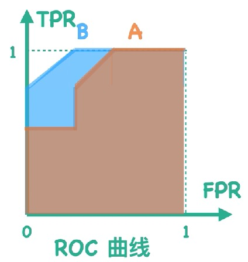

[TOC]

混淆矩阵适用于：二分类问题。

如果是多分类，转换成二分类问题。

# 一级指标

- TP( True Postive )：真实值是 postive , 模型预测是 postive 的样本数。真阳性

- FN( False Negative )：真实值是 postive , 模型预测是 negative 的样本数。假阴性

- FP( False Postive )：真实值是 Negative , 模型预测是 postive 的样本数。假阳性

- TN( True Negative )：真实值是 Negative , 模型预测是 negative 的样本数。真阴性

对角线上数据值（TP，TN）越大越好。

|            | 预测值 = 1 | 预测值 = 0 |
| ---------- | ---------- | ---------- |
| 真实值 = 1 | TP         | FN         |
| 真实值 = 0 | FP         | TN         |

# 二级指标

- 错误率：$\frac{FP+FN}{TP+FN+FP+TN}$   --- 针对整个模型

- 准确率（Accuracy）= $\frac{TP+TN}{TP+TN+FP+FN}$ --- 针对整个模型

- 查准率，精确率( precision ) $P = \frac{TP}{TP+ FP}$  --- 针对某一类别预测精确率

- 查全率：召回率( recall ) $R= \frac{TP}{TP+FN}$   --- 针对某一类别真实数据召回情况

- 特异度( specificity ) = $\frac{TN}{TN+FP}$

# 三级指标

- F1-值(  F1-score )  = $ \frac{2PR}{P+R} =\frac{2*TP}{2*TP+FP+FN}$ ：精确率和召回率的调和平均数。

P：precision

R：recal

## ROC 曲线和 AUC 值

Receiver Operator Characteristic（ROC） 曲线

逻辑回归预测的是为 0，1 的概率，需要根据一个阈值来判别标签：

比如 50%，当P(y|x) > 0.5 ;  y = 1

也可以 当P(y|x) > 0.8 ;  y = 1

每一个阈值都对应一个混淆矩阵，那么怎用一张图，画出这么多的混淆矩阵？答：ROC 曲线。

y = 1 召回率： $TPR = \frac{TP}{TP+FN} $

y = 0 ： $FPR = \frac{FP}{FP+TN} $  

TPR：在所有实际为阳性的样本中，被正确地判断为阳性之比率。

FPR：在所有实际为阴性的样本中，被错误地判断为阳性之比率。

以 TPR 为纵轴，以 FPR 为横轴。

LR 的分界面不断从 { 0.1 , 0.2 , ... ,1 } 不断尝试，每一个值都有一对（TPR，FPR），在坐标轴上绘制点，连城线就是ROC 曲线。围城的面积值就是 AUC 的值。AUC $\in (0,1)$

B 分类器比 A 分类器好。

**AUC 面积越大，分类效果越好**

### ROC 和 AUC 应用于多分类

#### 宏观AUC

#### 微观AUC

|            | 预测值 = 1 | 其他类别 |
| ---------- | ---------- | -------- |
| 真实值 = 1 | TP         | FN       |
| 真实值 = 0 | FP         | TN       |