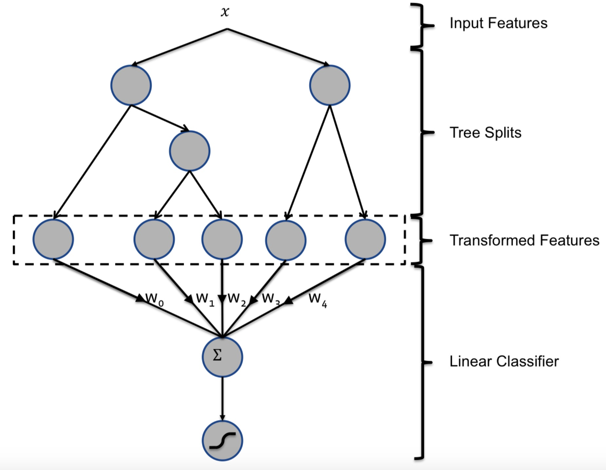

将每棵树当作一个离散特征，将样本最终落到的叶子的索引当作特征值，然后对这类特征进行0-1(one-hot)编码。例如，考虑图1所示的包含2棵子树的提升树模型，子树1有3个叶子，子树2有2个叶子。如果一个样本最终落到子树1的叶子2及子树2的叶子1，那么线性分类器的输入将是二元向量[0, 1, 0, 1, 0]，其中前3个元素对应子树1的叶子，后2个元素对应子树2的叶子。

基于提升树的转换理解为有监督的的特征编码，并将真实向量转换成压缩的二值向量。