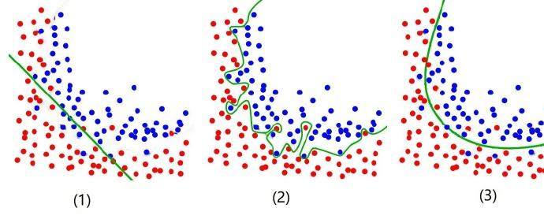
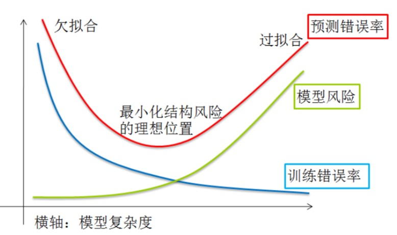
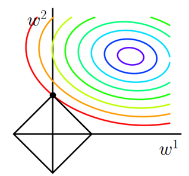

[TOC]

误差：模型预测结果与样本真实结果之间的差异。

训练误差（经验误差）：模型预测在训练集上的误差。

泛化误差：模型在新样本上的误差。

我们希望获得泛化误差较小的模型。

# 欠拟合

欠拟合：对训练样本的一般性质尚未学好。

解决方案：

- 增加训练的轮数。
- 训练集数据不够，补充训练集。
- 提供更多的特征，增加特征刻画能力：增加模型复杂度。

# 过拟合

过拟合：训练误差非常小，将训练样本自身的一些特点，当作了所有潜在样本都会具有的一般性质了，这样就会导致泛化能力下降。

目的：提高模型的泛化能力。控制模型复杂度。

解决方案：降低参数复杂度，模型复杂度。

**模型参数越少，模型越简单。**

**模型参数越小，模型越简单。**

- 加正则化项。
- 增加训练数据。
- 通过交叉验证（度量泛化误差）。

奥卡姆剃刀：如无必要，勿增实体。

## 正则化

正则化项：为了有效地控制模型参数的复杂度，加入参数复杂度的惩罚项，以使得模型选择更加简单的参数。

正则化框架

$min_w L(w) + \lambda r(w)$

L(w) ：经验损失，越小表示训练数据上拟合程度越高。

$\lambda $：折中因子，控制惩罚力度，越大惩罚力度越大。

r(w)：正则化项，越小表示模型复杂度越小。

常用的正则化项

- L1 范数正则：$||w||_1=\sum_i|w_i|$
- L2 范数正则：$w^2=\sum_iw_i^2$
- Lp 范数正则：$||w||_P=\sum_i|w_i|^P$

### L1，L2 -- 直观理解

损失函数添加正则化项，就相当于在最小化时，引入约束条件。

L1：$cost(w) = \frac{1}{2m}||Xw-y||^2+\lambda ||w||_1$ 等价与 $min_m \frac{1}{2m} ||Xw-y||^2 , s.t ||w||_1 \leq C $

L2：$cost(w) = \frac{1}{2m}||Xw-y||^2+\lambda ||w||_2^2$ 等价与 $min_m \frac{1}{2m} ||Xw-y||^2 , s.t ||w||_2^2 \leq C $

$s.t ||w||_1 \leq C$ 表示：w 只能在正方形边上及内部

$s.t ||w||_2^2 \leq C$ 表示：w 只能在圆形边上及内部

椭圆的五彩的线是等值线（线上的损失值相等），距离圆心越近 L(w) 损失函数越小。如果加上正则化项的约束后，整体最小的模型，在等值线与正方形与圆形第一个交点。

如果正方形，第一个交点大概率落在顶点上（L1 正则具有特征选择的功能，使用于特征大规模离散 LR 的任务。通过减少模型参数简化模型）。大量模型参数为 0。

​	拿一个魔方，从空中掉下，大概率角先着地。

如果圆形，第一个交点非常小概率落在坐标轴上（L2 ，通过减小模型参数数值，简化模型 ）。

**L1 正则具有稀疏性，特征选择**

### L1，L2 -- 数学理解

为什么加上正则化项后，泛化误差就减少了？

$F(w)=min_w L(w) + \lambda r(w)$

F(w) 的最优解：

$\frac{d f(w)}{dw_i}=0$

$\frac{d f(w)}{d \lambda }=0$

对 w 和 $\lambda $ 求偏导 = 0。

如果要限制 w 的大小，需要对 w 新增约束。

比如：$w_1^2+w_2^2+...+w_n^2 \leq m$  将 w 限制在一定范围内。 

那么：

$min_w L(w)= \sum_i{(f(x_i)-y_i)^2} ,\\ s.t ||w||_2^2 \leq C $

有不等式约束的最优化问题。满足 KKT 条件

KKT 条件
$$
min f(x) \\
 s.t g_j(x) \leq 0 (j=1,2,...,m) \\
 h_k(x) = 0 (k=1,2,...,l)
$$
如果满足KKT 条件，那么解空间必然满足一下条件

$$

$$
为了满足KKT 条件，变换为：

$min_w L(w)= \sum_i{(f(x_i)-y_i)^2} , \\ s.t ||w||_2^2 -C \leq 0 $

构造拉格朗日函数

$min_w L(w)= \sum_i{(f(x_i)-y_i)^2} +\lambda (||w||_2^2 - C)$

$min_w L(w)= \sum_i{(f(x_i)-y_i)^2} +\lambda ||w||_2^2 - \lambda C$

$\lambda C$ 是常数，对优化没有影响。

**正则化 等价于 带约束条件**

