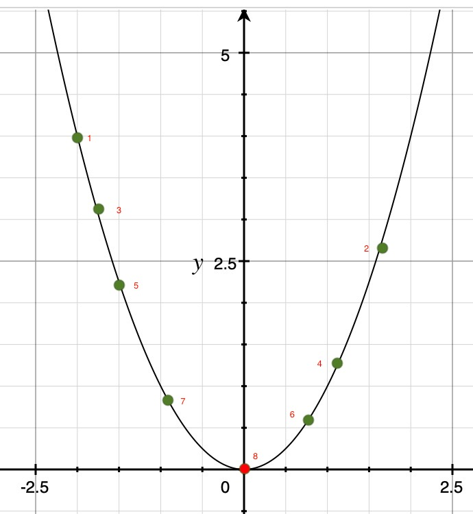

[TOC]

# 梯度下降

对于一些优化问题，没有办法求出解析解。那么只能渐进式求解，逼近最优解。

渐进式优化思路：站在当前点，向一个方向走一小步，只要是前进点优于当前点，就可以不断前进，直至逼近最优解。

导数定义：就是 x 变化一点点 $\Delta x$ ，去观察 y 的变化量。

导数定义：$\frac{dy}{dx}=\frac{d}{dx}f(x)=f'(x)=lim_{\Delta x \rightarrow 0}\frac{f(x+\Delta x)-f(x)}{\Delta x}$

有 $f(x + \Delta x) - f(x) = f'(x) \Delta x$    --- 注意：$f'(x) \Delta x $ 还需要乘以泰勒展开式的高阶项，这里忽略了。

若希望：$f(x + \Delta x) < f(x)$ ，那么 $f'(x) \Delta x < 0$

当 $f'(x) > 0$ 时，希望 $\Delta x < 0$ ，可以设：$\Delta x = -f'(x)$

当 $f'(x) < 0$ 时，希望 $\Delta x > 0$，可以设：$\Delta x = -f'(x)$

**==结论：若想要 f(x) 变小，使 $\Delta x$ 与 f'(x) 符号相反即可。$\Delta x=-f'(x) $便是下降方向==**

例子：

函数：$f(x) = x^2$ 导数：$\nabla f(x) = 2x$ 

1. 随意一个初始点：节点1（1，2，3，4，5，6，7，8节点都有可能）

2. 计算节点1 出导数值： 2x = 2*(-2) = - 4 ，下降方向为 $dir = 4 ;\lambda = 0.1$ 

   $x = x + \lambda * dir \Rightarrow x= -2 + 0.1*4 = -1.6  $

3. f( -1.6 ) <  f( -2 )

4.  2x = 2*(-1.6) = - 3.2 下降方向为 $dir = 3.2 ;\lambda = 0.1$

   $ x = x + \lambda * dir \Rightarrow x= -1.6 + 0.1*3.2 = -1.28$

5. f( -1.28 ) <  f( -1.6 )

6. ........

## line search

Backtracking Line Search ( 回溯直线搜索法 )：确定步长。如果步长太短，训练数据收敛速度慢，浪费计算资源。如果步长过大，在底部来回震荡，不能逼近最优解。

算法步骤：

1. 参数：

   - 搜索方向：dir
   - 当前参数：w，L(w)
   - 初始步长：c；c > 0
   - 容许度：b；0 < b < 1
   - 折半因子：a；0 < a < 1
   - 最大尝试次数：max_k

2. 尝试：$w_{new} = w + c*dir; k++; 计算L(w_{new}) $

3. if  $ F(w) - F(w_{new}) > b*|<d,w_{new}-w>| $ or k > max_k ： return $ (w_{new} ,L(w_{new})$ 

   else  减小步长： c = a * c ；跳转到 2

# 随机梯度下降

梯度下降法，在**计算梯度时，需要遍历所有样本**，一般训练集非常大，这样收敛速度非常慢。实际工作中，出现很多梯度下降的变种。随机梯度下降就是其中一种。

随机梯度下降（stochastic gradient descent）：每遇到一个或者多个样本（不需要遍历全部样本），就计算梯度。

这样计算梯度准吗？

机器学习我们并不知道样本的全集是什么样。训练集也是抽样出来的。所以我们可以从训练集中再抽取一定量（甚至是一条样本）的样本来计算梯度。

