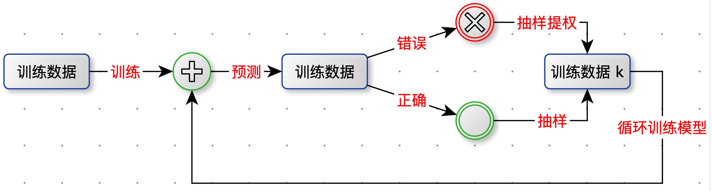
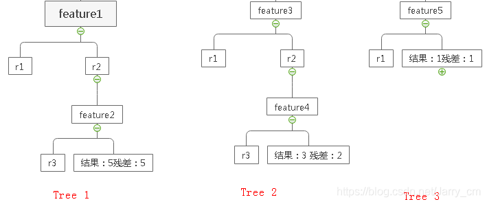

[TOC]

# 模型集成

三个臭皮匠顶一个诸葛亮。


将多个模型融合在一起，得到一个单一模型。

应用：分类，回归，聚类，推荐...


## 为什么要集成？

结论：将多个模型融合会得到更好的精确度。

假设有 5 个 Accuracy = 70% 的分类器，<font color=red>相互独立</font>。 采用投票的方式将 5 个分类器的结果进行集成：**当一个样本被三个及以上的分类器判断为正例，那么集成模型就判断为正例**。

集成模型的精度为：$C_5^2*0.7^3*0.3^2+C_5^4*0.7^4*0.3^1+C_5^5*0.7^5=83.7\%$


如果是 101 个分类器（必须保证101个分类器<font color=red>**相互独立**</font>,这个很难），那么 Accuracy = 99.9%


## 模型集成要解决的问题

1. <font color=green>如何获得多个模型，并且尽量相互独立。</font>

2. <font color=green>如何将多模型的结果融合。</font>

   

## 主要的集成思想

1. <font color=green>Committees：委员会，就是投票。每个模型都有投票权。</font>
2. <font color=green>Boosting：贪心算法。如果要训练 n 个模型，每次训练一个模型，根据上一个模型训练的结果训练下一个模型。</font>
3. <font color=green>Space split：将一个很大问题空间分割成 n 块，每次训练一个模型。比如：决策树</font>
4. <font color=green>Mixture Model：空间软化分</font>


# Committees


## 多个模型的结果进行融合。

- 分类问题：投票。
- 回归问题：模型的输出的均值。

## Bagging

解决问题：获得多个模型，并且尽量相互独立。也就是获取多个独立的训练集。可以并行训练模型。

Bagging（Bootstrap Aggregation）自举集成。


算法描述

对训练数据集进行<font color=green>**等概率放回采样**</font>，得到多个训练数据集，分别训练模型。


带放回的采样概率分析：

训练集有 n 条样本，放回的随机抽出 n 个样本。问：每个样本被抽的概率是多少？

分析：

样本被抽到的概率：$\frac{1}{n}$

样本被<font color=red >没</font>抽到的概率：$1-\frac{1}{n}$

n 次抽样都被<font color=red >没</font>抽到的概率：$(1-\frac{1}{n})^n$

n 次抽样都至少一次被抽到的概率：$1-(1-\frac{1}{n})^n$


当 n 很大时：$limit_{n\rightarrow$ }{1-(1-\frac{1}{n})^n}=1-\frac{1}{e}=0.632$

### Bagging 特点

Bagging 适合弱分类器

- 不稳定：随机采样会得到不同的基分类器。
- 每个基分分类器准确率略高于 50%。
- Bagging较适合偏差小，方差大的基分类器（决策树）。

Bagging 不适合强分类器

- 每个基分类器只有更少的训练样本，集成后反而不如单个分类器。

# Boosting

核心思想：对训练数据集进行采样，当前分错的样本采样权重更大。

Boosting 工作机制：



迭代 k 次，得到 k 个模型。

多模型融合：不等权投票，加大误差率小的分类器的投票权重。


## AdaBoost

解决问题：通过不同权重的重采样获取不过训练集。必须顺序训练模型。

### 算法过程

假设是一个二分类任务。

输入：训练集 $T=[(x_1,y_1),(x_2,y_2),...,(x_n,y_n)]\,\,; x_i \in X \subseteq R^n\,;y_i \in Y=[-1,1]$  

输出：G(x)

1. 初始化训练数据的权值分布（等权）：

   $D_1=(w_{1,1},w_{1,2},...,w_{1,i},...,w_{1,n}) \,;w_{1,i}=\frac{1}{N},i = 1,2,...,N$

2. 根据样本的权重，有放回抽样，进行 M 轮，得到 M 个模型。

   1. 在 $D_m$ 上，训练出一个基分类器：$G_m(x):X\rightarrow [-1,+1]$

   2. 计算$G_m(x) $在训练集 $D_m$ 上的分类误差率：$e_m = P(G_m(x_i)!=y_i)=\sum_{i-1}^N{w_{mi}I(G_m(x_i)!=y_i)}$

      <font color=red>注意：加权分类误差率</font> $w_{mi}$

   3. 计算$G_m(x)$ 的系数（模型的权重）：$a_m = \frac{1}{2}log_e{\frac{1-e_m}{e_m}}$

   4. 更新训练数据的权值分布：$D_{m+1}=(w_{m+1,1},w_{m+1,2},...,w_{m+1,i},...,w_{m+1,n})$

      $w_{m+1,i} = \frac{w_{m,i}}{Z_m}e^{-a_my_iG_m(x_i)};i=1,2,...,N$

      $Z_m$规范化因子：$Z_m=\sum_{i=1}^Nexp(-a_my_iG_m(x_i))$

      $Z_m$ 使 $D_m$ 成为一个分布。

3. 构建基本分类器的线性组合：$f(x)=\sum_{i=1}^M{a_mG_m(x)}$

   最终分类器：$G(x)=sign(f(x))=sign(\sum_{i=1}^M{a_mG_m(x_i)})$

```python
def ada_boost_train(data_set, label, num=40):
    class_list = []
    n = len(data_set)
    w = [1.0 / n] * n
    agg_class_est = [0.0] * n

    for i in range(num):
        # 构建基分类器：决策树
        best_stump, error, class_est = build_stump(data_set, label, w)

        alpha = float(0.5 * math.log((1.0 - error) / error, math.e))
        best_stump["alpha"] = alpha
        class_list.append(best_stump)

        print("alpha=%s, classEst=%s, bestStump=%s, error=%s " % (alpha, class_est, best_stump, error))

        expon = [0.0] * n
        for i in range(n):
            expon[i] = -1 * alpha * label[i] * class_est[i]

        for i in range(n):
            w[i] = w[i] * math.e(expon[i])

        z = sum(w)
        w = [w_i / z for w_i in w]

        agg_class_est = [agg_class_est[i] + alpha * class_est[i] for i in range(n)]
    return class_list, agg_class_est
```


# GBDT 

Gradient Boosting Decision Tree，梯度提升决策树。

通过梯度提升的方法集成多个决策树。


加法模型

$y_i = \sum_{k=1}^K{f_k(x_i)},f_k \in F$


如何学习加法模型？

前向分布算法（forward stagewise algorithm），因为学习的是加法模型，如果能够从前往后，每一步只学习一个基函数及其系数（结构），逐步逼近优化目标函数，那么就可以简化复杂度。这一学习过程称之为 Boosting。

例如：


决策树的复杂度可以由正则项

$\Omega(f_t) = r*T+\frac{1}{2}\lambda \sum_{j=1}^T{w_j^2} $

- T：树的叶子节点数量
- w：叶子节点对应的值向量的 L2 范数


节点分裂收益

假设当前节点为 C ，分裂后左孩子节点为 L，右孩子节点为 R。obj 为目标函数值。

$Gain = obj_c - obj_L - obj_R$

$Gain = \frac{1}{2}[\frac{G_L^2}{H_L+\lambda} +\frac{G_R^2}{H_R+\lambda}-\frac{(G_L+G_R)^2}{H_L+H_R+\lambda} ] - r$

$-r$ 表示：因为增加了树的复杂性（该分裂增加了一个叶子节点）带来的惩罚。


参考：https://cloud.tencent.com/developer/article/1005611

# XGBoost

​		XGBoost是一种集成学习算法，通过<font color=red>回归树</font>，每一次对<font color=red>残差（实际值与预测值之差）进行拟合</font>，最后把预测值相加得到最终的预测值。

​		XGBoost 中树都是二叉树。


​		比如：灯泡的寿命是10年，经过三棵树的训练（拟合10），第一颗树的训练结果为 5 年，那么残差为10-5=5年，在此基础上训练（拟合10 - 5 =5），第二棵树的训练结果为 3 年，残差为5-3=2年，接着第三棵树（拟合5 - 3 =2），训练结果为1年，残差为2-1=1年，结束，那么这棵树最终预测的寿命=5+3+1=9年，这个结果显然更接近于真实值。



XGBoost 特点

1. w 是最优化求出来的，不是平均值或规则指定的，这是XGBoost的一个创新。
2. loss function中包含了正则化防止过拟合的技术。
3. 支持自定义loss function，只要能泰勒展开（能求一阶导和二阶导）就行。
4. 支持并行化，训练速度快，boosting技术中下一棵树依赖上述树的训练和预测，所以树与树之间应该是只能串行！但是**在选择最佳分裂点，进行枚举的时候并行**！（这个也是树形成最耗时的阶段）。
5. XGBoost还特别设计了针对稀疏数据的算法。
6. 可实现后剪枝
7. 交叉验证，方便选择最好的参数
8. 行采样、列采样，随机森林的套路（防止过拟合）。
9. 预测值为每个回归树预测值的加和，这里也可以是加权。
10. XGBoost还支持设置样本权重，这个权重体现在梯度g和二阶梯度h上，是不是有点adaboost的意思，重点关注某些样本。

## XGBoost 参数

### 通用参数

- n_estimators：

- booster ： 默认值 gbtree。

  选择基模型，gbtree：树模型，gbline：线性模型。

- Silent ：默认值为 0。

  Silent = 1静默模式开启，不会输出任何日志。0 帮助我们了解模型运行情况。

- nthread：默认值最大可能的线程数。

  多线程的控制，应当输入系统的核数。如果希望使用cpu 全部核，就不要输入这个参数，算法会自动检测。

### booster 参数

1. eta[默认是0.3] 和GBM中的learning rate参数类似。通过减少每一步的权重，可以提高模型的鲁棒性。典型值0.01-0.2 

2. min_child_weight[默认是1] 决定最小叶子节点样本权重和。当它的值较大时，可以避免模型学习到局部的特殊样本。但如果这个值过高，会导致欠拟合。这个参数需要用cv来调整 

3. max_depth [默认是6] 树的最大深度，这个值也是用来避免过拟合的3-10 

4. max_leaf_nodes 树上最大的节点或叶子的数量，可以代替max_depth的作用，应为如果生成的是二叉树，一个深度为n的树最多生成2n个叶子,如果定义了这个参数max_depth会被忽略 

5. gamma[默认是0] 在节点分裂时，只有在分裂后损失函数的值下降了，才会分裂这个节点。Gamma指定了节点分裂所需的最小损失函数下降值。这个参数值越大，算法越保守。 

6. max_delta_step[默认是0] 这参数限制每颗树权重改变的最大步长。如果是0意味着没有约束。如果是正值那么这个算法会更保守，通常不需要设置。 

7. subsample[默认是1] 这个参数控制对于每棵树，随机采样的比例。减小这个参数的值算法会更加保守，避免过拟合。但是这个值设置的过小，它可能会导致欠拟合。典型值：0.5-1 

8. colsample_bytree[默认是1] 用来控制每颗树随机采样的列数的占比每一列是一个特征0.5-1 

9. colsample_bylevel[默认是1] 用来控制的每一级的每一次分裂，对列数的采样的占比。 

10. lambda[默认是1] 权重的L2正则化项 

11. alpha[默认是1] 权重的L1正则化项 

12. scale_pos_weight[默认是1] 各类样本十分不平衡时，把这个参数设置为一个正数，可以使算法更快收敛。

### 学习目标参数

- Objective：默认值 reg:linear

  这个参数定义需要被最小化的损失函数。最常用的值有：binary：logistic二分类的逻辑回归，返回预测的概率非类别。multi:softmax使用softmax的多分类器，返回预测的类别。在这种情况下，你还要多设置一个参数：num_class类别数目。

- eval_metric：默认值取决于objective参数的取值。

  对于有效数据的度量方法。对于回归问题，默认值是rmse，对于分类问题，默认是error。典型值有：rmse均方根误差；mae平均绝对误差；logloss负对数似然函数值；error二分类错误率；merror多分类错误率；mlogloss多分类损失函数；auc曲线下面积。

- seed：默认是 0

  随机数的种子，设置它可以复现随机数据的结果，也可以用于调整参数。


参考：https://blog.csdn.net/Jarry_cm/article/details/104279528

