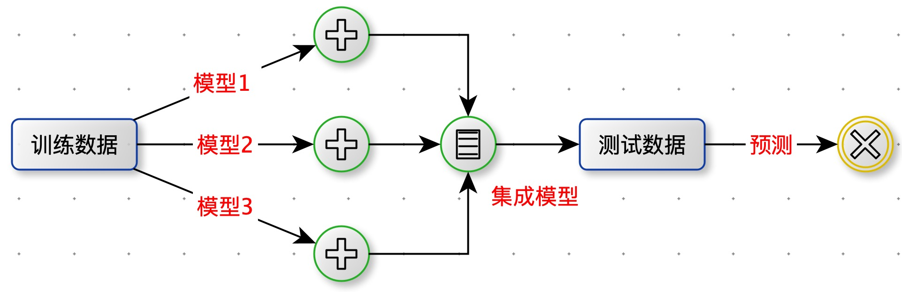

[TOC]

# 模型集成

将多个模型融合在一起，得到一个单一模型。

应用：分类，回归，聚类，推荐...

## 为什么要集成？

结论：将多个模型融合会得到更好的精确度。

假设有 5 个 Accuracy = 70% 的分类器，相互独立。 采用投票的方式将 5 个分类器的结果进行集成：**当一个样本被三个及以上的分类器判断为正例，那么集成模型就判断为正例**。

集成模型的精度为：$C_5^2*0.7^3*0.3^2+C_5^4*0.7^4*0.3^1+C_5^5*0.7^5=83.7\%$

如果是 101 个分类器（必须保证101个分类器**相互独立**,这个很难），那么 Accuracy = 99.9%

## 模型集成要解决的问题

1. 如何获得多个模型，并且尽量相互独立。

2. 如何将多模型的结果融合。

   

## 主要的集成思想

1. Committees：委员会，就是投票。每个模型都有投票权。
2. Boosting：贪心算法。如果要训练 n 个模型，每次训练一个模型，根据上一个模型训练的结果训练下一个模型。
3. Space split：将一个很大问题空间分割成 n 块，每次训练一个模型。比如：决策树
4. Mixture Model：空间软化分

# Committees

## 多个模型的结果进行融合。

- 分类问题：投票。
- 回归问题：模型的输出的均值。

## Bagging

解决问题：获得多个模型，并且尽量相互独立。

Bagging（Bootstrap Aggregation）自举集成。

算法描述

对训练数据集进行**等概率放回采样**，得到多个训练数据集，分别训练模型。

带放回的采样概率分析：

训练集有 n 条样本，放回的随机抽出 n 个样本。问：每个样本被抽的概率是多少？

分析：

样本被抽到的概率：$\frac{1}{n}$

样本被没抽到的概率：$1-\frac{1}{n}$

n 次抽样都被没抽到的概率：$(1-\frac{1}{n})^n$

n 次抽样都至少一次被抽到的概率：$1-(1-\frac{1}{n})^n$

当 n 很大时：$limit_{n\rightarrow$ }{1-(1-\frac{1}{n})^n}=1-\frac{1}{e}=0.632$

