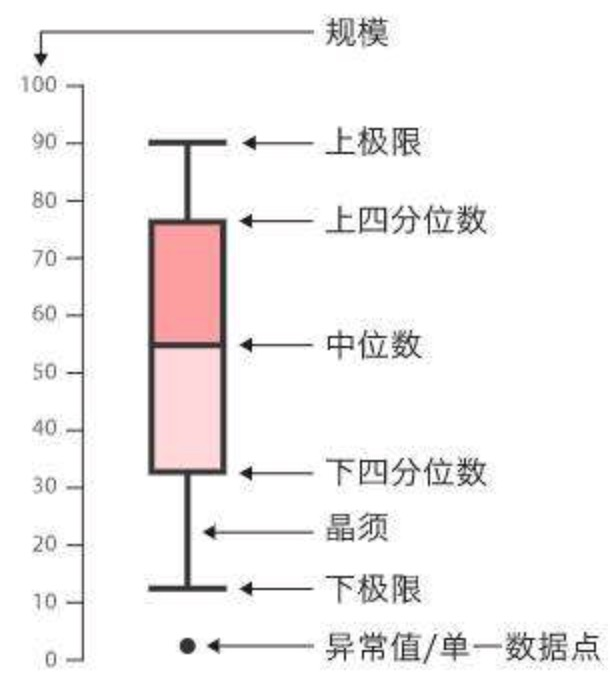

[TOC]

# 集中趋势的量度

## 均值

平均数的一般度量，用 μ 表示。容易受异常值影响。

$ μ = \frac{\sum_i^n x_i}{n} $

## 中位数

按次序排列后的中间值。在数据由于异常值而发生偏斜时使用。

- 如果 n 是奇数，中位数在 $\frac{n+1}{2}$ 位置。
- 如果 n 是偶数，中位数时 $\frac{n}{2}$ 和 $\frac{n}{2}+1$ 的均值。

注意：数据向右偏斜，均值 > 中位数。

## 众数

众数：指一组数据中出现次数最多的那个数据,一组数据可以有多个*众数*,也可以没有众数。

遇到类别数据时使用（当数据出现几组不同的倾向性）。

# 分散性与变异性的度量

## 方差和标准差

## 标准分

$z=\frac{x-μ}{\sigma}$

## 全距

## 四分位数

剔除异常值影响。

### 下四分位数

### 中位数

### 上四分位数，第三四分位数

四分位距=上四分位数-下四分位数

四分位距是 50% 中间数值形成的间距，能消灭所有异常值

## 百分数

第 k 百分位数就是位于数据范围 k% 处的数值，记为$P_k$

## 箱线图

如果数据向右偏斜，那么均值在中位数下方，下方的虚线比上方长。

## 

### 

## 