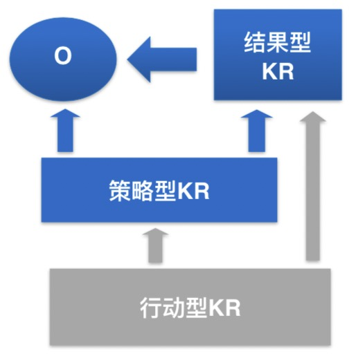

[Toc]

# 概念

==O==bjectives & ==K==ey ==R==esults

目标与关键成果管理法

OKR是一套**==严密的思考框架==**和==**持续的纪律要求**==，旨在 确保全员==**紧密协作**==，把==**精力聚焦**==在能促进组织成长的、 ==**可衡量的贡献**==上 。

# Objective 

O：方向

O 要回答的一个基本问题是：==**我们想要做什么**==？

设定 O，促使我们考虑：

==**在这个阶段，对我们至关重要的，必然要去做的成的事情是什么？**==

**O 的制定原则**

1. 应该是==**具体明确**==的，包括==**动词**==。
2. 定性的描述，应该尽量阐==**明目的和意图**==。
3. 不是例常维持性工作，应该是==**重要且有意义**==的，能鼓舞人心
4. 应该在该 O 实施主体的**==可控或可主导==**的范围之内。

# Key Results

KR 是衡量是否达成 O、监控如何达成 O 的标准。

KR 要回答的基本问题：

==**取得怎样的结果才能算有效地达成这个O？**==

**KR 的制定原则**

1. 必须是清晰的，==可衡量、可验证、有时限==
2. 应该是进取而==具有挑战性==的。
3. 应该==描述产出成果==（得到什么），而非仅仅描述任务或者动作（做了什么）
4. 尽量精简，只列出关键，必要的KR，且在逻辑上能==有效支撑 O==

每个 O的 KR 通常为 2 ~ 5 条，==不得超过 5 个==。

KR 的类型

1. 结果型 KR：衡量是否达成 O 的关键性结果型指标。

   - 综合结果型 KR：KPI 就是这类 KR
   - 局部或者阶段型 KR：综合结果型 KR 在某个局部或者某个阶段的分解。

2. 策略型 KR：

   反映了达成结果型 KR 的策略途径，对结果型 KR 或 O 有关键驱动作用的衡量指标。

3. 行动型 KR：

   达成 O / 结果型 KR / 策略型 KR 的关键行为。

# Demo

> O : 做一款在行业内有足够影响力的产品。
>
> KRs：
>
> 1. 2019 年产品的市场占有率在同类产品中处于市场前三
> 2. 2019 年产品在新用户群体的中30日留存率提高至 50%

==**最优组合：结果型 + 策略型**==

# 注意事项

**较重要的目标是关键目标的==敌人==**

除了关键目标，取得的其他成就毫无意义。

法则1：一个OKR 周期内，同时聚焦的关键目标不应超过 ==3== 个

法则2：==下一级==的目标必须要为==上一级==的目标服务。

法则3：所有的关键目标必须要有明确的==衡量标准==和==完成时限==。

**==80/20 法则：80% 的成果来自 20% 的关键事务。==**

**==必须灵魂拷问自己：==**

**==高质量地完成哪些任务会对结果产生最大的影响。==**

# OKR 执行

目标清晰，指令明确，就会集中精力，全力以赴。

例会跟进（每天看指标，每周一次复盘）

1. 通过团队协作，扫清障碍。
2. 根据进展情况的变化及时作出调整。

