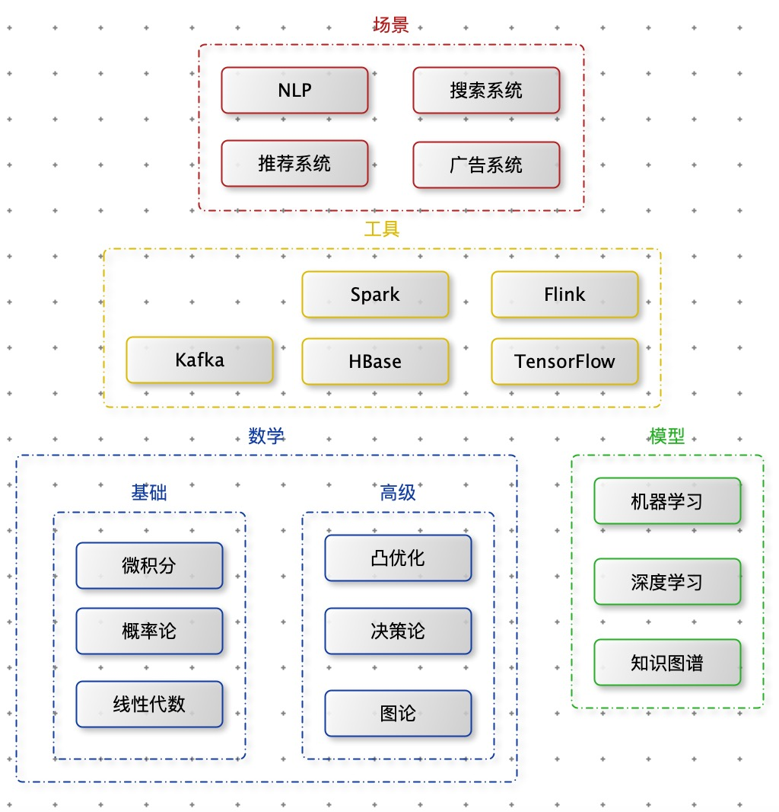

1. 积极主动：对人生负责。
2. 以始为终：任何事物，都必须经历两次创作。
3. 要事第一：重要之事决不能受芝麻小事牵绊。
4. 凡事做记录。
5. 彻底完成一件事。
6. 每天固定时间，做固定的事。
7. 猛火煮，慢火温。
8. 无事时心在腔子里，应事时专一不杂。
9. 探究现象背后的逻辑。
10. 学会打招呼。

- 计算机科学
  - 数学
    - 微积分
    - 线性代数
    - 概率论
    - 离散数学（选修）
  - 计算机
    - 数据结构
    - 组成与原理
    - 操作系统：《操作系统概念》
    - 计算机网络
    - 数据库原理（选修）

