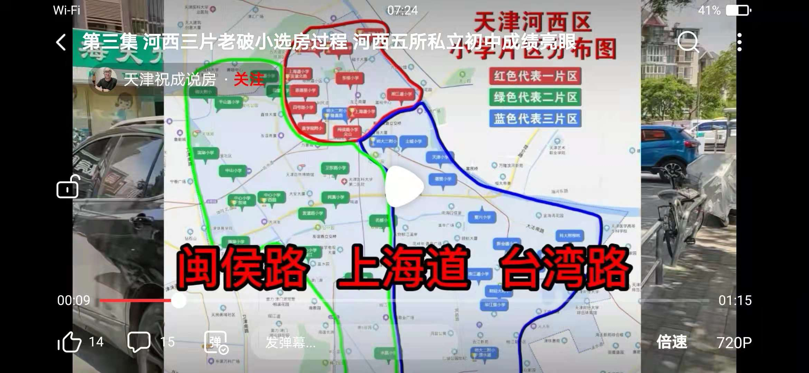

# 民办初中

| 学校           | 依托学校     | 2018年招生人数 | 学费     |
| -------------- | ------------ | -------------- | -------- |
| **1 自立中学** | 第四中学     | 300            | 8000/年  |
| **2 培杰中学** | 第四十二中学 | 300            | 8000/年  |
| 新华圣功学校   | 新华中学     | 160            | 12000/年 |
| 实验求学校     | 实验中学     | 160            | 12000/年 |
| 汇德学校       | 北师大附中   | 160            | 12000/年 |

# 公办初中和小学

| 学区     | 公立初中                 | 对应小学                                               |
| -------- | ------------------------ | ------------------------------------------------------ |
| 第一学区 | **5 新华中学**（市五所） | **8上海道小学**                 |
| 第一学区 | **8 海河中学**           | **20 闽侯路小学**               |
| 第一学区 | **10 佟楼中学**          |  **28 台湾路小学**              |
| 第一学区 | **16 卓群中学**          | **39 湘江道小学**               |
| 第一学区 |                          | 栋楼小学                                               |
| 第一学区 |                          | 四号楼小学                                             |
| 第一学区 |                          | 恩德里小学                                             |
| 第一学区 |                          | **39 华夏未来艺术小学（私立）** |

| 学区     | 公立初中            | 对应小学                                           |
| -------- | ------------------- | -------------------------------------------------- |
| 第二学区 | **4 实验中学**      | **19 中心小学(3个小区)**    |
| 第二学区 | **7 梧桐中学**      | **36  平山道小学**          |
| 第二学区 | **11 滨湖中学**     | **37 天津师范大学附属小学** |
| 第二学区 | **12 第四十一中学** | **39 卫东路小学**           |
| 第二学区 | **14 环湖中学**     | 中山小学                                           |
| 第二学区 | **17 梅江中学**     | 滨湖小学                                           |
| 第二学区 |                     | 南湖小学                                           |
| 第二学区 |                     | 友谊路小学                                         |
| 第二学区 |                     | 梧桐小学                                           |
| 第二学区 |                     | 马场道小学                                         |
| 第二学区 |                     | 同望小学                                           |
| 第二学区 |                     | 名都小学                                           |
| 第二学区 |                     | 水晶小学                                           |
| 第二学区 |                     | 纯真小学                                           |

| 学区     | 公立初中                              | 对应小学                                                     |
| -------- | ------------------------------------- | ------------------------------------------------------------ |
| 第三学区 | 3.**第四中学**                        | **11 天津师范大学第二附属小学（2个校区）** |
| 第三学区 | **6 第四十二中学**                    | **27 三水道小学**                     |
| 第三学区 | **9 学枫林路中学**                    | **30 华江里小学**                     |
| 第三学区 | **13 双水道中学**                     | **37 天津小学**                       |
| 第三学区 | **15 北京师范大学天津附中**（市五所） | 珠江道小学                                                   |
| 第三学区 | **18 微山路中学**                     | 新会道小学                                                   |
| 第三学区 | 第二新华中学                          | 灰堆第一小学                                                 |
| 第三学区 |                                       | 土城小学                                                     |
| 第三学区 |                                       | 陵水道小学                                                   |
| 第三学区 |                                       | 东海里小学                                                   |
| 第三学区 |                                       | 梅苑小学                                                     |

